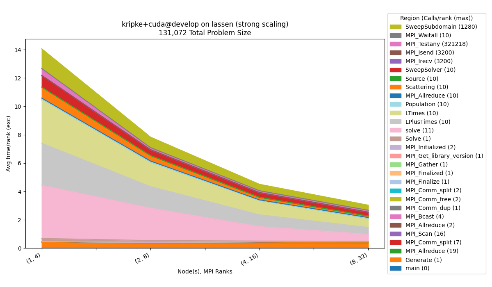

..
    Copyright 2023 Lawrence Livermore National Security, LLC and other
    Benchpark Project Developers. See the top-level COPYRIGHT file for details.

    SPDX-License-Identifier: Apache-2.0

#########################
 Analyze a Scaling Study
#########################

The ``benchpark analyze`` command can be used to generate pre-defined charts for
analysis of scaling studies using Caliper and Thicket. The study must use the Caliper
modifier ``caliper=time,mpi`` (:doc:`modifiers`) to collect the performance data.
``benchpark analyze`` uses the `Thicket <https://github.com/LLNL/thicket>`_ performance
analysis library to compose and visualize the Caliper performance data.

``benchpark analyze`` will generate:

1. A calltree of the regions that were executed in the benchmark.
2. A scaling study figure, which can be configured with command-line arguments.
3. A csv of the datapoints plotted on the figure.

``benchpark analyze`` requires additional Python packages, which can be installed by
running ``pip install .[analyze]`` in the benchpark directory.

To run ``benchpark analyze``:

.. code-block:: console

    $ benchpark analyze --workspace-dir RAMBLE_WORKSPACE_DIR <optional_arguments>

``benchpark analyze`` has many options, explained in the help menu for the command.

.. program-output:: ../bin/benchpark analyze -h

**********
 Calltree
**********

We will use one of the experiments available in Benchpark, Kripke, to demonstrate the
output of the ``benchpark analyze`` command.

The output includes the Calltree of the benchmark:

::

     main
    ├─  Generate
    │  ├─  MPI_Allreduce
    │  ├─  MPI_Comm_split
    │  └─  MPI_Scan
    ├─  MPI_Allreduce
    ├─  MPI_Bcast
    ├─  MPI_Comm_dup
    ├─  MPI_Comm_free
    ├─  MPI_Comm_split
    ├─  MPI_Finalize
    ├─  MPI_Finalized
    ├─  MPI_Gather
    ├─  MPI_Get_library_version
    ├─  MPI_Initialized
    └─  Solve
      └─  solve
          ├─  LPlusTimes
          ├─  LTimes
          ├─  Population
          │  └─  MPI_Allreduce
          ├─  Scattering
          ├─  Source
          └─  SweepSolver
            ├─  MPI_Irecv
            ├─  MPI_Isend
            ├─  MPI_Testany
            ├─  MPI_Waitall
            └─  SweepSubdomain

****************
 Strong Scaling
****************

To generate a strong scaling dataset, you would need to run the strong scaling scaling
study of Kripke:

.. code-block:: console

    $ benchpark system init --dest=lassen llnl-sierra
    $ benchpark experiment init --dest=kripke/cuda/strong lassen kripke+cuda+strong caliper=time,mpi
    $ benchpark setup lassen/kripke/cuda/strong wkp
    // Follow instructions for running Ramble ...

Run ``benchpark analyze``:

.. code-block:: console

    $ benchpark analyze --workspace-dir wkp/kripke/cuda/strong/lassen/workspace/

The default configuration will visualize a stacked area chart of:

- The exclusive average time per rank ``Avg time/rank (exc)`` collected by the caliper
  modifier ``caliper=time``.
- Number of nodes and number of MPI ranks on the x-axis, which are the parameters we
  vary in the experiment (for strong scaling).
- Constant information will be contained in the title, such as benchmark, programming
  model, benchmark version, cluster, etc.
- The legend will contain the regions and maximum calls out of all of the ranks
  (``Calls/rank (max)``).

**************
 Weak Scaling
**************

To generate the weak scaling dataset:

.. code-block:: console

    $ benchpark experiment init --dest=kripke/cuda/weak lassen kripke+cuda+weak caliper=time,mpi
    $ benchpark setup lassen/kripke/cuda/weak wkp
    // Follow instructions for running Ramble ...

Run ``benchpark analyze``:

.. code-block:: console

    $ benchpark analyze --workspace-dir wkp/kripke/cuda/weak/lassen/workspace/

.. figure:: _static/images/kripke_cuda_weak_raw_exc.png
    :width: 800
    :align: center

************
 Throughput
************

To generate the throughput dataset:

.. code-block:: console

    $ benchpark experiment init --dest=kripke/cuda/throughput lassen kripke+cuda+throughput caliper=time,mpi
    $ benchpark setup lassen/kripke/cuda/throughput wkp
    // Follow instructions for running Ramble ...

Run ``benchpark analyze``:

.. code-block:: console

    $ benchpark analyze --workspace-dir wkp/kripke/cuda/throughput/lassen/workspace/

.. figure:: _static/images/kripke_cuda_throughput_raw_exc.png
    :width: 800
    :align: center

************
 Percentage
************

.. code-block:: console

    $ benchpark analyze --workspace-dir wkp/kripke/cuda/strong/lassen/workspace/ --chart-type percentage

The ``--chart-type percentage`` option, visualizes the y-axis metric, relative to the
summation of the metric for all regions. This is useful in this example to visualize
what percentage of the time each region is taking.

.. figure:: _static/images/kripke_cuda_strong_percentage_exc.png
    :width: 800
    :align: center

*******************
 Inclusive Metrics
*******************

.. code-block:: console

    $ benchpark analyze --workspace-dir wkp/kripke/cuda/strong/lassen/workspace/ --yaxis-metric "Avg time/rank"

We can also visualize any inclusive metrics by selecting them as the ``yaxis_metric``.
Here we use ``Avg time/rank`` instead of ``Avg time/rank (exc)``. The ``main`` node is
automatically removed from the figure, because this information is redundant for the
inclusive metric.

.. figure:: _static/images/kripke_cuda_strong_raw_inc.png
    :width: 800
    :align: center

******************
 Region Filtering
******************

.. code-block:: console

    $ benchpark analyze --workspace-dir wkp/kripke/cuda/strong/lassen/workspace/ --group-regions-name --top-n-regions 10

An efficient way to filter out smaller regions quickly, is to use the
``--group-regions-name`` and ``--top-n-regions`` parameters. ``--group-regions-name``
computes the sum of the metric for all of the regions with the same name, so multiple
regions are shown as a single region. ``--top-n-regions`` filters the data to only show
the ``n`` regions with the highest values for the given metric (based on the first
profile). We can also add the ``--no-mpi`` argument to filter out all ``MPI_*`` regions.

.. figure:: _static/images/kripke_cuda_strong_raw_exc-2.png
    :width: 800
    :align: center

*****************************************
 Visualize Data From Multiple Workspaces
*****************************************

Data from multiple clusters will end up in separate Ramble workspaces. Simply point at
the Benchpark workspace instead of the Ramble workspace to include multiple Ramble
workspaces in your analysis. This example uses the ``line`` chart functionality to
visualize a single node memory bandwidth study. Other options are ``bar`` and
``scatter``.

.. note::

    The ``area`` chart will not work for data from multiple Ramble workspaces.

.. code-block:: console

    $ benchpark analyze --workspace-dir wkp/ --query-regions-byname Stream_TRIAD --chart-kind line --file-name-match Base_Seq-default --yaxis-metric 'Memory Bandwidth (GB/s)' --chart-yaxis-limits 8 2048 --chart-figsize 12 7 --yaxis-log --no-mpi

.. figure:: _static/images/raja-perf_mpi_strong_raw_exc.png
    :width: 800
    :align: center

*****************************
 Visualize a Metadata Column
*****************************

``benchpark analyze`` is not limited to performance data columns. Provide the name of a
metadata column to visualize that instead. This is useful for metrics like FOM's, which
only have one value per profile.

.. code-block:: console

    $ benchpark analyze --workspace-dir problem1/ --yaxis-metric Final-FOM --chart-kind line --disable-legend

.. figure:: _static/images/amg2023_rocm_weak_raw_exc.png
    :width: 800
    :align: center
