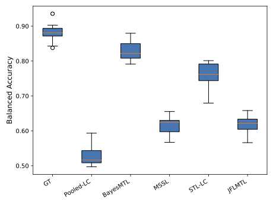

# BayesMTL

This project is an implementation of the Bayesian Multitask Learning (BayesMTL) from the paper Hierarchical Sparse Bayesian Multitask Model with Scalable Inference for Microbiome Analysis. 


# Dependencies 
The required library for this project includes:
matplotlib, numpy, optuna, pandas, ray, scikit_learn, scipy, seaborn, setuptools, tqdm. See requirements.txt for the minimal package versions.

# Setup
To set up the package as a python module run "pip install ." in terminal 

# Running the simple experiments
## Poisson Distribution
python -m bayesmtl.methods.mtl.BayesMTL --d Pois
Expected printed outputs: 

```
training accuracy per task is: [0.97590361 0.84444444 0.76136364 0.8625     0.98611111 0.93055556
 0.97619048 0.90789474 0.89156627 0.77777778]
training accuracy is: 0.8887515451174289
training accuracy per task sorted by sample size per task is: [0.98611111 0.93055556 0.90789474 0.8625     0.77777778 0.97590361
 0.89156627 0.97619048 0.76136364 0.84444444]
test accuracy per task is: [0.84057971 0.78571429 0.63157895 0.66666667 0.91358025 0.75308642
 0.83333333 0.77419355 0.86813187 0.72093023]
test accuracy is: 0.7808716707021792
test accuracy per task sorted by number of training samples is: [0.91358025 0.75308642 0.77419355 0.66666667 0.72093023 0.84057971
 0.86813187 0.83333333 0.63157895 0.78571429]
```


## Negative-Binomial
python -m bayesmtl.methods.mtl.BayesMTL --d NB
Expected printed outputs:

```
training accuracy per task is: [0.90625    1.         1.         0.93670886 1.         0.92035398
 0.85227273 0.98947368 0.99056604 1.        ]
training accuracy is: 0.9526774595267746
training accuracy per task sorted by sample size per task is: [1.         1.         1.         0.93670886 0.85227273 0.98947368
 0.90625    0.99056604 1.         0.92035398]
test accuracy per task is: [0.82716049 0.89873418 0.63043478 0.91463415 0.88607595 0.84615385
 0.84722222 0.87951807 0.85897436 0.79661017]
test accuracy is: 0.8365261813537676
test accuracy per task sorted by number of training samples is: [0.63043478 0.79661017 0.88607595 0.91463415 0.84722222 0.87951807
 0.82716049 0.85897436 0.89873418 0.84615385]
```


# Running the experiment to reproduce results from the paper
Step 1: Generate the simulated data
python -m bayesmtl.data.simulate_data

Step 2: Run the bayesmtl model 
python -m bayesmtl.test.run --menu bayesmtl/config/experiment.json

This will generate a full report using various metrics, and a sample figure from report is included here:

 

# Acknowledgments

BayesMTL has been developed under the financial support of:

- LLNL Laboratory Directed Research and Development Program, the ETI Consortium under US Department of Energy grant DE-NA0003921
- US Army Research Office under grant number W911NF1910269.


# Contributors
BayesMTL is written by Haonan Zhu(zhu18@llnl.gov) and Andre R. Goncalves (andre@llnl.gov) from LLNL and has received important feedback from Camilo Valdes (LLNL), Hiranmayi Ranganathan (LLNL), Boya Zhang (LLNL), and Alfred Hero (umich).

# Citing BayesMTL

If you are referencing BayesMTL in a publication, please cite the following paper:

* Haonan Zhu, Andre R. Goncalves, Camilo Valdes, Hiranmayi Ranganathan,
Boya Zhang, Jose Manuel Mart´ı, Car Reen Kok, Monica K. Borucki, Nisha J.
Mulakken, James B. Thissen, Crystal Jaing, Alfred Hero, and Nicholas A.
Be. [**Hierarchical sparse bayesian multitask model with scalable inference for
microbiome analysis**](https://arxiv.org/abs/2502.02552), 2025. LLNL-MI-853606. 

Or, see`BayesMTL.bib` for the raw BibTeX file.

# Copyright
Copyright (c) 2022-2025, Lawrence Livermore National Security, LLC. Produced at the Lawrence Livermore National Laboratory. LLNL-CODE-2002528. BayesMTL is free software; you can modify it and/or redistribute it under the terms of the MIT license. All new contributions must be made under this license. See COPYRIGHT for complete copyright and license information.