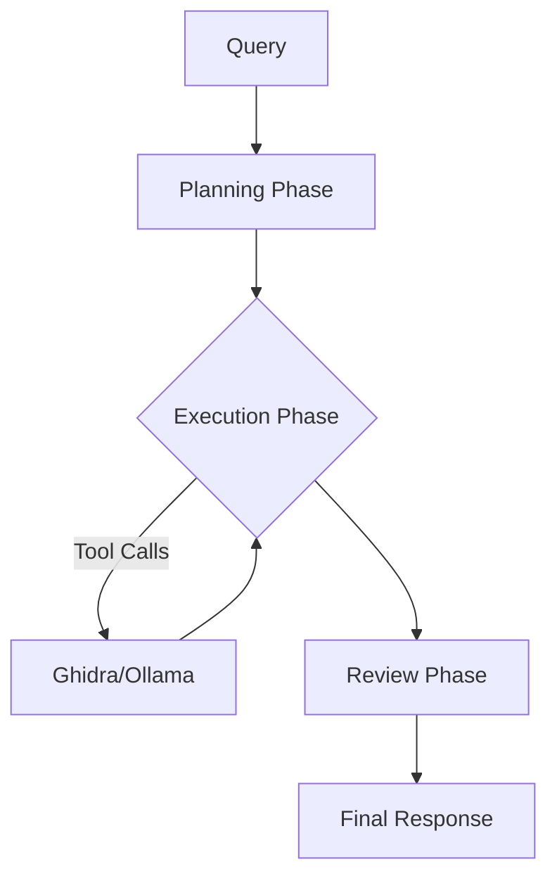

# OGhidra - AI-Powered Reverse Engineering with Ghidra


OGhidra bridges Large Language Models (LLMs) via Ollama with the Ghidra reverse engineering platform, enabling AI-driven binary analysis through natural language. Interact with Ghidra using conversational queries and automate complex reverse engineering workflows.

[](https://www.youtube.com/watch?v=hBD92FUgR0Y)


## What is OGhidra?

OGhidra combines the power of local LLMs with Ghidra's reverse engineering capabilities, allowing you to:
- **Analyze binaries using natural language** - Ask questions about functions, strings, imports, and more
- **Automate reverse engineering workflows** - Rename functions, analyze patterns, generate reports
- **Use local AI models** - Complete privacy with models running on your own hardware
- **Deep Data Inspection** - Leverage the custom OGhidraMCP plugin to read raw bytes and analyze memory directly
- **Multi-Instance Analysis** - Run multiple Ghidra instances simultaneously, analyzing different binaries in parallel
- **Work with modern GUI or CLI** - Choose the interface that suits your workflow





## Use Cases

- **Malware Analysis**: Quickly identify suspicious functions and behavioral patterns
- **Vulnerability Research**: Analyze imports, strings, and function relationships
- **Code Understanding**: Get AI-powered explanations of complex decompiled code
- **Bulk Operations**: Rename hundreds of functions with intelligent AI suggestions
- **Report Generation**: Create comprehensive security assessments and software reports
- **Parallel Analysis**: Load entire file systems or dependencies to cross verify findings

## Table of Contents

- [What is OGhidra?](#what-is-oghidra)
- [Use Cases](#use-cases)
- [Pre-Installation Requirements](#pre-installation-requirements)
- [OGhidra Installation](#oghidra-installation)
- [How to Use OGhidra](#how-to-use-oghidra)
- [Common Workflows](#common-workflows)
- [Software Report Generation](#software-report-generation)
- [Server Configuration](#server-configuration)
- [Advanced Features](#advanced-features)
- [Troubleshooting](#troubleshooting)
- [Contributing](#contributing)
- [License](#license)

---

### Monitor your Investigation and Rename All Functions


### Summarize all your Functions


## Pre-Installation Requirements

Before installing OGhidra, you need to set up three core components: **Ghidra**, **OGhidraMCP**, and **Ollama**

### System Requirements

**Python Version**:
- **Required**: Python 3.12+
- **Check your version**: Run `python --version` or `python3 --version`

**Hardware Requirements**:
Recommended: Make sure your VRAM can support the entire model to prevent excessive wait times due to memory swapping. 
- **RAM**: 
  - Minimum 8GB (for lightweight models like `gemma3:27b`)
  - 32GB+ recommended for large models (`gpt-oss:120b`)
- **Storage**: 50GB+ free space (for models and analysis data)
- **OS**: Windows 10+, Linux (Ubuntu 20.04+), or macOS 11+

### Step 1: Install Ghidra

Ghidra is the NSA's reverse engineering platform that OGhidra enhances with AI capabilities.

1. **Download Ghidra 11.3 or later** from the official repository:
   - [Ghidra Releases](https://github.com/NationalSecurityAgency/ghidra/releases)
   - Recommended: [Ghidra 11.3.2](https://github.com/NationalSecurityAgency/ghidra/releases/download/Ghidra_11.3.2_build/ghidra_11.3.2_PUBLIC_20250415.zip)

2. **Extract the downloaded archive** to your desired installation directory

3. **Install Java Development Kit (JDK) 17 or later** if not already installed:
   - Download from [Oracle](https://www.oracle.com/java/technologies/downloads/) or use OpenJDK
   - Verify installation: `java -version`

4. **Launch Ghidra** using the appropriate script:
   - Windows: Run `ghidraRun.bat`
   - Linux/Mac: Run `./ghidraRun`

5. **Create or open a project** and import a binary file for analysis

### Step 2: Install GhidraMCP Plugin

GhidraMCP provides the API bridge that allows external tools (like OGhidra) to interact with Ghidra programmatically.

**Option A: OGhidraMCP (Recommended)**

OGhidraMCP is an extended version of GhidraMCP with additional capabilities for AI-assisted reverse engineering.

| Property | Value |
|----------|-------|
| **Version** | 1.1.0 |
| **Ghidra Compatibility** | 11.3.2 (also compatible with 11.3.x, 11.4.x) |
| **Original Author** | LaurieWired |
| **Modified By** | ezrealenoch |

**Additional Features in OGhidraMCP:**
- **Multi-Instance Support**: Run multiple Ghidra instances simultaneously, each analyzing different binaries on unique ports (8080, then 8192-8202). Enables parallel analysis workflows and AI agents to interact with multiple binaries at once.
- `read_bytes`: Read raw bytes from memory addresses for AI analysis of data structures, magic bytes, and encrypted content
- `scan_function_pointer_tables`: Algorithmic scanning for vtables, dispatch tables, and jump tables
- **Enhanced API Endpoints**: Discovery endpoints (`/plugin-version`, `/program`) for instance management and compatibility with multi-instance architectures

**Installation:**
1. Locate the plugin in `OGhidraMCP/dist/ghidra_11.3.2_PUBLIC_20251223_OGhidraMCP.zip`
2. Open Ghidra
3. Go to `File` → `Install Extensions`
4. Click the `+` button
5. Select the `OGhidraMCP.zip` file
6. Click `OK` to install
7. Restart Ghidra

**Option B: Original GhidraMCP**

If you prefer the original plugin without modifications:

1. **Download the GhidraMCP plugin**:
   - [GhidraMCP Repository](https://github.com/LaurieWired/GhidraMCP)
   - Direct download: [GhidraMCP 1.3+](https://github.com/LaurieWired/GhidraMCP/releases)

2. **Install the plugin in Ghidra**:
   - Open Ghidra
   - Go to `File` → `Install Extensions`
   - Click the `+` button
   - Select the downloaded `GhidraMCP-release-X-X.zip` file
   - Click `OK` to install

3. **Restart Ghidra** to load the extension

**Enable the Plugin (Both Options):**

1. **Enable the GhidraMCP plugin**:
   - Go to `File` → `Configure` → `Developer`
   - Check the box for `GhidraMCPPlugin` (or `OGhidraMCPPlugin`)
   - Click `OK`

2. **Configure the server port** (optional):
   - Go to `Edit` → `Tool Options` → `GhidraMCP HTTP Server`
   - Default port is `8080` - change if needed
   - **Multi-Instance Mode**: If port 8080 is already in use, the plugin automatically tries ports 8192-8202, allowing multiple Ghidra instances to run simultaneously
   - Click `OK`

3. **Verify the server is running**:
   - With a project open, the GhidraMCP server should start automatically
   - Check Ghidra's console for "GhidraMCP HTTP server started on port XXXX" message
   - The port number will be shown in the console (may differ from configured port if using multi-instance mode)

### Step 3: Install Ollama

Ollama is the local LLM runtime that powers OGhidra's AI capabilities.

1. **Download and install Ollama**:
   - [Ollama Official Website](https://ollama.com)
   - [Ollama GitHub Repository](https://github.com/ollama/ollama)
   - Available for Windows, macOS, and Linux

2. **Verify Ollama installation**:
   ```bash
   ollama --version
   ```

3. **Start the Ollama service**:
   ```bash
   ollama serve
   ```
   - This runs the Ollama API server on `http://localhost:11434`
   - Keep this terminal running, or set up Ollama as a system service

4. **Download required AI models**:
   
   Open a new terminal and pull the following models:

   ```bash
   # Primary reasoning model (large, high quality)
   ollama pull gpt-oss:120b
   
   # Alternative primary model (faster, good balance)
   ollama pull gemma3:27b

   # Primary Cloud Model (Large, Cloud Hosted, Mistral please hire me)
   ollama pull devstral-2:123b-cloud
   
   # Embedding model for vector search (RAG, LARGE Semantic Search)
   ollama pull nomic-embed-text
   ```

   **Model Details**:
   - `gpt-oss:120b` - Large open-source GPT model, best quality for complex analysis (requires ~80GB RAM)
   - `gemma3:27b` - Google's Gemma 3 model, excellent balance of speed and quality (~20GB RAM)
   - `devstral-2:123b-cloud` - Large Cloud Hosted Model
   - `nomic-embed-text` - Lightweight embedding model for semantic search and RAG features

5. **Verify models are installed**:
   ```bash
   ollama list
   ```

---

## OGhidra Installation

Now that prerequisites are installed, set up OGhidra itself.

### Step 0: Verify Python Version

Ensure you have Python 3.12 or later installed:

```bash
python --version
# or
python3 --version
```

### Step 1: Clone the Repository

```bash
git clone https://github.com/yourusername/OGhidra.git
cd OGhidra
```

### Step 2: Install Python Dependencies

Choose one of the following options:

**Option A: Using UV (Recommended Suggestion Thanks jstasiak)**

[UV](https://docs.astral.sh/uv/) is a modern, fast Python package manager. If you have it installed:

```bash
# Install dependencies and create virtual environment automatically
uv sync

# Run OGhidra (uv run handles the virtual environment for you)
uv run main.py --interactive
```

> **install UV** [https://docs.astral.sh/uv/getting-started/installation/](https://docs.astral.sh/uv/getting-started/installation/)

**Option B: Using pip (Traditional)**

```bash
# Create virtual environment
python -m venv venv

# Activate it
# On Windows:
.\venv\Scripts\activate

# On Linux/Mac:
source venv/bin/activate

# Install dependencies
pip install -r requirements.txt
```

### Step 3: Configure Environment Variables

1. **Copy the example configuration**:
   ```bash
   # On Windows:
   copy .envexample .env
   
   # On Linux/Mac:
   cp .envexample .env
   ```

2. **Edit `.env` file** with your preferred text editor and configure (or leave as is):

   ```env
   # Ollama Configuration
   OLLAMA_API_URL=http://localhost:11434
   OLLAMA_MODEL=gemma3:27b
   
   # Alternative: Use gpt-oss for higher quality (requires more RAM)
   # OLLAMA_MODEL=gpt-oss:120b
   
   # GhidraMCP Server Configuration
   GHIDRA_MCP_URL=http://localhost:8080
   
   # Memory and RAG Settings
   SESSION_HISTORY_ENABLED=true
   SESSION_HISTORY_USE_VECTOR_EMBEDDINGS=true
   
   # CAG (Cache-Augmented Generation) Settings
   CAG_ENABLED=true
   CAG_KNOWLEDGE_CACHE_ENABLED=true
   CAG_SESSION_CACHE_ENABLED=true

   # LLM Logging Configuration
   # Enable comprehensive logging of all LLM interactions (prompts, responses, timing, tokens)
   LLM_LOGGING_ENABLED=true
   LLM_LOG_FILE=logs/llm_interactions.log
   LLM_LOG_PROMPTS=true
   LLM_LOG_RESPONSES=true
   LLM_LOG_TOKENS=true
   LLM_LOG_TIMING=true
   LLM_LOG_FORMAT=json

   # Live Chain of Thought View
   # Print the AI's reasoning process to the terminal in real-time
   OLLAMA_SHOW_REASONING=true

   # Request Delay (Rate Limiting)
   # Add a delay (in seconds) between AI requests to prevent rate limiting
   OLLAMA_REQUEST_DELAY=0.0
   ```

### Step 4: Verify Installation

1. **Ensure Ghidra is running** with a project open and GhidraMCP plugin enabled

2. **Ensure Ollama is running**:
   ```bash
   ollama serve
   ```

3. **Launch OGhidra CLI** in interactive mode to test:
   ```bash
   # If using UV:
   uv run main.py --interactive
   
   # If using pip (with venv activated):
   python main.py --interactive
   ```

4. **Run health check**:
   ```
   health
   ```
   
   You should see successful connections to both Ollama and GhidraMCP servers.

---

## How to Use OGhidra

OGhidra offers two primary interfaces: **GUI Mode** (recommended for most users) and **Interactive CLI Mode** (for scripting and advanced users).

### GUI Mode (Recommended)

The graphical interface provides the most intuitive experience with visual feedback and one-click operations.

**Launch the GUI**:
```bash
# If using UV:
uv run main.py --ui

# If using pip (with venv activated):
python main.py --ui
```

#### GUI Interface Overview

**Left Panel - Workflow & Status**:
- Real-time workflow progress tracking
- Memory usage monitoring
- CAG (Cache-Augmented Generation) status
- List of renamed functions during session

**Right Panel - Interaction**:
- **Query Input Box**: Type natural language questions or commands
- **AI Response Area**: View detailed AI analysis with syntax highlighting
- **Smart Tool Buttons**: One-click access to common operations

**Menu Bar**:
- **File**: Save/load sessions, exit application
- **Tools**: Server configuration, system settings
- **Help**: Documentation and about information

#### Smart Tool Buttons

Use these one-click buttons for common reverse engineering tasks:

| Button | Function | Description |
|--------|----------|-------------|
| **Analyze Current Function** | Analyze selected function | AI-powered deep dive into current function's behavior |
| **Rename Current Function** | Intelligent rename | AI suggests meaningful names based on function behavior |
| **Rename All Functions** | Bulk rename | Systematically rename all functions in binary |
| **Analyze Imports** | Import analysis | Identify libraries, system calls, and external dependencies |
| **Analyze Strings** | String analysis | Find embedded URLs, credentials, configuration data |
| **Analyze Exports** | Export analysis | Analyze exported functions and API surface |
| **Generate Software Report** | Create report | Comprehensive security assessment in MD/JSON/HTML |

#### Natural Language Queries

In the query input box, you can ask questions naturally:

- "What does the function at 0x00401000 do?"
- "Show me all functions that call CreateProcess"
- "Find suspicious string operations"
- "Analyze the main function and explain its logic"
- "List all network-related imports"

### Interactive CLI Mode

For advanced users, scripting, and automation workflows.

**Launch CLI Mode**:
```bash
# If using UV:
uv run main.py --interactive

# If using pip (with venv activated):
python main.py --interactive
```

#### Available Commands

| Command | Usage | Description |
|---------|-------|-------------|
| `run-tools analyze_function` | `run-tools analyze_function <name_or_addr>` | Decompile and analyze specific function |
| `run-tools strings` | `run-tools strings` | List all strings in the binary |
| `run-tools imports` | `run-tools imports` | Display imported functions and libraries |
| `run-tools exports` | `run-tools exports` | Show exported symbols |
| `health` | `health` | Check Ollama and GhidraMCP connectivity |
| `tools` | `tools` | List all available tools/commands |
| `models` | `models` | Show available Ollama models |
| `cag` | `cag` | Display CAG status and cache information |
| `memory-stats` | `memory-stats` | View session memory statistics |
| `instances_list` | `instances_list` | List all active Ghidra instances |
| `instances_discover` | `instances_discover start_port=8192 end_port=8200` | Discover Ghidra instances on port range |
| `instances_use` | `instances_use port=8192` | Switch to a different Ghidra instance |
| `instances_current` | `instances_current` | Show current instance information |
| `help` | `help` | Show command help |
| `exit` / `quit` | `exit` | Exit interactive mode |

#### Example CLI Session

```
OGhidra> health
✓ Ollama server: Connected (http://localhost:11434)
✓ GhidraMCP server: Connected (http://localhost:8080)
✓ Models available: gemma3:27b, gpt-oss:120b

OGhidra> run-tools imports
Analyzing imported functions...
[AI analyzes imports and provides insights]

OGhidra> Explain the main function
[AI plans analysis, decompiles main, and provides detailed explanation]

OGhidra> exit
```

---

##  Common Workflows

### Workflow 1: Bulk Function Renaming, Loading Vectors, and Query

One of OGhidra's most powerful features is intelligently renaming all functions in a binary and loading the results into a vector database.

**Using GUI**:
1. Click the **"Rename All Functions"** button
2. Select renaming mode in the dialog:
   - **Full**: Rename all functions with detailed analysis
   - **Quick**: Faster renaming with basic analysis
3. Review renamed functions in the left panel list
4. Click the **"Load Vectors"** button in the Analyzed Functions Tab
5. Ask questions in the Query Box!

**Using CLI**:
```
OGhidra> enumerate-binary
OGhidra> What does my application do? Is there any malicious capability?
```

**Renaming Process**:
1. **Enumeration**: OGhidra lists all functions in the binary
2. **Analysis**: AI analyzes each function's decompiled code, called functions, and string references
3. **Naming**: Generates meaningful names based on behavior (e.g., `check_license`, `decrypt_config`, `send_network_data`)

**Vector Loading Option**:
- When enabled, OGhidra builds a vector embedding database of all functions
- Enables semantic search: "Find all crypto functions" or "Show error handling code"
- Useful for large binaries (1000+ functions)

### Workflow 2: Security Analysis

Perform comprehensive security assessment of a binary.

**Using GUI**:
1. Click **"Analyze Imports"** to identify libraries and system calls
2. Click **"Analyze Strings"** to find hardcoded credentials, URLs, or suspicious patterns
3. Click **"Generate Software Report"** and select HTML format
4. Open the generated report in your browser for full security assessment

**Using CLI**:
```
OGhidra> analyze security risks in this binary
OGhidra> find all network communication functions
OGhidra> identify potential vulnerabilities
```

### Workflow 3: Understanding a Specific Function

**Using GUI**:
1. In Ghidra, select the function you want to analyze
2. In OGhidra, type: "Analyze the current function in detail"
3. Review the AI's explanation of the function's logic, parameters, and behavior

**Using CLI**:
```
OGhidra> run-tools analyze_function sub_401000
OGhidra> What does this function do?
OGhidra> Are there any security issues in this function?
```

## Software Report Generation

OGhidra can generate comprehensive analysis reports in multiple formats.

### Report Contents

- **Executive Summary**: Software classification, purpose, threat level
- **Binary Overview**: Statistics on functions, imports, exports, memory segments
- **Architecture Analysis**: Code quality, design patterns, complexity metrics
- **Function Analysis**: Categorized analysis with renamed function tracking
- **Security Assessment**: Risk breakdown, suspicious indicators, CVE references
- **Behavioral Analysis**: Workflows, network behavior, file operations, registry access

### Generating Reports

**GUI Method**:
1. Enumerate all functions using the enumeration steps indicated above **"Rename All Functions"** and **"Load Vectors"**
2. Click the **"Generate Software Report"**
3. Select output format:
   - **Markdown (.md)**: Human-readable, version-control friendly
   - **JSON (.json)**: Machine-readable for automation/integration
   - **HTML (.html)**: Formatted web page with styling
4. Choose save location
5. Wait for generation (may take several minutes for large binaries)

**CLI Method**:
```
OGhidra> enumerate-binary
OGhidra> generate a comprehensive security report for this binary
```

**Output Location**: Reports are saved in the `reports/` directory by default.

---

## Multi-Instance Support

OGhidraMCP supports running multiple Ghidra instances simultaneously, each analyzing different binaries. This enables powerful parallel analysis workflows where you can:

- **Analyze multiple binaries at once**: Open different binaries in separate Ghidra windows, each on its own port
- **Compare binaries side-by-side**: Use AI to analyze similarities and differences between multiple executables
- **Parallel batch processing**: Process multiple files concurrently with AI assistance

### How Multi-Instance Works

1. **Automatic Port Allocation**: When you open a Ghidra instance with OGhidraMCP:
   - First instance tries port **8080** (default)
   - If 8080 is taken, it automatically uses ports **8192-8202** (dynamic allocation)
   - Each instance gets a unique port automatically

2. **Instance Discovery**: OGhidra automatically discovers all running Ghidra instances on startup and can switch between them.

3. **Instance Management Commands** (CLI Mode):
   ```bash
   # List all active Ghidra instances
   instances_list
   
   # Discover instances on a specific port range
   instances_discover start_port=8192 end_port=8200
   
   # Switch to a different instance
   instances_use port=8192
   
   # Show current instance information
   instances_current
   ```

### Example Multi-Instance Workflow

```bash
# Start OGhidra
python main.py --interactive

# List discovered instances
OGhidra> instances_list
=== Active Ghidra Instances ===
• Port 8080: malware.exe [Project1] (CURRENT)
• Port 8192: benign.exe [Project2]
• Port 8193: library.dll [Project3]

# Switch to analyze a different binary
OGhidra> instances_use port=8192
Switched to Ghidra instance on port 8192 analyzing 'benign.exe'

# Now all queries will target the benign.exe binary
OGhidra> analyze the main function
[AI analyzes benign.exe's main function]

# Switch back to malware
OGhidra> instances_use port=8080
```

**Note**: Multi-instance architecture is inspired by the [GhydraMCP](https://github.com/starsong/GhydraMCP) project by starsong and contributors.

---

## Server Configuration

For distributed setups (e.g., running Ollama on a GPU server), configure remote servers through the GUI.

### Using GUI Configuration Dialog

1. Go to **Tools** → **Server Configuration**
2. Configure settings:
   - **Ollama Server URL**: Default `http://localhost:11434`, change to remote GPU server if needed
   - **Ollama Model**: Select from dropdown of available models
   - **GhidraMCP Server URL**: Default `http://localhost:8080`
3. Click **Test Connection** to verify
4. Click **Save** - changes apply immediately without restart

### Remote Ollama Setup Example

```env
# .env configuration for remote GPU server
OLLAMA_API_URL=http://192.168.1.100:11434
OLLAMA_MODEL=gpt-oss:120b

# Local GhidraMCP
GHIDRA_MCP_URL=http://localhost:8080
```

This allows you to:
- Run heavyweight models (120B+) on dedicated GPU servers
- Share Ollama instance across team
- Keep Ghidra local while offloading AI processing

---

## Advanced Features

### Multi-Instance Analysis

OGhidraMCP's multi-instance architecture allows you to run multiple Ghidra windows simultaneously, each analyzing a different binary. This is particularly useful for:

- **Comparative Analysis**: Compare malware variants, library versions, or patched binaries side-by-side
- **Batch Processing**: Analyze multiple files in parallel with AI assistance
- **Workflow Efficiency**: Keep different analysis contexts open without switching projects

The system automatically handles port allocation and instance discovery. See the [Multi-Instance Support](#multi-instance-support) section for detailed usage instructions.

### Session Memory & RAG (Retrieval-Augmented Generation)

OGhidra remembers previous analysis sessions and can retrieve relevant context:

- **Session History**: Automatically saves all queries and responses
- **Vector Embeddings**: Converts analysis results into searchable vectors
- **Contextual Queries**: AI references past analysis when answering new questions

**Enable in `.env`**:
```env
SESSION_HISTORY_ENABLED=true
SESSION_HISTORY_USE_VECTOR_EMBEDDINGS=true
```

**CLI Commands**:
- `memory-stats` - View memory database statistics
- `memory-clear` - Clear session history
- `memory-vectors-on` / `memory-vectors-off` - Toggle vector embeddings

### CAG (Cache-Augmented Generation)

CAG injects cached knowledge directly into AI prompts for better performance:

- **Knowledge Cache**: Pre-loaded Ghidra commands, workflows, and patterns
- **Session Cache**: Decompiled functions and renamed functions from current session
- **Reduced Tokens**: Faster responses by reusing cached information

**Enable in `.env`**:
```env
CAG_ENABLED=true
CAG_KNOWLEDGE_CACHE_ENABLED=true
CAG_SESSION_CACHE_ENABLED=true
CAG_TOKEN_LIMIT=2000
```

**View CAG Status**: Type `cag` in CLI mode or check GUI memory panel

### Multi-Phase AI Architecture

OGhidra uses a three-phase AI processing system:


1. **Planning Phase**: AI analyzes your query and creates a multi-step plan
2. **Execution Phase**: Plan is executed deterministically with error correction
3. **Review Phase**: Results are synthesized into a comprehensive answer

This architecture prevents AI hallucination and ensures reliable tool execution.

### Agentic Orchestration Improvements

OGhidra's AI investigation loop includes efficiency enhancements:

| Feature | Description |
|---------|-------------|
| **Tool Batching** | Groups related commands into single turns, reducing round-trips |
| **Capability-First Mapping** | High-level discovery before deep analysis |
| **Anti-Looping** | Duplicate tool calls blocked; cached results served |
| **Completed Steps Tracking** | Prevents repetition via dynamic injection |

### Knowledge Artifacts (Experimental)

The AI can persist findings across steps using text-based artifacts:

```
ARTIFACT: [network] C2_IP = 192.168.1.50
ARTIFACT: [crypto] AES_KEY = 0xDEADBEEF
ARTIFACT: [function] Decryptor = 0x180045000
```

Artifacts are automatically parsed, stored in session memory, and displayed in future prompts.

---

## Troubleshooting

### Common Issues

**Issue**: "Python version incompatible" or dependency installation failures
- **Solution**: Verify Python version with `python --version`
- Minimum required: Python 3.10
- Recommended: Python 3.12 or 3.13
- If using older Python (3.8, 3.9), upgrade to 3.12+
- Create a fresh virtual environment after upgrading

**Issue**: "Cannot connect to Ollama server"
- **Solution**: Ensure Ollama is running (`ollama serve`)
- Verify URL in `.env` matches Ollama server: `OLLAMA_API_URL=http://localhost:11434`
- Check firewall settings if using remote server

**Issue**: "GhidraMCP connection failed"
- **Solution**: Ensure Ghidra is running with a project open
- Verify GhidraMCP plugin is enabled in `File` → `Configure` → `Developer`
- Check port configuration in Ghidra: `Edit` → `Tool Options` → `GhidraMCP HTTP Server`

**Issue**: "Model not found"
- **Solution**: Pull the model using Ollama: `ollama pull gemma3:27b`
- Verify with `ollama list`
- Update `.env` to use an available model

**Issue**: "Out of memory" when using large models
- **Solution**: Switch to smaller model: `OLLAMA_MODEL=gemma3:27b` instead of `gpt-oss:120b`
- Close other applications to free RAM
- Consider using remote Ollama server with more RAM

**Issue**: "Function renaming is slow"
- **Solution**: Use "Quick" mode instead of "Full" for faster renaming
- Disable vector loading if not needed
- Reduce `CAG_TOKEN_LIMIT` in `.env`

### Health Check

Always start troubleshooting with a health check:

**GUI**: Tools > Health Check

**CLI**:
```bash
# If using UV:
uv run main.py --interactive

# If using pip (with venv activated):
python main.py --interactive

# Then type:
health
```

This shows the status of all connections and identifies configuration issues.

---

## Additional Resources

- **Installation Tutorial**: [YouTube Video](https://www.youtube.com/watch?v=6Vopm0t1ZlY)
- **Ghidra Documentation**: [https://ghidra-sre.org](https://ghidra-sre.org)
- **GhidraMCP Repository**: [https://github.com/LaurieWired/GhidraMCP](https://github.com/LaurieWired/GhidraMCP)
- **Ollama Documentation**: [https://ollama.com/docs](https://ollama.com/docs)

## Support

For setup assistance or questions:
- Email: enochsurge@gmail.com
- Open an issue on GitHub
- Check existing documentation in the repository

We welcome contributions to OGhidra! Please see our [Contributing Guidelines](CONTRIBUTING.md) for details on how to submit pull requests, report issues, and request features.

## Acknowledgments

OGhidra builds upon and credits the following excellent projects:

- **[GhidraMCP](https://github.com/LaurieWired/GhidraMCP)** by [LaurieWired](https://github.com/LaurieWired) - The foundation of our Ghidra HTTP plugin
- **[GhydraMCP](https://github.com/starsong/GhydraMCP)** by [starsong](https://github.com/starsong) and contributors - Multi-instance architecture that enables simultaneous analysis of multiple binaries across different Ghidra windows

These projects made it possible to create a robust bridge between AI models and Ghidra's powerful reverse engineering capabilities.

License
----------------

OGhidra is distributed under the terms of the BSD license. 

See [LICENSE-BSD](https://github.com/LLNL/OGhidra/blob/main/LICENSE),
[NOTICE](https://github.com/LLNL/OGhidra/blob/main/NOTICE.md) for details.

LLNL-CODE-2013290


