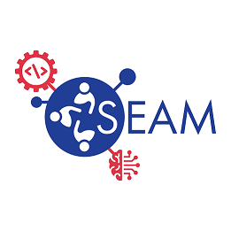

# SEAM Surrogate Modeling and Design Optimization Course Material



## Overview  

This repository contains materials for an introductory course on "Surrogate Modeling and Design Optimization," originally developed for the Shared Education in Artificial intelligence and Machine learning (SEAM) professional development program at Lawrence Livermore National Laboratory (LLNL). It features the `surmod` Python package, which implements core techniques including Feedforward Neural Networks (FFNNs) and Gaussian Processes (GPs) as surrogates, basic Bayesian Optimization (BO) for design optimization, and Sensitivity Analysis (SA). Weekly workflow scripts in the `scripts` directory demonstrate these methods in practice. Example datasets included in the `data` directory are used to support hands-on learning and experimentation.  

For more detailed documentation on the modules in the `surmod` package, please view our [documentation](https://seamsurrogates.readthedocs.io/en/latest/index.html).

Information about the SEAM program is available to employees of Lawrence Livermore National Laboratory at https://seam.llnl.gov  

Please send correspondence about this code to seam@llnl.gov  

## Getting Started

1. **Clone the repository**
```bash
    git clone https://github.com/LLNL/SEAMsurrogates.git
    cd SEAMsurrogates
```

2. **Create a virtual environment**
```bash
    python3 -m venv .venv
```

3. **Activate the virtual environment**
```bash
    source .venv/bin/activate
```

4. **Install dependencies**
```bash
    pip install -r requirements.txt
```

5. **Install the `surmod` package locally**
```bash
    pip install -e .
```

## Course Outline

| Week | Topic                                                    | Driver Scripts                                                                                                       |
| ---- | -------------------------------------------------------- | -------------------------------------------------------------------------------------------------------------------- |
| 1    | Intro to Deep Learning, PyTorch, and Surrogate Modeling  |                                                                                                                      |
| 2    | Intro to Neural Networks (NNs) as Surrogates             | [`nn_sandbox.py`](scripts/neural_network/nn_sandbox.py)                                                              |
| 3    | Exploring NN Surrogates for Example Data                 | [`nn_jag.py`](scripts/neural_network/nn_jag.py)                                                                      |
| 4    | Intro to Gaussian Processes (GPs) as Surrogates          | [`gp_sandbox.py`](scripts/gaussian_process_regression/gp_sandbox.py)                                                 |
| 5    | Exploring GP Surrogates for Example Data                 | [`gp_jag.py`](scripts/gaussian_process_regression/gp_jag.py)                                                         |
| 6    | Basic Bayesian Optimization (BO) for Design Optimization | [`bo_sandbox.py`](scripts/bayesian_optimization/bo_sandbox.py)                                                       |
| 7    | Exploring BO for Design Optimization on Example Data     | [`bo_jag.py`](scripts/bayesian_optimization/bo_jag.py)                                                               |
| 8    | Intro to Sensitivity Analysis                            | [`sa_sandbox.py`](scripts/sensitivity_analysis/sa_sandbox.py), [`sa_jag.py`](scripts/sensitivity_analysis/sa_jag.py) |
| 9    | Discuss Problem Statement Ideas for Final Project        |                                                                                                                      |
| 10   | Work on Final Project                                    |                                                                                                                      |
| 11   | Work on Final Project                                    |                                                                                                                      |
| 12   | Final Project Review & Presentation                      |                                                                                                                      |

## Contributors and Contact Information

- Jason Bernstein ([bernstein8@llnl.gov](mailto:bernstein8@llnl.gov))
- Emily Bogle ([bogle4@llnl.gov](mailto:bogle4@llnl.gov))
- Andrew Gillette ([gillette7@llnl.gov](mailto:gillette7@llnl.gov))
- Kevin Quinlan ([quinlan5@llnl.gov](mailto:quinlan5@llnl.gov))


## License

This software is distributed under the terms of the BSD-Commercial license. 

See Link to LICENSE and NOTICE for details.

## Release

LLNL-CODE-2010455