Below is a **dependency diagram** of the tables and views, organized hierarchically by batch names. The diagram shows how tables and views depend on each other and their relationships. The structure is rendered using **Mermaid syntax** for clarity.

```mermaid
graph TD
    %% Batch: Raw to Standard View
    subgraph "Batch: Raw to Standard View"
        raw_host --> host
        raw_macip --> host_ip
        raw_process --> process
        raw_process_conn_incr --> process_conn_incr
        process_conn_incr --> process_net_conn
        raw_process_file --> process_file
        raw_process_registry --> process_registry
        raw_imageload --> process_image_load
        process_exe_file_summary --> files_tmp_v1
        process_image_load --> files_tmp_v1
        process_file --> files_tmp_v1
        files_tmp_v1 --> files
        files --> all_files
    end

    %% Batch: Process Summary
    subgraph "Batch: Process Summary"
        process_registry --> process_registry_summary
        process_file --> process_file_summary
        process_net_conn --> process_net_summary
        process_image_load --> process_image_load_summary
        process --> process_summary
        process_registry_summary --> process_summary
        process_file_summary --> process_summary
        process_net_summary --> process_summary
        process_image_load_summary --> process_summary
        host --> process_summary
    end

    %% Batch: Label Summaries
    subgraph "Batch: Label Summaries"
        labels_networkx --> labels_graph_nodes
        labels_graph_nodes --> labels_graph_process_summary
        labels_graph_nodes --> labels_graph_net_conn
    end

    %% Batch: LOLBAS, MITRE, and SIGMA Summaries
    subgraph "Batch: LOLBAS, MITRE, and SIGMA Summaries"
        process --> process_lolbas_summary
        mitre_car --> process_mitre_summary
        mitre_labels --> process_mitre_summary
        sigma_labels --> sigma_labels_summary
        sigma --> sigma_labels_summary
    end

    %% Batch: Process Uber Summary
    subgraph "Batch: Process Uber Summary"
        process_summary --> process_uber_summary
        sigma_labels_summary --> process_uber_summary
        labels_graph_process_summary --> process_uber_summary
        process_lolbas_summary --> process_uber_summary
        process_mitre_summary --> process_uber_summary
    end
```

### **Explanation of the Diagram**
1. **Batch: Raw to Standard View**:
   - Raw data tables (e.g., `raw_host`, `raw_macip`) are transformed into standardized tables (`host`, `host_ip`, `process`, etc.).
   - Intermediate tables like `process_conn_incr` and `files_tmp_v1` are used to aggregate and summarize data before creating final tables like `process_net_conn` and `files`.

2. **Batch: Process Summary**:
   - Summarizes activity for processes, files, networks, and registry data into views like `process_summary`.
   - Combines data from multiple tables (e.g., `process_registry_summary`, `process_file_summary`) to create a unified view.

3. **Batch: Label Summaries**:
   - Extracts and summarizes labels from external sources (`labels_networkx`) into views like `labels_graph_nodes` and `labels_graph_process_summary`.

4. **Batch: LOLBAS, MITRE, and SIGMA Summaries**:
   - Integrates threat intelligence data (LOLBAS, MITRE, SIGMA) into process-related summaries.

5. **Batch: Process Uber Summary**:
   - Combines all process-related summaries, external labels, and threat intelligence into a comprehensive view (`process_uber_summary`).

This hierarchical structure shows the relationships and dependencies among the tables and views, grouped by their respective batches. Let me know if you need further clarification or adjustments!