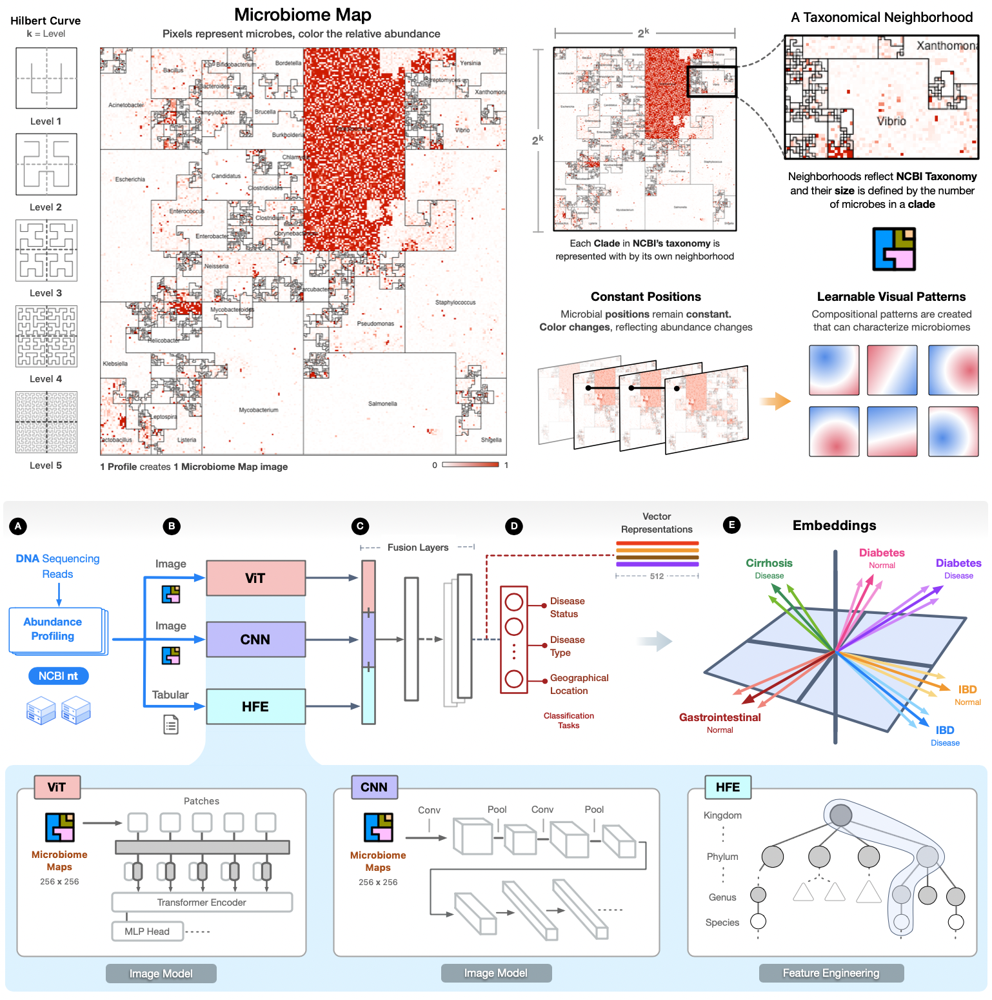
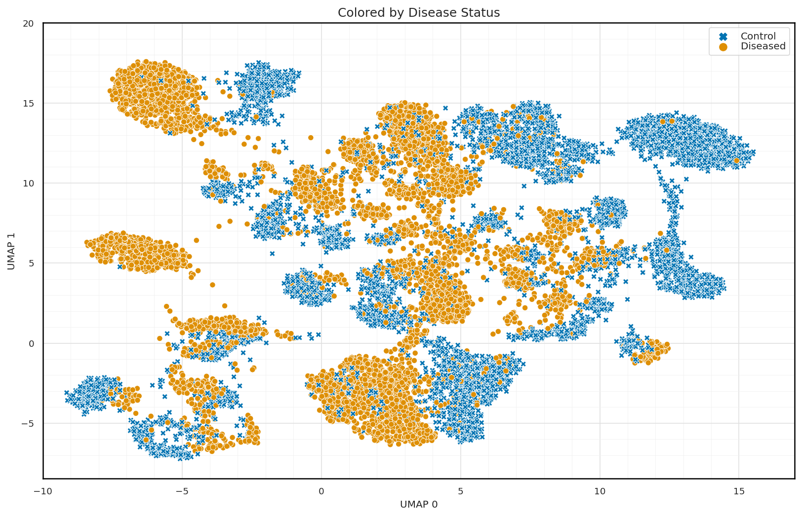

# Invisible Organ (invisorg): An Embeddings Fusion Approach Predicts Disease State from Microbiome Features

### Release
**LLNL Release Number**: LLNL-CODE-2014247


## Project Description
The code in this repository is in support of the main manuscript. This work highlights the use of an embeddings approach that can encode multiple features and create efficient contextualization of profiled metagenomes derived from microbiome samples using computer vision models and image representations of the abundance profiles. The model's embeddings can be used to cluster existing samples based on multiple conditions and interpretations, and new embeddings can be quickly created for new samples and fitted to existing clusters to characterize them. This has practical applications for unknown, unlabeled microbiome samples. The model's embeddings can be used to cluster existing samples based on multiple conditions and interpretations, and new embeddings can be quickly created for new samples and fitted to existing clusters to characterize them. This has practical applications for unknown, unlabeled microbiome samples.



# Getting Started
The datasets used in this work are sourced from the Meta2DB database described in the paper: [Meta2DB: A Curated Metagenomic and Metadata Database for Training Machine Learning Models to Predict Human Health](https://www.biorxiv.org/content/10.1101/2024.10.03.616398v1).

Meta2DB is a curated metagenomic and metadata database that provides structurally consistent microbiome taxonomy feature count tables for 13,897 samples across 84 studies, 23 disease states, and 34 geographical locations. All samples were uniformly processed using a streamlined metagenomic classification pipeline that employs a reference database indexed to contain all sequences across all kingdoms of life that were present in the NCBI Nucleotide (nt) database retrieved on Jan 04, 2023.

## Microbiome Map Images
A [microbiome map](https://www.frontiersin.org/journals/bioinformatics/articles/10.3389/fbinf.2023.1154588/full) is a 2D visualization of metagenomic abundance profiles created using a Hilbert curve visualization (HCV) technique, where each position (pixel) in the resulting square image corresponds to a single microbial genome from a reference collection. The position's (e.g., a microbe) intensity color value represents the relative abundance of that microbe in a metagenomic sample. Tabular profiles are converted into images with the [Jasper](https://www.microbiomemaps.org) tool. An image is created for each profile, with no neighborhood labels as they are only useful for inspecting single images. Pixels represent a single microbe, with color corresponding to their CLR abundance.

The **hot spots** represent regions of high microbial abundance that appear as bright pixels clustered within specific neighborhoods, serving as distinctive spatial signatures that can identify unique biological patterns. These "hot spots" arise when particular microbial taxa reach elevated abundance levels, creating visual patterns that reflect the underlying biological state of a sample. The spatial distribution and intensity can encode multiple layers of biological information simultaneously (taxonomic composition, condition-specific signatures) making them powerful discriminative features for pattern recognition.

For learning tasks, hot spots can be extracted as spatial features, where their location, intensity, size, and clustering patterns become quantitative descriptors that distinguish between sample types. The Hilbert curve's locality-preserving properties ensure that nearby pixels represent related microbes, making hot spot spatial patterns biologically meaningful.

## Hierarchical Feature Engineering (HFE)
We also leverage NCBI's taxonomy by using hierarchical feature engineering (HFE) to create features at different lineages and taxonomic paths. These features represent the most informative taxonomic elements and aggregated abundances, which capture phylogenetic compositions and their relationships to disease variables.
HFE uses a four-phase pipeline that starts by engineering features through bottom-up taxonomic tree traversal, summing relative abundances of child taxa to create higher-level taxonomic features. It then applies correlation-based filtering to remove redundant child nodes that are highly correlated with their parents, followed by information gain-based filtering to retain only informative features along taxonomic paths. This is the key of HFE: rather than working with thousands of individual sequences, we get a compact set of features at the most informative taxonomic levels that capture the phylogenetic relationships relevant for a classification task.

We modified the original method from the paper ["Taxonomy-aware feature engineering for microbiome classification"](https://bmcbioinformatics.biomedcentral.com/articles/10.1186/s12859-018-2205-3) by Oudah & Henschel to support an alternative implementations of information gain methods alongside the original WEKA method. The [`hfe`](hfe/hfe.py) method also supports running in a linux cluster with the option of not using WEKA.

Our new HFE implementation can be found in [`hfe.py`](hfe/hfe.py).

</br>

## PyTorch Dataset Loader
The [`dataset.py`](datasets/dataset.py) file contains a PyTorch dataset class, `PublicMicrobiomeDataset`, that loads microbiome map images and their metadata.

### CSV Labels
The file [`paper_labels_v1.5b_joint.csv`](labels/paper_labels_v1.5b_joint.csv) contains the necessary labels and metadata information. Example format for labels are:

```
sample_name,dataset,status,type,site,country
SRR6784403,2017_NagySzakalD,control,neurological,human gut,USA
SRR6784404,2017_NagySzakalD,diseased,neurological,human gut,USA
SRR6784405,2017_NagySzakalD,diseased,neurological,human gut,USA
.
.
```

**Optional:** The dataset contains the flag `use_hfe` which if `True` requires HFE features be provided in the parameter `hfe_features`.

</br>

# Training
We trained our models with 3-runs of 5-fold cross validation for "disease status" using binary classification; for multi-class classification using "disease type", "body site", or "geographical location"; and for multi-label classification which combines all factors.

Our data consists of 13K microbiome map images, with 90% used for training and validation (80%/20%), and 10% used for testing (holdout). We first train and evaluate our custom ViT and CNN models on the same data and then integrate them as submodel backbones into the fusion architecture by removing their classification heads and routing output features to the trainable layers

The training implementation can found in the script [`train_models.py`](train_models.py).

</br>

# Models
The models in this repository constructs a unified representation space which creates embeddings that can form clusters of biologically meaningful subgroups and reveal patterns across multiple metadata dimensions. Our results show that computer vision models can be trained with **visual** representations of metagenomic profiles, and enable the classification of human health-relevant phenotypes with high accuracy and strong potential for future generalizability.

## Convolutional Neural Network (CNN)
We implement a custom sparse-aware CNN that consists of five convolutional blocks, with spatial attention masks applied after the second and fifth blocks to suppress low-activation background areas and focus the model's feature extraction on regions of stronger activation, i.e., "hot spots" of very abundant microbes. Each block consists of convolution, BatchNorm, ReLU, dropout, and max-pooling stages. Activation masks are applied at two points in the network, after the second block and after the fifth block. After masking, the feature maps are flattened and passed through a two-layer classifier that outputs either probabilities for multi-label tasks or raw logits otherwise. This architecture preserves efficiency while improving focus on taxonomical neighborhoods.

The implementation can be found in [`cnn.py`](models/cnn.py).

## Vision Transformer (ViT)
Our ViT implementation follows standard architectures and includes image tokenization and positional embeddings (Figure 3 in the manuscript), followed by four transformer blocks that allow the model to integrate the spatially discrete abundance patches within a map. The blocks split the input (patch-level feature vectors) into subspaces (i.e., distinct projections that let each head see different feature combinations) so the model can learn a variety of disease patterns in parallel. Our ViT model contains 10.7 million trainable parameters, and outputs a feature vector of size 512.

The implementation can be found in [`vit.py`](models/vit.py).

## Fusion Model
Our fusion model combines a CNN and ViT to learn the unique visual patterns in our representations, which leverages the CNN's ability to learn **local** patterns with the ViT's strength in modeling **global** context, making it well-suited for the spatial details of the maps.

The implementation can be found in [`fusion.py`](models/fusion.py).


### Embeddings
We generate our embeddings using the fusion model trained with a multi-label classification scheme, making a forward pass with each map. The dimension of our embeddings was chosen empirically as 512. This size provided a good tradeoff in representing the visual patterns in our maps and generated the best performance in clustering and generalization evaluations (see the paper's supplementary materials).

The notebook [`fusion.ipynb`](notebooks/fusion.ipynb) contains a workflow for extracting the model's embeddings for our samples.



</br>

## Software Requirements

The following python packages are required, but do check each of the files for a comprehensive list of the required packages (all Python).

```python
iterative_stratification
matplotlib
numpy
pandas
scikit_learn
scipy
seaborn
tabulate
torch
torchinfo
torchvision
tqdm
weka  # used for HFE only.
```

## Dependencies
See [`requirements.txt`](/requirements.txt) for details.


### Installing third-party packages

```bash
pip install numpy pandas matplotlib seaborn, etc.
```

</br>

# License
The software is distributed under the GNU GENERAL PUBLIC LICENSE, Version 3. See [`LICENSE`](/LICENSE) file for details.

</br>

# Paper Citation
Submitted to [BMC Microbiome](https://microbiomejournal.biomedcentral.com/).

Valdes C, Goncalves A, Kok C, Zhu H, Zhang B, Ranganathan H, Thissen J, Marti JM, Mulakken N, Jaing C, Be N. _An Embeddings Fusion Approach Predicts Disease State from Microbiome Features_. SUBMITTED.


</br>

## Source Code Author(s)
 - Camilo Valdes [[camilo@llnl.gov](mailto:camilo@llnl.gov)]

### Getting Involved
If you would like to get involved news and developments regarding this project, please bookmark and monitor this project for updates.

### Contributing
If you would like to contribute to the development of this project, please contact [[camilo@llnl.gov](mailto:camilo@llnl.gov)]. All contributions, including patches and pull requests, will be reviewed. Submission does not guarantee acceptance. Review timelines are unpredictable and may be lengthy. Please do not expect a prompt acknowledgement or response.

**Scope of Contributions**</br>
This project accepts contributions in the following areas:

- Bug fixes
- Documentation improvements
- Performance optimizations

Feature requests and new functionality may be considered, but this project maintains a narrow focus. Before investing significant time on a contribution, consider reaching out to discuss whether it aligns with the project's direction.

The following are generally out of scope:
- New external dependencies
- Major architectural changes
- Features outside the core focus of the paper

### Reporting Bugs
If you encounter a bug, please open an issue with a clear description of the problem, steps to reproduce it, and any relevant environment details (OS, version, etc.). Do note that not all reported bugs will be addressed, and there is no guaranteed timeline for fixes.

### Licensing
By submitting a contribution, you agree that your work will be licensed under the same license as this project.
