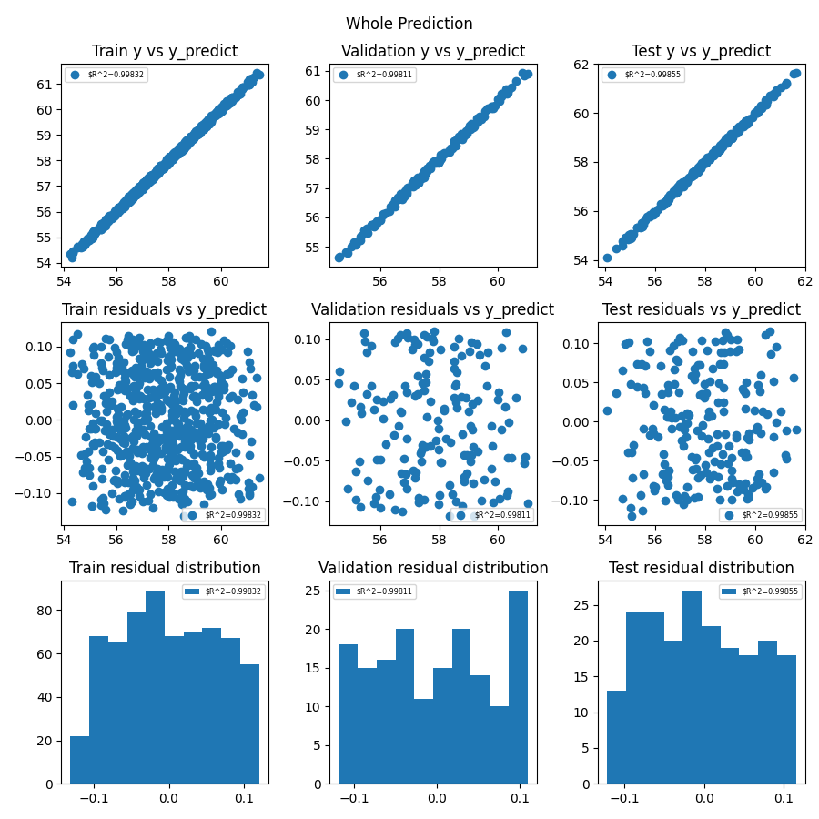

# Ball Bounce Metadata Machine Learning

This tutorial is built on top of the [Ball Bounce VVUQ](../bouncing_ball_vvuq/1_baseline_simulation.md) tutorial by creating a machine learning model using the metadata added to the simulation ensembles.

## Overview

In the previous LSTM and Transformer tutorials we trained the models to predict the transient behavior of a simulation by giving it the data at the start of the simulation. This is useful if a user is interested in gathering the transient simulation data by calling the less expensive LSTM or Transformer model (after it has been trained) rather than the more expensive high fidelity full physics simulation. However, if one is just interested in the end result of the simulation, this end result can be considered the label while the initial conditions of the simulation can be considered the features for a machine learning model. Thus, one can train a machine learning model using these features (initial conditions) and labels (end result). We will use [SciKit Learn's](https://scikit-learn.org/stable/) machine learning algorithms for this tutorial.

## Changes to Ball Bounce VVUQ tutorial

Same changes as the Ball Bounce LSTM tutorial.

## Visualization Metadata Machine Learning Kosh Notebook

This notebook allows the user to train a machine learning model and visualize its predictions. The notebook can be updated as needed to modify the machine learning model and post-process the prediction results. The notebook automatically gets converted to a Python script using the command `jupyter nbconvert --to script $(SPECROOT)/*.ipynb` in the `metadata-machine-learning-ball-bounce` step so there is no need to manually export it to a script. The notebook has more details on what training a machine learning model entails.

Below is the plot of the machine learning model prediction and its true value for comparison. This is where fine tuning the model becomes an "art" since adjusting these values could give a completely different prediction. What works for this set of ensembles might not work for another. Note that due to the randomness of the data split, the predictions below will not be the same each time.

```
from sklearn.linear_model import LinearRegression

LinReg = LinearRegression()
```



## How to run

1. Run `setup.sh` in the top directory to create a virtual environment with all necessary dependencies and install the jupyter kernel.

2. Run `source weave_demos_venv/bin/activate` to enter the virtual environment (you can `deactivate` when you've finished the demo to exit it) and `cd` back into this directory.

3. Follow the steps below.
   1. Run `merlin run ball_bounce_suite_merlin_metadata_machine_learning.yaml --pgen pgen_ensembles.py` and `merlin run-workers ball_bounce_suite_merlin_metadata_machine_learning.yaml`
      1. Change `NUM_STUDIES = 1024` to a smaller number depending on computer capability  (e.g. 64) in `pgen_ensembles.py`
   2. Run `visualization_metadata_machine_learning_kosh.ipynb`
      1. Update the machine learning model and/or update `NUM_STUDIES` above to get more training samples

  * Note: If the notebook `visualization_metadata_machine_learning_kosh.ipynb` is to your liking, you can just run step 1 above and the updated notebook will automatically be exported as a script.

## Content overview

### Starting files:

- `create_store.py`: Create store that will be used throughout workflow.
- `ball_bounce.py`: The "simulation" script, containing all the logic for bouncing the ball.
- `dsv_to_kosh.py`: A bare-bones ingester that finds dsv files and inserts them into a Kosh datastore using the parallel safe threadsafe methods.
- `pgen_ensembles.py`: A custom parameter generator for Maestro and Merlin containing the uncertainty bounds of the parameters for the baseline simulation ensemble.
- `ball_bounce_suite_merlin_metadata_machine_learning.yaml`: The Merlin workflow description for running the baseline simulation ensemble, consolidating the data into a datastore, and training the machine learning model.
- `visualization_metadata_machine_learning_kosh.ipynb`: A Jupyter notebook to train the machine learning model.

### Files created by the demo:

- `ball-bounce-metadata-machine-learning`
  - `create-initial-store`: Contains the code to create store.
  - `run-ball-bounce/`: Contains the baseline simulation ensemble.
  - `ingest-ball-bounce/`: Contains the code to add the baseline simulation ensemble to the datastore.
  - `metadata-machine-learning-ball-bounce/`: Contains the images created by the Jupyter notebook.