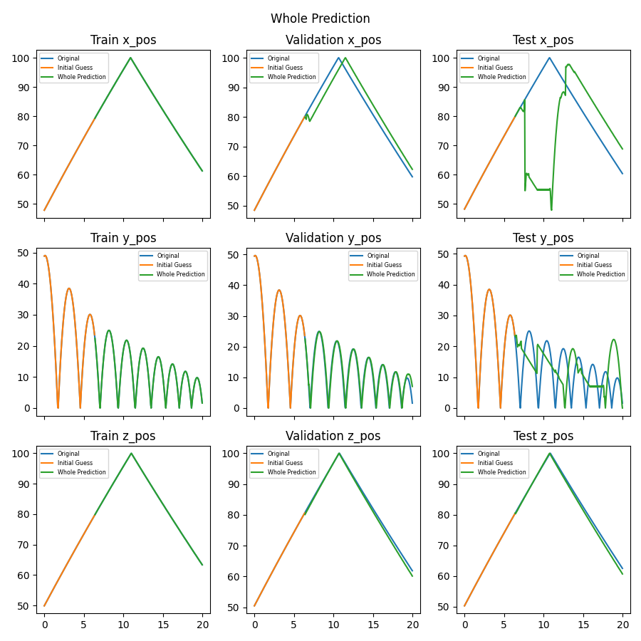

# Ball Bounce Transformer

This tutorial is built on top of the [Ball Bounce VVUQ](../bouncing_ball_vvuq/1_baseline_simulation.md) tutorial by creating a Transformer using the data from the simulation ensembles.

## Overview

A Transformer is a type of Neural Network (NN) that can process data where order is important such as text and time history data. One of the benefits of a Transformer over a Long Short-Term Memory (LSTM) is that transformers can process the tokens (words) in parallel through self-attention for better GPU utilization while LSTMs process the tokens in sequential order. This self-attention also allows each token to gather context from the other words in the sentence to better understand its meaning in relation to the other words in the sentence while the LSTM's sequential processing causes it to predict only on the final sentence vector which is compressed information since each word can't "see" all the other words. More information can be found in ["Attention Is All You Need"](https://arxiv.org/abs/1706.03762). This tutorial will use [Tensorflow](https://www.tensorflow.org/) which is a Machine Learning library developed by Google. [Keras](https://keras.io/) is an API for Tensorflow that allows users to easily and more intuitively work with Tensorflow. This tutorial is based on [Neural machine translation with a Transformer and Keras](https://www.tensorflow.org/text/tutorials/transformer).

## Changes to Ball Bounce VVUQ tutorial

Same changes as the Ball Bounce LSTM tutorial.

## Visualization Transformer Kosh Notebook

This notebook allows the user to train a Transformer model and visualize its predictions. The notebook can be updated as needed to modify the Transformer model and post-process the prediction results. The notebook automatically gets converted to a Python script using the command `jupyter nbconvert --to script $(SPECROOT)/*.ipynb` in the `transformer-ball-bounce` step so there is no need to manually export it to a script. The notebook has more details on what training a Transformer model entails.

Below is the plot of the Transformer prediction and its true value for comparison. This is where fine tuning the model becomes an "art" since adjusting these values could give a completely different prediction. What works for this set of ensembles might not work for another. Note that due to the randomness of the data split and the training early stopping, the predictions below will not be the same each time. Training the model requires a lot of data and time thus the plot below is from a model that was quickly trained with minimal data.

```
num_layers = 4  # The number of encoder and decoder layers
d_model = 128  # The Positional Embedding depth (how many "linguistic" features to create per word)
dff = 512  # How many nodes the feed forward network has per layer
num_heads = 8  # The number of self-attention heads
dropout_rate = 0.1  # Dropout rate in feed forward network

transformer = Transformer(
    num_layers=num_layers,
    d_model=d_model,
    num_heads=num_heads,
    dff=dff,
    input_vocab_size=VOCAB_SIZE+1,
    target_vocab_size=VOCAB_SIZE+1,
    dropout_rate=dropout_rate)
```



## How to run

1. Run `setup.sh` in the top directory to create a virtual environment with all necessary dependencies and install the jupyter kernel.

2. Run `source weave_demos_venv/bin/activate` to enter the virtual environment (you can `deactivate` when you've finished the demo to exit it) and `cd` back into this directory.

3. Follow the steps below.
   1. Run `merlin run ball_bounce_suite_merlin_transformer.yaml --pgen pgen_ensembles.py` and `merlin run-workers ball_bounce_suite_merlin_transformer.yaml`
      1. Change `NUM_STUDIES = 1024` to a smaller number depending on computer capability  (e.g. 64) in `pgen_ensembles.py`
   2. Run `visualization_transformer_kosh.ipynb`
      1. Update the transformer model and/or update `NUM_STUDIES` above to get more training samples

  * Note: If the notebook `visualization_transformer_kosh.ipynb` is to your liking, you can just run step 1 above and the updated notebook will automatically be exported as a script.

## Content overview

### Starting files:

- `create_store.py`: Create store that will be used throughout workflow.
- `ball_bounce.py`: The "simulation" script, containing all the logic for bouncing the ball.
- `dsv_to_kosh.py`: A bare-bones ingester that finds dsv files and inserts them into a Kosh datastore using the parallel safe threadsafe methods.
- `pgen_ensembles.py`: A custom parameter generator for Maestro and Merlin containing the uncertainty bounds of the parameters for the baseline simulation ensemble.
- `ball_bounce_suite_merlin_transformer.yaml`: The Merlin workflow description for running the baseline simulation ensemble, consolidating the data into a datastore, and training the transformer.
- `visualization_transformer_kosh.ipynb`: A Jupyter notebook to train the transformer.

### Files created by the demo:

- `ball-bounce-transformer`
  - `create-initial-store`: Contains the code to create store.
  - `run-ball-bounce/`: Contains the baseline simulation ensemble.
  - `ingest-ball-bounce/`: Contains the code to add the baseline simulation ensemble to the datastore.
  - `transformer-ball-bounce/`: Contains the images created by the Jupyter notebook.