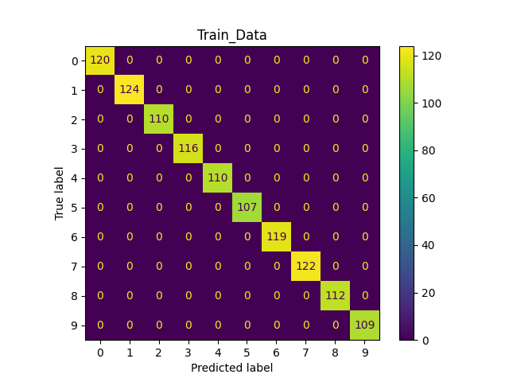

# Digit Classification

This tutorial will use Machine Learning to classify handwritten digits from the following dataset: [Optical Recognition of Handwritten Digits](https://archive.ics.uci.edu/dataset/80/optical+recognition+of+handwritten+digits). This will showcase the use of Kosh Loaders which can read any type of data.

## Overview

Kosh is a powerful database tool that can be used to store, load, and modify different types of data such as scalar/string data, timeseries data, metadata, and different filetypes. We will use Kosh to store [Optical Recognition of Handwritten Digits](https://archive.ics.uci.edu/dataset/80/optical+recognition+of+handwritten+digits) and add metadata to it. We will then load the images through Kosh and prepare them for classification machine learning model. We will use [SciKit Learn's](https://scikit-learn.org/stable/) machine learning algorithms for this tutorial.

## Visualization Digit Classification Kosh Notebook

This notebook allows the user to train a machine learning model and visualize its predictions. The notebook can be updated as needed to modify the machine learning model and post-process the prediction results. The notebook has more details on what training a machine learning model entails.

Below is the confusion matrix of the machine learning model prediction and its true value for comparison. This is where fine tuning the model becomes an "art" since adjusting these values could give a completely different prediction. What works for this set of data might not work for another. Note that due to the randomness of the data split, the predictions below will not be the same each time.

```
from sklearn.linear_model import LogisticRegression

LogReg = LogisticRegression()
```



## How to run

1. Run `setup.sh` in the top directory to create a virtual environment with all necessary dependencies and install the jupyter kernel.

2. Run `source weave_demos_venv/bin/activate` to enter the virtual environment (you can `deactivate` when you've finished the demo to exit it) and `cd` back into this directory.

3. Run `visualization_metadata_machine_learning_kosh.ipynb` as it contains all the necessary information.

## Content overview

### Starting files:

- `visualization_metadata_machine_learning_kosh.ipynb`: A Jupyter notebook to train the machine learning model.

### Files created by the demo:

- `*confusion_matrix.png`: Confusion matrices of the Train, Validation, and Test datasets for the machine learning model.
- `images/`: The location of each datapoint saved image.