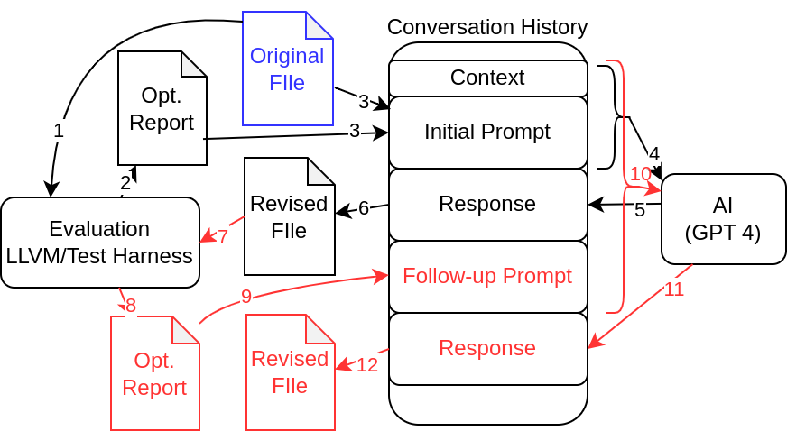

# CompilerGPT

Compiler optimization reports are an important tool for performance engineers. However, they are often too complex for non compiler experts. CompilerGPT attempts to harness the power of LLM AI models to automatically attempt optimizations suggested by the optimization reports.

CompilerGPT is a framework that submits compiler optimization reports (e.g., clang) and the source code to an LLM. The LLM is prompted to prioritize the findings in the optimization reports and then to make changes in the code accordingly. An automated test harness validates the changes. The test harness provides feedback to the LLM on any errors that were introduced to the code base.

CompilerGPT iterates with the LLM a given number of times and reports on the obtained correctness and performance results of each iteration.

CompilerGPT calls AI modules through scripts which makes it flexible to use with different frameworks. Most connections are based on CURL. A legacy configuration for OpenAI's Python framework also exists. CompilerGPT's auto-configuration currently supports OpenAI, Anthropic, openrouter, and ollama.

## LLMTools Library

The `llmtools` branch contains a C++ dynamic library that factors out basic elements of interacting with LLMs. This library provides a clean interface for creating conversation histories, appending prompts, querying LLMs, and processing responses. A test driver (`test-llmtools.bin`) demonstrates simple usage of the library.

### Robustness

The current implementation uses a fail-fast approach when handling malformed LLM responses:
- If the response is invalid JSON, the parser throws an exception and the application terminates
- If the JSON is valid but the expected response field is missing, it throws a `boost::system::system_error`
- The logging system captures these exceptions to aid in diagnosis

Future improvements could include:
- Schema validation before accessing JSON fields
- Graceful degradation (marking responses as invalid while continuing execution)
- Retry mechanisms with back-off for HTTP 5xx errors
- Size and content validation guards

For more information on when to use this library compared to other C++ interfaces for LLMs, see [LLMTools Usage Guidelines](docs/llmtools-guidelines.md).

---

## Badges

<!-- Add build status, license, and documentation badges here -->
[](LICENSE)

---

## Getting Started

### Minimal Requirements

- C++ compiler supporting C++20, e.g. GCC 12+
  - make: Boost header only (boost > 1.78 such as 1.85, 1.87). Required libraries include algorithm, asio, json, process
  - cmake (>=3.24): downloads boost 1.84 automatically
- curl
- Python 3 (for prettyjson.py)

#### LLMTools Library Requirements

The `llmtools` library has the following dependencies:
- C++ compiler supporting C++14 (for ROSE compatibility)
- Boost libraries:
  - Boost.JSON
  - Boost.Filesystem
  - Boost.Process
  - Boost.Asio
  - Boost.Utility (for string_view)
  - Boost.Lexical_Cast

#### Installing Dependencies

- **Boost**: Download and install from https://www.boost.org/ or use cmake for installation
- **curl**: Install via your package manager (e.g., `sudo apt install curl`)
- **Python 3**: Install via your package manager (e.g., `sudo apt install python3`)

#### Install with make

Set BOOST\_HOME to the boost installation directory and call make to build compgpt.bin, logfilter.bin, and prettyjson.bin.

```bash
compilergpt> export BOOST_HOME="/path/to/boost/installation"
compilergpt> make -j8
```

#### Install with cmake

Build compgpt.bin, logfilter.bin, and prettyjson.bin with cmake. cmake will download and use a tested boost version.

```bash
compilergpt> mkdir build
compilergpt> cd build
compilergpt/build> cmake ..
compilergpt/build> make -j8
```

---

### Directory Structure

- `include/`: C++ header files
- `src/`: C++ sources (compgpt and tools)
- `scripts/`: Scripts to interact with AI (gpt, claude, ollama, openrouter)
- `tests/`: Test codes to illustrate the working of CompilerGPT
- `figures/`: Diagrams and workflow figures
- `VERSION`, `version.mk`: Versioning information

---

## Utilities

- **compgpt.bin**: Main binary for running CompilerGPT.
- **logfilter.bin**: Utility for filtering logs.
  _Usage: `./logfilter.bin [options] < input.log > output.log`_
  _[Add more details as needed]_
- **prettyjson.bin**: Pretty-prints JSON files (C++ version).
  _Usage: `./prettyjson.bin input.json`_
- **prettyjson.py**: Pretty-prints JSON files (Python version).
  _Usage: `python3 src/prettyjson.py input.json`_
- **test-llmtools.bin**: Test driver for the LLMTools library.
  _Usage: `./test-llmtools.bin [--log=<file>] [--model=<model>]`_
  _Build with: `make CXXVERSION=-std=c++14 test-llmtools.bin`_

---

## Scripts

| Script | Purpose | Usage Example |
|--------|---------|---------------|
| scripts/claude/exec-claude.sh | Run queries with Anthropic Claude | `bash scripts/claude/exec-claude.sh ...` |
| scripts/gpt4/exec-openai.sh | Run queries with OpenAI GPT-4 | `bash scripts/gpt4/exec-openai.sh ...` |
| scripts/gpt4-python/exec-gpt-4o.sh | Run queries with OpenAI GPT-4o (Python) | `bash scripts/gpt4-python/exec-gpt-4o.sh ...` |
| scripts/gpt4-python/query-gpt-4o.py | Python utility for GPT-4o | `python3 scripts/gpt4-python/query-gpt-4o.py ...` |
| scripts/ollama/exec-ollama.sh | Run queries with Ollama | `bash scripts/ollama/exec-ollama.sh ...` |
| scripts/openrouter/exec-openrouter.sh | Run queries with OpenRouter | `bash scripts/openrouter/exec-openrouter.sh ...` |

To add a new LLM provider, create a new subdirectory in `scripts/` and add an `exec-*.sh` script following the existing pattern.

---

## Tests

- Test suites are in `tests/`, with subdirectories for different benchmarks.
- `humaneval/` contains paired `*_declaration.cc` and `*_test.cc` files.
- `llmtools-example/` contains a minimal example of using the LLMTools library to create a code optimization assistant. See [its README](tests/llmtools-example/README.md) for details.
- Other suites: `matmul-1/`, `matmul-2/`, `matmul-3/`, `nas-benchmarks/`, `omp-prefixsum/`, `simple/`, `smith-waterman/`, `translation-dafny-ada/`, `translation-dafny-cpp/`, etc.

### Running Tests

- If a test target exists in the Makefile:
  _Usage: `make test`_
  Otherwise, run tests manually as described in the relevant test directory.

### Adding Tests

- Follow the structure in `humaneval/` for new test cases: create a `*_declaration.cc` and a corresponding `*_test.cc` file.
- For other suites, follow the conventions in their respective directories.

---

## Figures

- Diagrams and workflow figures are in `figures/`.
- Example:
  

---

## Environment Variables

GPT Environment: Default queries will use OpenAI's API (in scripts/gpt4/). Three environment variables control the invocation:
- `OPENAI_API_KEY`: the openai key for queries
- `SSL_CERT_FILE` (optional): the location of a root certificate to avoid SSL connection errors.

Claude Environment:
- `ANTHROPIC_API_KEY`: the key to support Claude requests

Openrouter.ai Environment:
- `OPENROUTER_API_KEY`: the key to support openrouter.ai requests

---

## Building and Running CompilerGPT

### Build CompilerGPT

Set the BOOST_HOME environment variable to your Boost installation directory and build:

    export BOOST_HOME="/path/to/boost/install/dir"
    make # builds all binaries (`compgpt.bin`, `logfilter.bin`, `prettyjson.bin`).

### Building LLMTools

To build the LLMTools library and test driver:

    make CXXVERSION=-std=c++14 test-llmtools.bin

This explicitly sets the C++14 standard to ensure compatibility with ROSE.

### Using LLMTools

Before running the test driver, you need to set the LLMTOOLS_PATH environment variable to point to the CompilerGPT repository:

    export LLMTOOLS_PATH=/path/to/CompilerGPT/

You also need to have your OpenAI API key set in the environment:

    export OPENAI_API_KEY=your_api_key_here

To run the test driver:

    ./test-llmtools.bin

This will query the OpenAI API with a simple code optimization prompt and display the result:

```
The default model for OpenAI is gpt-4o

AI response:
To optimize the given code snippet, you can use the multiplication operator to achieve the same result more efficiently. Instead of adding `x` to itself multiple times, you can multiply `x` by 4:

x = x * 4;

This change reduces the number of operations and makes the code more concise and clear.
```

#### Command Line Options

The test driver supports several command line options:

- `--help`: Display help message
- `--log=<file>`: Enable logging to the specified file
- `--model=<model>`: Specify a different model than the default (gpt-4o)

Example with logging enabled:

    ./test-llmtools.bin --log=llmtools.log

This will create a log file with detailed information about the execution:

```
[Tue Aug 26 16:13:54 2025] Logging started
[Tue Aug 26 16:13:54 2025] LLMTOOLS_PATH: /Users/liao6/workspace/CompilerGPT/
[Tue Aug 26 16:13:54 2025] Default model for OpenAI: gpt-4o
[Tue Aug 26 16:13:54 2025] Configuring llmtools with path: /Users/liao6/workspace/CompilerGPT/
[Tue Aug 26 16:13:54 2025] Configuration complete
[Tue Aug 26 16:13:54 2025] System prompt: You are an expert programmer and skilled in C++ program optimization
[Tue Aug 26 16:13:54 2025] Creating conversation history
[Tue Aug 26 16:13:54 2025] Conversation history created
[Tue Aug 26 16:13:54 2025] User prompt: Optimize the following code snippet: ```cpp x = x + x + x + x;''' where x is of type int.
[Tue Aug 26 16:13:54 2025] Appending prompt to conversation history
[Tue Aug 26 16:13:54 2025] Prompt appended
[Tue Aug 26 16:13:54 2025] Querying LLM for response
[Tue Aug 26 16:13:59 2025] Response received
[Tue Aug 26 16:13:59 2025] AI response: To optimize the given code snippet...
[Tue Aug 26 16:13:59 2025] Execution completed successfully
```

#### Known Issues with LLMTools

1. **JSON Library**: The library uses Boost.JSON instead of nlohman's JSON library. This is not expected to be an issue even though ROSE prefers nlohman.

2. **Concurrent Queries**: The library does not support concurrent queries from the same working directory because files with the same names could be overwritten.

### Running CompilerGPT

To run CompilerGPT on a C++ source file with a configuration:

    compgpt.bin --config=configfile.json c++-source-file

The configuration is read from the specified JSON file, which defines how to interact with the target compiler and LLM system.

### Creating Configuration Files

A default configuration can be created with:

    compgpt.bin --create-config --config=configfile.json

#### Using Alternative LLMs

Claude is an alternative to the GPT model. It can be used similarly, but requires a different configuration. For example, to create a default Claude configuration:

    compgpt.bin --create-config --config=claude.json --config:ai=claude --config:model=claude-3-5-sonnet-20241022

CompilerGPT works with both clang and gcc. To generate a configuration for gcc:

    compgpt.bin --create-config --config=gcc-claude.json --config:ai=claude --config:compiler=/usr/bin/g++

#### Deriving New Configurations

New configurations can be derived from existing ones using the `--config:from` option. This is useful for creating various configurations for different AI components or compilers that share prompts and evaluation scripts:

    compgpt.bin --create-config --config=ollama.json --config:ai=ollama --config:model=llama3.3 --config:from=claude.json

### Cleanup

- `make clean` removes object files.
- `make pure` removes binaries and intermediate files.

---

## Versioning

- Version information is in `VERSION` and `version.mk`.
- Update the `VERSION` file to change the project version.


---

## Example

CompilerGPT generates different versions and a [conversation history](Example.md).

---

## Other Use Cases

In addition, compgpt can be setup to use AI for translation projects. Currently, the config file needs to be tweaked manually to support that use case.

---

## License

CompilerGPT is distributed under a BSD 3 license.

SPDX-License-Identifier: BSD-3-Clause

See the LICENSE file for details.

Third-party benchmarks distributed with CompilerGPT retain the original licensing. See the respective directories for license details.

---

## Project Status

1.x Demonstrates the basic workflow

---

## Source Code Release

Copyright (c) 2025, Lawrence Livermore National Security, LLC.
All rights reserved. LLNL-CODE-2001821

---

## Contributing

Contributions are welcome! Please open issues or pull requests.
[Add code style and contribution guidelines here or link to CONTRIBUTING.md if available.]

---

## Platform Support

- Supported platforms: Linux (tested).
- Other platforms may work but are not officially supported.
