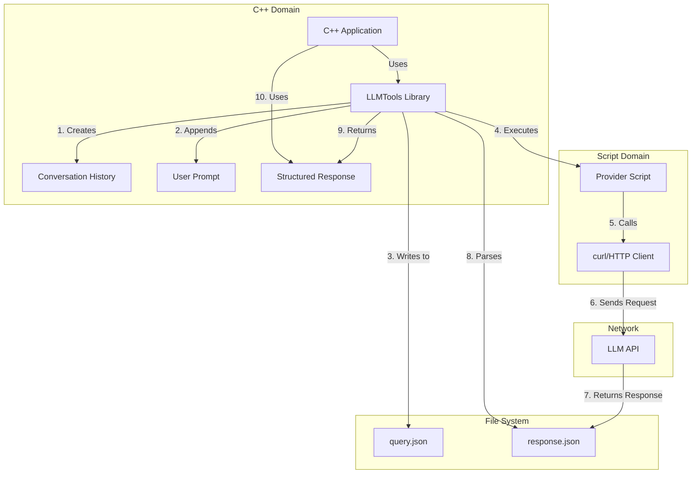

# LLMTools Usage Guidelines

## 1. The Typical C++ Choices Today

| Category                               | Representative libraries / approaches                                                                                                                                                 | Main Characteristics                                                                                                                                                                                                                                                                                               |
| -------------------------------------- | ------------------------------------------------------------------------------------------------------------------------------------------------------------------------------------- | ------------------------------------------------------------------------------------------------------------------------------------------------------------------------------------------------------------------------------------------------------------------------------------------------------------------ |
| **Thin REST wrappers**                 | • **libcpr** (C++ Requests)  • **cpp-httplib** + **nlohmann/json**  • **Boost.Beast** (+ your JSON lib)  • Community OpenAI wrappers (**liboai**, **openai-cpp**)                     | Minimal abstractions: you build HTTP requests and JSON payloads yourself. Fast to integrate and easy to vendor (often header-only), but you own retries, streaming chunk handling, auth flows, and error policy. ([GitHub][1], [Boost][2])                                                                         |
| **Full SDKs / service clients (C++)**  | • **AWS SDK for C++** (Amazon Bedrock Runtime)  • **Google Cloud Vertex AI** C++ Client (AI Platform)  • **NVIDIA Triton Inference Server** C++ client                                | Higher‑level clients with built‑in auth, retries, pagination/streaming (often gRPC) and telemetry hooks; larger dependency trees. **Note:** OpenAI does not ship an official C++ SDK; use REST or community libs. ([sdk.amazonaws.com][3], [Google Cloud][4], [NVIDIA Docs][5], [OpenAI Platform][6], [GitHub][7]) |
| **Embedded / on-device**               | • **llama.cpp** (C/C++ API; optional REST server)  • **TensorRT‑LLM** C++ runtime (NVIDIA GPUs)  • **ONNX Runtime** C++ API  • **whisper.cpp** (local ASR)  • **GGUF/GGML** executors | Run models locally (no network). Great for edge/HPC; requires model conversion/quantization and careful memory/VRAM budgeting. Footprint varies from tiny CPU‑only builds to GPU‑accelerated runtimes. ([GitHub][8], [NVIDIA Docs][9], [ONNX Runtime][10])                                                         |
| **Framework-style orchestration libs** | • **llama.cpp server** + C++/HTTP clients  • **instinct.cpp** (agent/RAG in C++)  • **LLMKit++** (LangChain‑inspired, Ollama‑backed)                                                  | Opinionated chains/agents, tools, and memory abstractions. Smaller/younger ecosystems in C++ compared to Python; useful when you want built‑ins beyond raw API calls. ([GitHub][8])                                                                                                                                |

**Notes & sources (updated Aug 2025):**

* `libcpr` releases and repo; `cpp-httplib` releases; `nlohmann/json`; `Boost.Beast` docs. ([GitHub][11], [Boost][2])
* Community OpenAI C++ libraries: `liboai`, `openai-cpp`. OpenAI’s official SDKs focus on Python/JS/.NET, not C++. ([GitHub][12], [OpenAI Platform][6])
* Full SDKs / clients: AWS Bedrock Runtime (C++), Google Cloud Vertex AI C++ client, NVIDIA Triton C++ client libs. ([sdk.amazonaws.com][3], [Google Cloud][4], [NVIDIA Docs][5])
* Embedded / on‑device: `llama.cpp`, GGUF format, TensorRT‑LLM C++ runtime, ONNX Runtime C++ API, `whisper.cpp`. ([GitHub][8], [NVIDIA Docs][9], [ONNX Runtime][10])


## 2. Where `llmtools` Sits

`llmtools` is purposely **mid-level**:

1. **Provider abstraction, not provider SDK**  
   • One `Settings` struct works for OpenAI, Claude, Ollama, OpenRouter.  
   • Switch provider by one enum; no per-provider header dance.

2. **Shell-script execution model**  
   • Instead of embedding a HTTP client, it spawns the `scripts/<provider>/exec-*.sh` helpers (which in turn call `curl`, Python, etc.).  
   • Great for HPC clusters / secure sites where outbound traffic must go through vetted scripts or `srun` wrappers.  
   • Easy to add a *new* provider by dropping in another script.

3. **Conversation-centric helpers**  
   • `createConversationHistory`, `appendPrompt`, `queryResponse`, `lastEntry` shield you from JSON path quirks (`choices[0].message.content]`, etc.).  
   • History is persisted to disk so an external process (e.g. ROSE instrumentation) can inspect or manipulate it.

4. **Boost-only, C++14**  
   • No extra HTTP / TLS libs; leverages `boost::process`, `boost::json`, `boost::asio` already common on many HPC systems.  
   • C++14 chosen so code can be linked into ROSE-generated passes and older toolchains (GCC 5+/Clang 7+).

5. **Minimal runtime footprint**  
   • Statically linked `.a` (~200 k in size) + Bash scripts. No long-living threads, no global singletons.

## 3. When To **Prefer** `llmtools`

| Ideal Situation | Why `llmtools` is a Good Fit |
|-----------------|-----------------------------|
| **You already rely on scripting for API invocation** (e.g. tokens come from an internal vault script). | You can slot those scripts into `scripts/…` without touching C++. |
| **Need to support many providers with the same binary**. | Switch once via `Settings`; no re-compilation. |
| **Running inside ROSE-generated tools / LLVM passes** that must remain C++14-only. | Other SDKs require C++17+ and extra deps. |
| **Want on-disk audit trail** of every prompt/response for reproducibility. | `llmtools` stores `query.json` and the response file verbatim. |
| **HPC / air-gapped nodes** where outbound HTTP access is proxied through launch scripts. | No in-process TLS code – curl binary can be substituted by site-approved command. |

## 4. When You Might **Not** Use `llmtools`

| Requirement | Consider Instead |
|-------------|------------------|
| **High-throughput, low-latency streaming completions** (web service). | A dedicated SDK with persistent HTTP/HTTP2 connections (OpenAI SDK, Azure SDK). |
| **Concurrent in-process calls** from many threads. | `llmtools` currently serializes to fixed filenames; use a thread-safe SDK or fork `llmtools` to add temp-file isolation. |
| **Cross-platform GUI app** needing <100 ms call overhead. | Direct libcurl/CPPREST or SDK that avoids fork/exec. |
| **Size-critical embedded deployments** where spawning Bash is impossible. | A single-header HTTP client or an embedded llama.cpp model. |

## 5. Summary Guidance

Use `llmtools` when you value **provider-agnostic, file-based, script-extensible** interactions that are:

• Easy to integrate in build/CI/pipeline scripts  
• Friendly to HPC and audit/compliance environments  
• Compatible with C++14 toolchains and ROSE instrumentation

Choose a heavier SDK when you need **high performance, concurrency, or deep integration** with a single provider's advanced features (streaming, fine-tuning, monitoring hooks).

## 6. How LLMTools Bridges C++ to LLMs

LLMTools provides a unique bridge between C++ applications and LLM services through a hybrid approach that combines the type safety and structure of C++ with the flexibility of shell scripts for external API communication.

### 6.1 Architecture Overview



### 6.2 Key Components

1. **Settings Structure**: Configures provider-specific details while maintaining a uniform interface
2. **Conversation History**: Manages the state of the conversation using Boost.JSON
3. **Script Execution Layer**: Delegates HTTP communication to provider-specific scripts
4. **JSON Parsing**: Handles response parsing with error handling
5. **File-based Communication**: Uses the filesystem as an intermediary for data exchange

### 6.3 End-to-End Process Example

Let's walk through a complete example of how LLMTools bridges C++ to an LLM:

#### Step 1: Configure the LLM Provider

```cpp
// Set up the environment
std::string LLMTOOLS_PATH = "/path/to/CompilerGPT/";

// Configure for OpenAI
llmtools::Settings config = llmtools::configure(LLMTOOLS_PATH, llmtools::openai, "gpt-4o");
```

This creates a `Settings` object that points to the appropriate script (`scripts/gpt4/exec-openai.sh`) and sets up the correct response field path for parsing the JSON response.

#### Step 2: Create a Conversation History

```cpp
// Create a new conversation with a system prompt
boost::json::value conversationHistory = llmtools::createConversationHistory(
    config, 
    "You are an expert C++ programmer specializing in high-performance computing."
);
```

Under the hood, this creates a JSON array with a system message that will be written to `query.json`.

#### Step 3: Add a User Prompt

```cpp
// Add the user's question to the conversation
std::string prompt = "How can I optimize this matrix multiplication code?";
conversationHistory = llmtools::appendPrompt(conversationHistory, prompt);
```

This appends a new object to the JSON array with `{"role": "user", "content": "..."}`.

#### Step 4: Query the LLM

```cpp
// Send the query to the LLM and get the response
conversationHistory = llmtools::queryResponse(config, conversationHistory);
```

This is where the C++ to LLM bridge happens:

1. The conversation history is written to `query.json`
2. The script specified in `config.invokeai` is executed (e.g., `scripts/gpt4/exec-openai.sh gpt-4o`)
3. The script reads `query.json`, constructs the appropriate HTTP request, and calls curl
4. The LLM API processes the request and returns a response
5. The script writes the response to `response.json`
6. LLMTools parses `response.json` using the path in `config.responseField`
7. The response is added to the conversation history

#### Step 5: Extract the Response

```cpp
// Get the LLM's response
std::string response = llmtools::lastEntry(conversationHistory);
std::cout << "LLM Response: " << response << std::endl;
```

### 6.4 Script Layer Details

The script layer is a key part of the bridge. For example, here's a simplified version of what happens in `scripts/gpt4/exec-openai.sh`:

```bash
#!/bin/bash
MODEL=$1
API_KEY=$OPENAI_API_KEY

# Read the query.json file
QUERY=$(cat query.json)

# Construct the API request
curl -s https://api.openai.com/v1/chat/completions \
  -H "Content-Type: application/json" \
  -H "Authorization: Bearer $API_KEY" \
  -d "{
    \"model\": \"$MODEL\",
    \"messages\": $QUERY,
    \"temperature\": 0.7
  }" > response.json
```

### 6.5 Benefits of This Architecture

1. **Separation of Concerns**: C++ code handles data structures and business logic, while scripts handle API communication
2. **Flexibility**: Easy to add new providers by adding new scripts without changing C++ code
3. **Auditability**: All prompts and responses are saved to disk for inspection
4. **Security**: API keys can be managed by the script layer, not embedded in C++ code
5. **Compatibility**: Works with older C++ standards and doesn't require HTTP libraries in C++

### 6.6 Practical Example: Code Optimization Assistant

Here's a complete example showing how to use LLMTools to create a code optimization assistant:

```cpp
#include <iostream>
#include <string>
#include "llmtools.h"

int main() {
    // Set up environment
    const char* env_path = std::getenv("LLMTOOLS_PATH");
    if (!env_path) {
        std::cerr << "Error: LLMTOOLS_PATH not set\n";
        return 1;
    }
    std::string LLMTOOLS_PATH = env_path;
    
    // Configure for OpenAI
    llmtools::Settings config = llmtools::configure(LLMTOOLS_PATH, llmtools::openai, "gpt-4o");
    
    // Create conversation with system prompt
    boost::json::value conversation = llmtools::createConversationHistory(
        config,
        "You are an expert C++ programmer specializing in optimizing code for performance."
    );
    
    // Code to optimize
    std::string code = R"(
    void matrix_multiply(double* A, double* B, double* C, int n) {
        for (int i = 0; i < n; i++) {
            for (int j = 0; j < n; j++) {
                C[i*n + j] = 0;
                for (int k = 0; k < n; k++) {
                    C[i*n + j] += A[i*n + k] * B[k*n + j];
                }
            }
        }
    }
    )";
    
    // Create prompt
    std::string prompt = "Please optimize this matrix multiplication function for better cache locality:\n\n```cpp\n" + code + "\n```";
    
    // Add prompt to conversation
    conversation = llmtools::appendPrompt(conversation, prompt);
    
    // Query LLM
    std::cout << "Querying LLM for optimization advice...\n";
    conversation = llmtools::queryResponse(config, conversation);
    
    // Get response
    std::string response = llmtools::lastEntry(conversation);
    
    // Display result
    std::cout << "\nOptimized code suggestion:\n" << response << std::endl;
    
    return 0;
}
```

This example demonstrates the complete bridge from C++ to LLM and back, with the LLMTools library handling all the complexity of API communication, JSON parsing, and conversation management.
