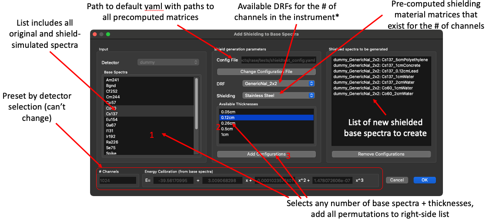

.. _shielding_generation:

********************************
Shielded Base Spectra Generation
********************************

RASE is able to model shielding effects from an assortment of materials and thicknesses by applying pre-calculated shielding responses to unshielded base spectra. Matrices capturing detector response to arbitrary gamma energies (and the matrix inverses of those responses) were generated for several generic detectors GADRAS and python, chosen to sweep a range of detector materials, sizes, and number of channels. The responses included in the release of RASE v3.0 are:

*  512 channel 1.5"(L)x14"(W)x70"(Depth) PVT, 5% FWHM 
*  1024 channel 2"(Diam)x2"(Depth) NaI, 2.5% FWHM 
*  1024 channel 2"(L)x4"(W)x16"(Depth) NaI, 2.5% FWHM
*  2048 channel 1"(Diam)x1"(Depth) LaBr, 0.87% FWHM 
*  3000 channel 1.16"(L)x1.16"(W)x1.16"(Depth) CZT, 0.48% FWHM

Note that all the resolutions are at 662 keV, and are significantly better than their real world counterparts; this is done to support unfolding spectra from a wide range of instruments. Though these detector responses exist for a relatively narrow set of generic instruments, they provide a good approximation of shielding effects for most detectors at a given channel count regardless of material type or size, provided that:

*  the energy resolution of the base spectra is the same or worse than the 662 keV energy resolutions quoted in the list above 
*  the spectra do not demonstrate strong effects due to the geometry

The matrices required for the shielding algorithm are distributed with RASE in two .zip files. They should be unzipped by the user into a directory of their choice, but is by default assumed to be in the :code:`C:\\RASE` directory. The path to the unpacked folder should be specified in the :code:`shielding_paths_config.yaml` file distributed with the RASE release. This file should be pointed to in the shielding dialog.  

.. rase_shielding_workflow:

.. figure:: _static/rase_shielding_workflow.png
    :scale: 60 %

    **RASE shielding workflow.**

|

Shielded Spectra Creation
=========================

Shielded spectra are created using a special dialog accessible via the "Tools->Shielded Base Spectra Creation" menu or from within the detector creation window by clicking the "Create Shielded Spectra" button in the top right corner. This dialog can only be accessed if there is a detector that has base spectra associated with it. Once created, shielded spectra are automatically attached to the instrument treated with RASE as identical to any other base spectrum. The user may even add multiple layers of shielding to a spectrum, though this has not been validated experimentally and so the user is encouraged to proceed with caution. 

Shielding can only be applied to spectra that have identical number of channels to the precomputed matrices. However, they do not have to be calibrated in a specific way to be compatible with shielding; they are rebinned under the hood, have the shielding algorithm applied to them, and then have their original calibration factors reinstated. As a consequence, shielding can only be added to one instrument at once; however, any number of thicknesses can be applied to any number of sources for a given instrument.

Spectra that are created via the shielding GUI have an asterisk (\*) following the name to discriminate from experimentally acquired shielded spectra.

Currently shielded spectra can only be exported by exporting the entire detector. Exporting shielded spectra will be implemented in a future release of RASE.

.. rase_shielding_gui:

    **RASE shielding GUI.**

|

!!!IMPORTANT!!!: Sensitivity Factors and Scenarios with Shielded Spectra
------------------------------------------------------------------------

Unlike shielded spectra derived from experiment, the RASE/FLUX sensitivity factors of shielded base spectra created using the RASE shielding tool are calculated based using dose rate/flux of the corresponding *unshielded* spectrum. **This is a change from the way that the sensitivity factors are determined for experimentally measured shielded spectra**, which use the dose rate/flux at the surface of the detector *after* the source has been shielded. Calculating the sensitivity factors of the RASE-generated shielded spectra using the unshielded dose rate/flux values avoids introducing additional uncertainties, and does not require user to specify the energy of photopeak used for the flux calculation.

Because of this difference, users must take care to define and interpret scenarios that include RASE-created shielded spectra in terms of what that dose rate/flux is expected to be at that location for the corresponding *unshielded* source. Thus, if a RASE-generated shielded source and an unshielded source are both described with the same flux value, the photopeak from the shielded source is expected to have fewer counts than the unshielded source (in contrast with an experimentally shielded spectrum, where the unshielded and shielded source are both expected to yield roughly the same total photopeak count at a given flux). Similarly, direct comparisons between experimentally shielded spectra and RASE-generated shielded spectra will require the user to scale the dose rate/flux of the RASE-generated shielded spectra by the attenuation factor of the shielding to align it with the experimental case.

|

Validation and Limitations
==========================

The shielding approach has been experimentally validated to provide accurate photopeak attenuation to within 10% of experimental results for several commercial instruments under realistic steel and tungsten configurations (0.05 cm to 1 cm). However, it was observed that more substantial shielding produces scattering effects that are not always accurately reproduced in the continuum region of the modeled shielding, which can sometimes result in significant divergence from experimental results. Users should keep this in mind if any algorithm being assessed is strongly dependent on the continuum region of a spectrum for identification (e.g.: a template matching algorithm), especially if using highly attenuating materials such as Uranium or greater thicknesses of lower attenuating materials such as steel or water.

Oscillations have also been observed when applying shielding to spectra with a lower level discriminator greater than about 30 keV. Users should always spot-check generated spectra: minor oscillations are expected, especially past the photopeak region, but spectra with substantial oscillations (including oscillations visible in the photopeaks) should not be used.

Neutron count rates are not adjusted by shielding in any way.

.. rase_shielding_workflow:

.. figure:: _static/rase_shielding_measurements.png
    :scale: 50 %

    **Comparison between the RASE shielding algorithm and experimentally shielded spectra for a COTS NaI detector for various sources and thicknesses of stainless steel.**

