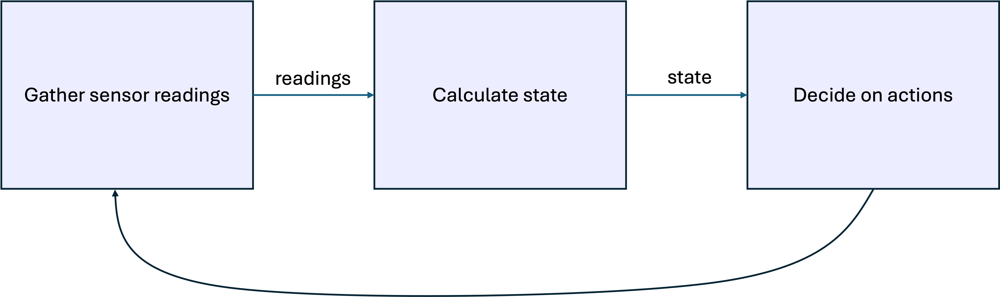
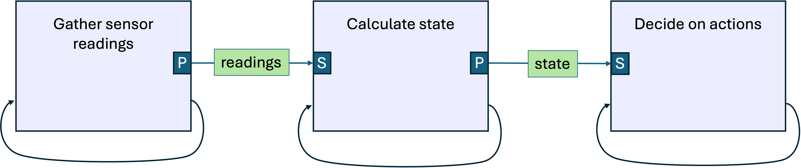

@defgroup tutorial4 Tutorial 4

# A "Real (If Somewhat Contrived) Program" in Skywing

Let's build our first "real program" in Skywing, envisioning an
industrial control environment in which agents need to work together
to collectively monitor and control a system.

In our imagined setting, suppose we have a collection of electric
batteries that are hooked into a power distribution grid and both
provide power to, and take power from, the grid. These charge level in
each battery naturally rises and falls over time as excess power is
available in the grid (to charge the battery) or excess demand exists
in the grid (to discharge the battery). Although these batteries are
part of the same overall system, they are not necessarily in the same
place, and naturally charge and discharge at their own independent
rates.

Each battery has a Skywing agent in front of it, helping to
decide when to force the battery to charge and discharge more or less. The control algorithm is quite simple:
* If the _total charge level_ of all batteries exceeds a certain
  threshold, the batteries collectively have excess capacity, and we
  should push more energy into the grid (thus allowing us to get paid
  for serving the grid).
* If the _total charge level_ of all batteries falls _below_ a certain
  threshold, then the batteries risk not being able to serve energy in
  an emergency, so we should push more energy into the batteries to
  recharge them.

Critically, no single Skywing agent has sufficient information on its
own to make proper decisions; the decision are made based on the
collective charge level of _all_ batteries in the system. Therefore,
the Skywing agents must work together in order to decide when to
charge or discharge the batteries.

***Remark:*** Actual battery behavior and control in a true power
   system is far more complicated than this, and there are a bunch of
   ways we are not modeling battery behavior in physically realistic
   ways. That's okay, the point of the exercise is to illustrate the
   Skywing control flow.

We will construct a
program that carries out a typical workflow, one in which the Skywing
collective performs the following tasks:

We will construct a Skywing program to do this. We'll break down Skywing's work into three separate, but coordinated, tasks:
1. Continually gather sensor data telling us the charge level of each individual battery.
2. Continually perform a collective summation to tell us the total charge level of all batteries.
3. Continually use the output of the collective computation to determine if we need to further charge or discharge the batteries.

In this tutorial, we will discuss how algorithm design considerations
drive certain software design strategies. We will then show how we
employ those strategies to build a realistic Skywing program (with fake data).

## Key Design Considerations

Because we are designing for a monitoring-and-control flow, the above
workflow is performed continually, in an infinite loop. We never
"complete" the work and shut down. If we were writing code for a
single, centralized control machine, the code structure might look
something like this pseudocode:
```
while (true)
{
   charge_levels = gather_battery_charge();
   total_charge = calculate_total_charge(charge_levels);
   decide_on_actions(total_charge);
}
```
A control flow diagram of this, which is quite simple, might look
something like this:
| {width=400%} |
|:--:|
| Figure 1: Centralized pseudocode control flow. |

However, it's not quite as straightforward as this in Skywing. In
particular, the second step requires collectively computing a
summation. As we learned in [Tutorial 03](03. Iterative Methods.md),
the requirement to do this in a resilient fashion drives the need to
do this iterative decentralized iterative methods. These iterative
methods never truly "finish," they forever "get closer and closer" to
an answer. Because of this, we must design for the fact that, even if
convergence happens quickly, there is no single moment of "finished,
move on"; instead, the process runs continually, and we at any moment
say "give me your current best guess."

With that in mind, consider the above pseudocode. As that loop is
written, it cannot call each function until the prior function call
has finished. But how are we supposed to know when to perform the work
of `decide_on_actions()` if `calculate_total_charge()` never truly
"finishes" (only ever has a "current best guess")?

We solve this problem by having *all the tasks running all the
time.* Recall from [Tutorial 01](01. Introduction.md) that a Skywing
**Job** is a thread of execution written by the Skywing user. Here, we
will have each Skywing agent run three Jobs simultaneously, one for
each task. Rather than passing information between the Jobs through
function return values and parameters, as is done in the above
pseudocode, we will pass information using Skywing's
publication/subscription capabilities (see [Tutorial 02](02. Publishing and Subscribing.md)).

The control flow for this approach, in contrast to the one above, looks like this:
| {width=100%} |
|:--:|
| Figure 2: Skywing Job-based control flow. The self-loops indicate that each Job continually performs its task. Information ("charge levels" and "total charge") is passed between Jobs through publications [P] and subscriptions [S]. |

***Remark.*** *More generally, suppose we want to write a program that
   consists of a dependent sequence of tasks: Task 1, Task 2, ...,
   Task N. Suppose that Task i uses the output of Task i-1, and
   potentially earlier Task outputs as well. In a sequential program,
   we would typically execute Tasks 1 through N in order, waiting for
   each one to complete before beginning the next.*

   *We can convert this to a Skywing program by turning each Task into
   a Skywing Job, where each Job publishes its output, and any
   subsequent task that uses it subscribes to that publication. This
   way, we do not need to worry about whether or not Job i-1 is
   "complete" or "close enough to complete." Job i will simply update
   its own computations as Job i-1 converges towards its correct
   answer, and the entire program converges to the correct answer as a
   whole.*

   *Will this approach scale efficiently to very long program
   sequences? Probably not. Such programs will require greater design
   sophistication. But many practical industrial control programs
   simply don't have long dependency sequences; the above three-step
   sequence is all many programs require.*

## Designing Job-to-Job data flows at the agent level.

At this point, we've decided that we will have three Jobs, one for
each of the three workflow tasks, but we're not quite ready to start
writing code. The conceptual diagram in Figure 2 shows the Jobs and
data flow for a single agent, but we need address the fact that the
collective is made up of many individual agents:

| {width=50%} |
|:--:|
| Figure 3: Many agents in the collective. We have omitted the self-loops, but it is understood the Jobs run indefinitely. |

We don't want to be designing our software at the nitty-gritty level
of individual agents and agent pairs, but we do need to decide which
steps involve on-agent communications and which involve collective
communications. To that end, we consider the conceptual diagram in
Figure 2 and ask the following questions:
1. For each Job, does it require collective communications?
2. For each Job-to-Job communication, does it stay on-agent or is it collective?

We answer the first set of questions:
* Job `gather_battery_charge`: Gathering a battery charge level comes from a function or library call external to Skywing, so does not rely on the collective.
* Job `calculate_total_charge`: Summing all battery charge levels requires incorporating all input data across the collective, so collective communications is required. Note that we do not specify exactly *what* data is being communicated; this depends on the specific solver algorithms being used. We simply abstract the specifics of the collective communications away and call it "solver_internals".
* Job `decide_on_actions`: Actions are decided locally, so no collective communications required.

***Remark:*** *In some programs, deciding on actions may also be a collective operation, but we are not considering that here.*

We answer the second set of questions:
* `charge_levels` data: Can be sent from Job to Job on a given agent, so stays on-agent.
* `total_charge` data: Can be sent from Job to Job on a given agent, so stays on-agent.

With these answers in mind, we produce a Skywing communications
diagram, only showing 2 agents for brevity:
| {width=100%} |
|:--:|
| Figure 4: Initial Skywing program flow, showing publications [P] and subscriptions [S]. Only 2 agents shown for brevity. |

This is very close to our final flow, but we can improve it a bit
more. Consider the state information being sent to the final decision
Job, as `total_charge1` and `total_charge2` for Agent 1 and Agent 2,
respectively. Because the `calculate_total_charge` Job is performing a
*collective* computation, both `total_charge1` and `total_charge2`
represent their Agents' current guess at the answer to the collective
computation. Although they won't contain exactly the same data at any
given moment, they *represent the same information*. Therefore,
`total_charge1` and `total_charge2` are interchangeable from the
perspective of the collective. For that reason, we don't need two
separate tags; we can simply use a single `total_charge` tag and allow *all*
agents in the collective to publish under that tag.

This won't have much of an effect on this particular program. However,
it is good practice to have agents publish under the same tag when
they are publishing "the same" information. This provides the
collective with a great deal of flexibility regarding how the
collective handles the data: agents can find backup publishers if one
disappears, we can check multiple and verify they agree, etc.

The resulting improved (and final) flow diagram looks like this:
| {width=100%} |
|:--:|
| Figure 4: Final Skywing program flow, showing publications [P] and subscriptions [S]. Only 2 agents shown for brevity. |

We are now ready to write our program.

## Writing the three Skywing Jobs.

Each Job, as it only needs to carry out one specific task, is not particularly complicated.

### `gather_charge_levels` Job

This Job needs to collect sensor readings which tell us the charge
level of the attached battery and publish it, enabling the
`calculate_total_charge` Job to take it as input.

Note that one *could* write this as a separate, non-Skywing thread,
sending the data through some other means (e.g. shared memory). That
would work fine in this case but would be very restrictive. By
setting this up as a Skywing Job and sending the data via Skywing
publications, we aren't forcing any decisions on *which* Job and
*which* agent actually gets the data. In the future we could have the
`calculate_total_charge` Job happen on a different agent, or we could
have multiple agents use this same data as input, or we could set up a
separate Job that takes multiple sensor inputs and validates their
consistency. We intentionally use Skywing's pub/sub system to send
data because it gives us the flexibility to change structure and add
resilience in the future.

The actual work of the Job has two simple steps:
1. Set up a publication.
2. In a loop, gather charge data and publish it.

Setting up the publication is straightforward:
```
    SensorDataTag sensor_reading_tag("sensor_reading" + std::to_string(agent_number));
    job.declare_publication_intent(sensor_reading_tag);
```

Gathering and publishing sensor data in a loop looks like this:
```
    while (/* not done */)
    {
      double sensor_value = sensor.get_reading();
      job.publish(sensor_reading_tag, sensor_value);
    }
```

In a real application, gathering sensor data would involve making a
call to some external, non-Skywing library provided by the vendor of
the sensor. In our case, we'll simply use a synthetic data generation
class. The interface of the function looks like this:
```
class BatteryChargeSensor
{
public:
  double get_reading();
  void set_sensor_mean(double mean);
};
```

 This class has two functions, one used to gather a sensor reading,
and one used to take a control action that alters the battery's
charging and discharging behavior.

***Note:*** In the example, the battery charge sensor is implemented
   using an _autoregressive time series model_, or AR model. The
   details of how an AR model works is not crucial for this tutorial,
   but it is a nice way to generate random time series of data. See
   the full example for the full class definition.

Altogether, the Job looks like this:
```
void gather_battery_charge_job(Job& job,
			       ManagerHandle manager_handle,
			       size_t agent_number,
			       std::shared_ptr<BatteryChargeSensor> sensor,
			       size_t sensor_freq_ms)
{
    (void) manager_handle; // required but not needed parameter

    // set up battery sensor publication
    BatteryChargeTag sensor_reading_tag("sensor_reading" + std::to_string(agent_number));
    job.declare_publication_intent(sensor_reading_tag);

    // loop to gather and publish sensor readings
    while (std::chrono::steady_clock::now() - start_time < std::chrono::seconds(60))
    {
      double sensor_value = sensor->get_reading();
      job.publish(sensor_reading_tag, sensor_value);
      print_message(agent_number, "BatteryChargeSensor: " + std::to_string(sensor_value));
      std::this_thread::sleep_for(std::chrono::milliseconds(sensor_freq_ms));
    }
}
```
Note we have some setup code to create initial connections to other
agents. It isn't critical that *this* Job do the connections, but
*some* Job has to, so we might as well do it here.

### `calculate_total_charge` Job

This Job is slightly more complex than the other two, because it needs
to set up and execute a collective solve while gathering new inputs
and publishing results throughout.

Recall from [Tutorial 03](03. Iterative Methods.md) that creating a collective `AsynchronousIterative` object requires defining
1. A publication to be used internal to the collective operation.
2. A set of subscriptions, also internal to the collective operation.

The set of collective internal publications and subscriptions defines
the *topology* of the decentralized solve. Different topologies can be
used, as long as the topology is connected. In our case we choose to
use a circle topology, where each agent subscribes to information from
themselves, the agent "to their left," and the agent "to their right,"
in a circle.

The resulting setup code looks like this:
```
    size_t i = agent_number;
    std::string left_ID = "iter" + std::to_string((i > 0) ? i-1 : size_of_system-1);
    std::string this_ID = "iter" + std::to_string(i);
    std::string right_ID = "iter" + std::to_string((i < (size_of_system-1)) ? i+1 : 0);
    std::vector<std::string> iter_sub_tag_IDs{left_ID, this_ID, right_ID};

    double starting_value = 0;
    Waiter<IterMethod> iter_waiter =
        WaiterBuilder<IterMethod>(manager_handle, job, this_ID, iter_sub_tag_IDs)
            .set_processor(starting_value)
            .set_publish_policy()
            .set_stop_policy(std::chrono::seconds(60))
            .set_resilience_policy()
            .build_waiter();
```

Now, the part of this Job that is really new compared with Tutorial 03
is what happens during the collective callback method. Previously, we
simply used it to print out status information. This time, we use it
to both (A) publish the current best guess at the result, and (B)
check for new sensor input values:
```
    // Callback called on each iteration of the iterative method.
    auto update_fun = [&](IterMethod& p) {
        // Get the current best guess at the result, print it, and publish it.
        double current_value = p.get_processor().get_value();
	print_message(agent_number, "Value: " + std::to_string(current_value));
        job.publish(state_tag, current_value);

	// Check for an updated sensor reading from the subscription,
	// and incorporate into the iterative method if available.
        std::optional<double> sensor_value =
            job.get_data_if_present(sensor_reading_tag);
        if (sensor_value) {
            p.get_processor().set_value(*sensor_value);
        }
    };
```

Altogether, the code for this Job (simplified somewhat for brevity) looks like this:
```
void calculate_total_charge_job(Job& job,
		   ManagerHandle manager_handle,
		   size_t agent_number,
		   size_t size_of_collective)
{
    // set up publishing of state results
    TotalChargeTag total_charge_tag("total_charge");
    job.declare_publication_intent(total_charge_tag);

    // set up subscribing to individual update from other job on this agent
    BatteryChargeTag sensor_reading_tag("sensor_reading" + std::to_string(agent_number));
    job.subscribe(sensor_reading_tag).wait();

    // set up iterative method:
    // 1. Establish pub/subs for iteration in a circle topology around the collective.
    std::vector<std::string> iter_sub_tag_IDs = ...;

    // 2. Build and prepare iterative solver.
    Waiter<IterMethod> iter_waiter = ...;
    IterMethod summation_iteration = iter_waiter.get();

    // Callback called on each iteration of the iterative method.
    auto update_fun = [&](IterMethod& p) {
        // Get the current best guess at the result, print it, and publish it.
        double current_value = p.get_processor().get_value();
	print_message(agent_number, "Value: " + std::to_string(current_value));
        job.publish(total_charge_tag, current_value);

	// Check for an updated sensor reading from the subscription,
	// and incorporate into the iterative method if available.
        std::optional<double> sensor_value =
            job.get_data_if_present(sensor_reading_tag);
        if (sensor_value) {
            p.get_processor().set_value(*sensor_value);
        }
    };

    summation_iteration.run(update_fun);
}
```

### `decide_on_actions` Job

This Job is also quite simple:
1. Set up a subscription.
2. In a loop, collect sensor data and make any needed decisions based on it.

In our case, our decision-making is fairly simple: If the total
battery charge is over a threshold, all agents encourage the batteries
to discharge more (by calling the
`BatteryChargeSensor::set_sensor_mean()` function); if the total
battery charge is under a threshold, all agents encourage the
batteries to charge more (again by calling the
`BatteryChargeSensor::set_sensor_mean()` function).

The code for this Job (simplified for brevity) looks like this:
```
void decide_on_actions_job(Job& job,
			   ManagerHandle manager_handle,
			   size_t agent_number,
			   std::shared_ptr<BatteryChargeSensor> sensor,
			   size_t decider_freq_ms)
{
    TotalChargeTag total_charge_tag("total_charge");
    job.subscribe(total_charge_tag);

    double high_charge_threshold = 400.0;
    double low_charge_threshold = -400.0;
    double deadband_threshold = 300.0;
    double forced_charge_mag = 0.05;
    while (/* still running */)
    {
      // get current state estimate
      std::optional<double> current_total_charge = job.get_waiter(total_charge_tag).get();
      if (current_total_charge)
      {
	// if total charge over threshold, encourage more discharging.
	if (*current_total_charge > high_charge_threshold)
	  sensor->set_sensor_mean(-forced_charge_mag);

	// if total charge under threshold, encourage more charging.
	if (*current_total_charge < low_charge_threshold)
	  sensor->set_sensor_mean(forced_charge_mag);

	// if total charge within normal range, don't encourage either way.
	if (*current_total_charge < deadband_threshold && *current_total_charge > -deadband_threshold)
	  sensor->set_sensor_mean(0.0);

	std::this_thread::sleep_for(std::chrono::milliseconds(decider_freq_ms));
      }
    }
}
```

## Putting it all together.

The only significant piece missing is a `main` function to submit the
Jobs to a Skywing Manager and start it all up. A Job function, as
passed to a Manager, has a specific signature, so we use a
lambda-wrapper approach to capture additional information as
needed. For example, we define a lambda wrapper for the
`calculate_total_charge` Job as
```
    if (agent_number != 0)
    {
      manager.configure_initial_neighbors("127.0.0.1", agent_port - 1);
    }
    auto calculate_total_charge_lambda = [agent_number, size_of_collective]
      (Job& job, ManagerHandle manager_handle) {
      calculate_total_charge_job(job, manager_handle, agent_number, size_of_collective);
    };
    ...
    manager.submit_job("calculate_total_charge_job", calculate_total_charge_lambda);
```
where `calculate_state_job` is defined above.

# Running the code

The full code for this Tutorial is available as `ex4.cpp` in the `example-cmake-project` folder.

To run the example, source the run script with a starting port
```
source run_ex4.sh size_of_collective=[int] starting_port=[int]
```
For example,
```
source run_ex4.sh size_of_collective=4 starting_port=20000
```

If you redirect the output to a file, you can then run the included
Python script to plot the behavior:
```
source run_ex4.sh starting_port=20000 | tee out.txt
python3 plot_results_ex4.py out.txt
```

You can also modify some of the example's parameters to experiment
with behavior. It is illustrative to try modifying these to see how
the Skywing algorithms respond to changes such as these.

Here are some interesting examples to try:
```
source run_ex4.sh size_of_collective=4 AR_order=2 AR_constant=0.99 starting_port=21000 | tee out.txt
source run_ex4.sh size_of_collective=4 AR_order=3 AR_constant=0.98 starting_port=21000 | tee out.txt
```

Here is a complete list of parameters that can be set at command line,
and defaults if they have them:
-starting_port [int]. Port number of first agent. Each agent subsequent agent increments the port used by 1. Default: None (required parameter)
-size_of_collective [int]. The number of agents in the collective. Default: None (required parameter)
-AR_order [int]. The order of the autoregressive model simulating individual battery charge levels. Higher order produces smoother sequences and larger numbers. Default: 2.
-AR_constant [float]. Parameter impacting the strength of autoregressive correlation. Default: 0.99.
-run_duration [float]. The length of time to run the program for, in seconds. Default: 60.0.
