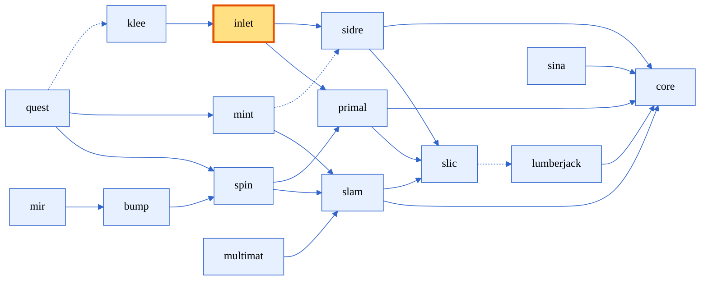

[comment]: # (#################################################################)
[comment]: # (Copyright 2017-2025, Lawrence Livermore National Security, LLC)
[comment]: # (and Axom Project Developers. See the top-level LICENSE file)
[comment]: # (for details.)
[comment]: #
[comment]: # (# SPDX-License-Identifier: BSD-3-Clause)
[comment]: # (#################################################################)

# Lesson 02: Input validation with Inlet

This lesson demonstrates how to use Axom's `Inlet` component to define, parse, and validate structured mesh metadata from configuration files. We'll show how to create robust input parsing with validation rules.

## Motivation

In the previous lesson, we provided input for our mesh metadata on the command line
```bash
> ./bin/lesson_01_mesh_metadata_sidre --min_x 0.0 --min_y 0.0 \
                                      --max_x 1.0 --max_y 1.5 \
                                      --res_x 15  --res_y 25
```
This can be tedious and error prone, especially as we add more input parameters!

In this lesson, we'd like to extend this by providing our input parameters in a convenient format, and we'd also like to define constraints on the input that can be validated when loading the file.

That is, we'd like our input to look more like this YAML snippet:

```yaml
mesh:
  bounding_box:
    min:
      x: 0.0
      y: 0.0
    max:
      x: 1.0
      y: 1.5
  resolution:
    x: 15
    y: 25
```

## Inlet: Structured input processing

<div style="text-align: center;">


<figcaption>Figure: Axom components, highlighting Inlet</figcaption>
</div>

Inlet provides a powerful way to define and parse input schemas with validation:

- Define required parameters and optional parameters with defaults
- Validate numeric ranges and relationships between parameters
- Support for YAML, JSON and Lua configuration formats
- Clear error reporting for invalid inputs
- Simplified documentation for your input

### Key components of Inlet

Inlet offers a powerful abstraction for input processing with the following key concepts:

**Container**
:  The core class that represents a hierarchical group of fields
  - Can hold nested containers to represent complex data structures
  - Supports path-based access (like `container["path/to/field"]`)
  - Enables validation of entire data structures

**Field**
:  Individual data elements within containers
  - Supports primitive types: int, double, bool, string
  - Array types for sequences of values
  - Each field can have metadata like description, default values, etc.

**Verifiers**
:  Function objects that validate container constraints
   - Used to enforce complex rules between fields
   - Can define custom validation logic beyond simple range checking
   - Register directly with containers to ensure data integrity


## Schema definition for mesh metadata

Here is a basic schema definition for our mesh metadata example:

<details open>
  <summary>Basic mesh metadata schema </summary>

```cpp
// Define a schema for a simulation configuration
auto& schema = inlet.addStruct("mesh", "Mesh metadata");

// Setup bounding box info
auto& bb = schema.addStruct("bounding_box", "Mesh bounding box");

auto& min = bb.addStruct("min", "Minimum coordinates");
min.addDouble("x", "Minimum x coordinate");
min.addDouble("y", "Minimum y coordinate");

auto& max = bb.addStruct("max", "Maximum coordinates");
max.addDouble("x", "Maximum x coordinate");
max.addDouble("y", "Maximum y coordinate");

// Set up resolution info
auto& res = schema.addStruct("resolution", "Mesh resolution");
res.addInt("x", "Resolution in x direction");
res.addInt("y", "Resolution in y direction");
```
</details>

We can easily add some basic validation within our schema:
<details>
  <summary style="color: gray;"> Schema with some inline validation (click to expand) </summary>

```cpp
// Define a schema for a simulation configuration
auto& schema = inlet.addStruct("mesh", "Mesh metadata");

// Setup bounding box info -- all fields are now required
auto& bb = mesh_schema.addStruct("bounding_box", "Mesh bounding box").required();

auto& min = bb.addStruct("min", "Minimum coordinates").required();
min.addDouble("x", "Minimum x coordinate").required();
min.addDouble("y", "Minimum y coordinate").required();

auto& max = bb.addStruct("max", "Maximum coordinates").required();
max.addDouble("x", "Maximum x coordinate").required();
max.addDouble("y", "Maximum y coordinate").required();

// each resolution value must be positive
auto& res = mesh_schema.addStruct("resolution", "Mesh resolution").required();
res.addInt("x", "Resolution in x direction").required().range(1, std::numeric_limits<int>::max());
res.addInt("y", "Resolution in y direction").required().range(1, std::numeric_limits<int>::max());
```
</details>
<br />

We can also add custom verifiers. For example, here's how we could express that the bounding box minimums must be less than the bounding box maximums in each dimension:

```cpp
// Bounding box validation: ensure min < max in each dimension
bb.registerVerifier([](const inlet::Container& input) -> bool {
  const double min_x = input["min/x"];
  const double max_x = input["max/x"];
  const double min_y = input["min/y"];
  const double max_y = input["max/y"];

  SLIC_WARNING_IF(
    min_x >= max_x,
    axom::fmt::format("Invalid bounding box range for x-coordinate: {} >= {}", min_x, max_x));
  SLIC_WARNING_IF(
    min_y >= max_y,
    axom::fmt::format("Invalid bounding box range for y-coordinate: {} >= {}", min_y, max_y));
  return (min_x < max_x) && (min_y < max_y);
});
```
Verifier callbacks return a `bool` indicating if all test pass. In this example, we're also logging a warning message to give more context about the problem.


### Initialization with `FromInlet`

The `FromInlet` template maps Container data directly to C++ structs.

Here is a struct for the mesh metadata for our 2D Cartesian mesh from the last example:
```cpp
// Define a struct that will hold our mesh configuration
struct MeshMetadata
{
  struct BoundingBox
  {
    double min_x, min_y;
    double max_x, max_y;
  };

  struct Resolution
  {
    int x, y;
  };

  BoundingBox bounding_box;
  Resolution resolution;
};
```

We can initialize a `MeshMetadata` from an inlet container using the following construct:
```cpp
// Template specialization to map inlet data to our MeshMetadata struct
template <>
struct FromInlet<MeshMetadata>
{
  MeshMetadata operator()(const inlet::Container& input_data)
  {
    MeshMetadata result;

    auto bb = input_data["bounding_box"];
    result.bounding_box.min_x = bb["min/x"];
    result.bounding_box.min_y = bb["min/y"];
    result.bounding_box.max_x = bb["max/x"];
    result.bounding_box.max_y = bb["max/y"];

    auto res = input_data["resolution"];
    result.resolution.x = res["x"];
    result.resolution.y = res["y"];

    return result;
  }
};
```

The following snippet defines the schema, loads and validates input and constructs a `MeshMetadata` instance:

```cpp
// Parse and validate the input file
inlet::Container input = inlet::fromFile("input.yaml");
inlet::Container schema;

// Define our schema
MeshMetadata::defineSchema(schema);
// Validate input against schema
inlet::Container validated = inlet::applySchema(input, schema);

// Populate struct from validated container, using FromInlet<> specialization
MeshMetadata metadata = validated["mesh"].get<MeshMetadata>();
```

This approach cleanly separates input definition, validation, and consumption, making your code more robust against malformed inputs.

> :clapper: Let's try running this example code to see different runs with valid and invalid YAML inputs. We have included some yaml files with lesson_02
>
> ```bash
> > ./bin/lesson_02_validated_inlet_metadata ../lesson_02/input2D.yaml
> ```

## Enhanced features example

The `improved_inlet_metadata` example extends the basic example with:

1. Support for both 2D and 3D meshes
2. Multiple input formats (YAML and Lua)
3. Dimension-specific validation
4. Integration with Axom's `primal::BoundingBox` type

### Support for 2D and 3D
We begin by updating our top-level verifier for the mesh schema to ensure
that 2D meshes only have `x` and `y` fields, while 3D meshes also have `z` fields.
Note that we have also added a `dim` field for the mesh's dimension.

```cpp
// Add constraint to ensure z values are only provided when dim is 3
mesh_schema.registerVerifier([](const inlet::Container& input) {
  const int dim = input["dim"];
  bool valid = true;

  for(const auto& field : {"bounding_box/min/z", "bounding_box/max/z", "resolution/z"})
  {
    if(dim == 3)
    {
      if(!input.contains(field))
      {
        SLIC_WARNING(
          axom::fmt::format("Z-coordinate for '{}' is required when dimension is 3", field));
        valid = false;
      }
    }
    else if(dim == 2)
    {
      if(input.contains(field))
      {
        SLIC_WARNING(
          axom::fmt::format("Z-coordinate for '{}' should not be provided when dimension is 2",
                            field));
        valid = false;
      }
    }
  }

  return valid;
});
```

### Support for YAML and Lua

We can easily support reading in YAML or LUA inputs with Inlet's built-in `YAMLReader` and `LuaReader` classes:

```cpp
// Define appropriate reader based on file extension
if(axom::utilities::string::endsWith(inputFilename, ".yaml") ||
   axom::utilities::string::endsWith(inputFilename, ".yml"))
{
  reader = std::make_unique<axom::inlet::YAMLReader>();
  SLIC_INFO("Using YAML reader for input file: " + inputFilename);
}
#ifdef AXOM_USE_LUA
else if(axom::utilities::string::endsWith(inputFilename, ".lua"))
{
  reader = std::make_unique<axom::inlet::LuaReader>();
  SLIC_INFO("Using Lua reader for input file: " + inputFilename);
}
#endif
else
{
  SLIC_ERROR("Unsupported file extension for: " + inputFilename);
  return 1;
}

// Parse the input file using the appropriate reader
reader->parseFile(inputFilename);

// Create the Inlet with the configured reader
Inlet inlet(std::move(reader));

// The rest of the code is format-agnostic - Inlet abstracts the differences
// between input formats (YAML, Lua, etc.)
```

> :bulb: **Note:** Lua is an optional dependency of Axom, and is available when Axom is configured with a `LUA_DIR` path. When available, `axom/config.hpp` will have a `AXOM_USE_LUA` compiler define.

> :bulb: **Note:** Inlet also support JSON, through the `JSONReader` but this is not demonstrated in this example.

### Example inputs: 2D vs. 3D; YAML vs. Lua

Supporting both 2D and 3D input formats:
<details open>
  <summary>2D YAML example</summary>

```yaml
mesh:
  dim: 2
  bounding_box:
    min:
      x: 0.0
      y: 0.0
    max:
      x: 1.0
      y: 1.5
  resolution:
    x: 15
    y: 25
```
</details>

<details>
  <summary>3D YAML example</summary>

```yaml
mesh:
  dim: 3
  bounding_box:
    min:
      x: 0.0
      y: 0.0
      z: 0.0
    max:
      x: 1.0
      y: 1.5
      z: 2.0
  resolution:
    x: 15
    y: 25
    z: 30
```
</details>

<details>
  <summary>3D Lua example</summary>

```lua
mesh = {
  dim = 3,
  bounding_box = {
    min = { x = 0.0, y = 0.0, z = 0.0 },
    max = { x = 1.0, y = 1.5, z = 2.0 }
  },
  resolution = { x = 15, y = 25, z = 30 }
}
```
</details>

<br />

> :clapper: We can try running this example code in the ``improved_inlet_metadata`` example to see how it handles both 2D and 3D configurations in different input formats (YAML and Lua), and demonstrates dimension-specific validation.
> e.g.:
>
> ```bash
> > ./bin/lesson_02_improved_inlet_metadata ../lesson_02/input3D.lua
> ```


## Summary and next steps

In this lesson, we introduced Axom's Inlet component as a way of defining and validating structured input for simulations. We also demonstrated how we can use this to read in mesh metadata for our Cartesian meshes and extended the example to work with 2D or 3D input in different format (YAML or Lua).

In the next lesson, we will introduce Axom's Klee component which is built on top of Inlet and allows users to specify geometric input for multimaterial simulations.