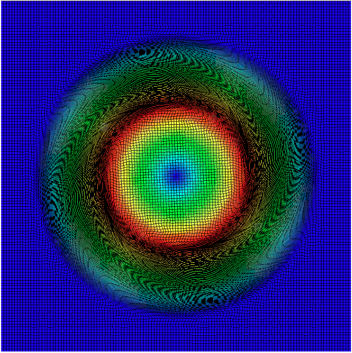
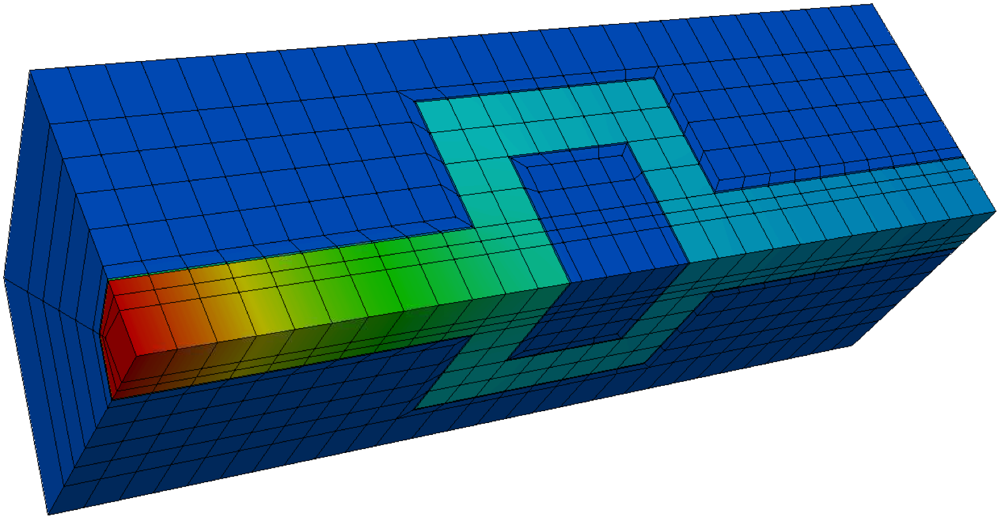
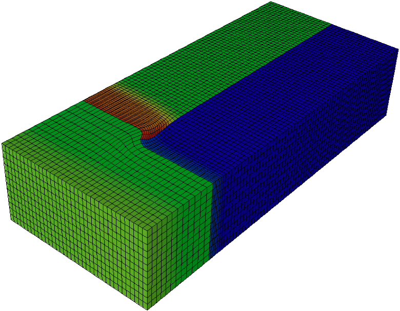
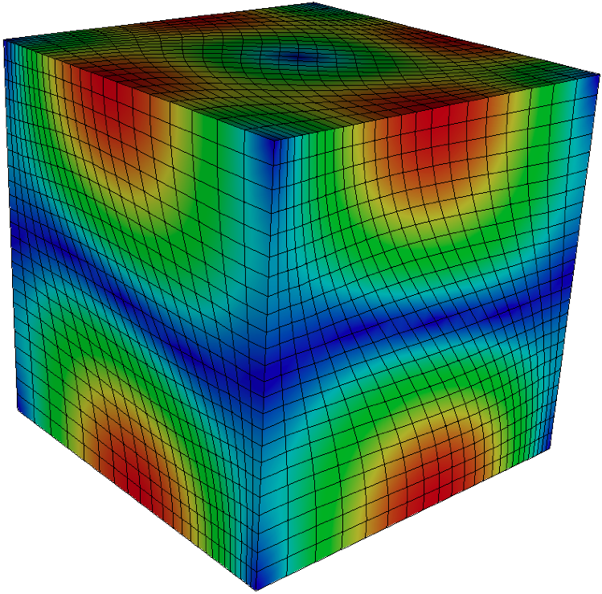
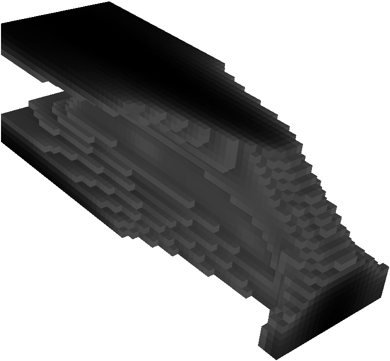
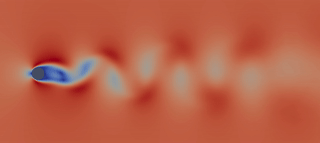

# Gallery

This page collects screenshots from various ROM simulations based on libROM. 

 

*Sedov blast simulated with [Laghos](https://github.com/CEED/Laghos/tree/rom)
and accelerated by [libROM](https://github.com/LLNL/libROM).  Visualization with
[VisIt](https://visit-dav.github.io/visit-website/).*

----

*2D Gresho vortex simulated with
[Laghos](https://github.com/CEED/Laghos/tree/rom) and accelerated by
[libROM](https://github.com/LLNL/libROM).  Visualization with
[VisIt](https://visit-dav.github.io/visit-website/).*

----

*2D Nonlinear diffusion problem simulated with 
[MFEM](https://github.com/mfem/mfem) and accelerated by
[libROM](https://github.com/LLNL/libROM).  Visualization with
[VisIt](https://visit-dav.github.io/visit-website/).*

----

*3D Crooked pipe for nonlinear radiation diffusion problem simulated with
[BLAST](https://computing.llnl.gov/projects/blast) and accelerated by
[libROM](https://github.com/LLNL/libROM).  Visualization with
[VisIt](https://visit-dav.github.io/visit-website/).*

----

*2D Rayleigh-Taylor instability problem simulated with
[Laghos](https://github.com/CEED/Laghos/tree/rom) and accelerated by
[libROM](https://github.com/LLNL/libROM).  Visualization with
[VisIt](https://visit-dav.github.io/visit-website/).*

----

*1D1V two stream instability problem simulated with
[HyPar](http://hypar.github.io/) and accelerated by
[libROM](https://github.com/LLNL/libROM) DMD and
[GPLaSDI](https://github.com/LLNL/GPLaSDI).  Visualization with
[VisIt](https://visit-dav.github.io/visit-website/).*

*Triple-point problem simulated with
[Laghos](https://github.com/CEED/Laghos/tree/rom)  and accelerated by
[libROM](https://github.com/LLNL/libROM).  Visualization with
[VisIt](https://visit-dav.github.io/visit-website/).*

----

*An optimal design for the wind turbine blade solved with
[LiDO](https://engineering.llnl.gov/resources/center-for-design-and-optimization)
and accelerated by [libROM](https://github.com/LLNL/libROM).  Visualization with
[VisIt](https://visit-dav.github.io/visit-website/).*

----

*3D Boltzmann particle transport problem solved with 
[ARDRA](https://computing.llnl.gov/projects/ardra-scaling-up-sweep-transport-algorithms)
and accelerated by [libROM](https://github.com/LLNL/libROM).  Visualization with
[VisIt](https://visit-dav.github.io/visit-website/).*

----

*3D Boltzmann particle transport problem solved with 
[ARDRA](https://computing.llnl.gov/projects/ardra-scaling-up-sweep-transport-algorithms)
and accelerated by [libROM](https://github.com/LLNL/libROM).  Visualization with
[VisIt](https://visit-dav.github.io/visit-website/).*

----

*Pore collapse simulated with
[ALE3D](https://ale3d4i.llnl.gov/)
and accelerated by [libROM](https://github.com/LLNL/libROM).  Visualization with
[VisIt](https://visit-dav.github.io/visit-website/).*

*Taylor-Green vortex problem simulated with
[Laghos](https://github.com/CEED/Laghos/tree/rom)  and accelerated by
[libROM](https://github.com/LLNL/libROM).  Visualization with
[VisIt](https://visit-dav.github.io/visit-website/).*

----

*Stress-constrained optimal L-bracket problem solved by
[LiDO](https://engineering.llnl.gov/resources/center-for-design-and-optimization)
and accelerated by [libROM](https://github.com/LLNL/libROM).  Visualization with
[VisIt](https://visit-dav.github.io/visit-website/).*

----

*3D cantilever beam problem solved by
[LiDO](https://engineering.llnl.gov/resources/center-for-design-and-optimization)
and accelerated by [libROM](https://github.com/LLNL/libROM).  Visualization with
[VisIt](https://visit-dav.github.io/visit-website/).*

----

*2D vortex shedding cylinder problem solved by [SU2](https://su2code.github.io/)
and its reduced basis by [libROM](https://github.com/LLNL/libROM) below. Click
image below for zoomed-in picture.  Visualization with
[ParaView](https://www.paraview.org/).*

----

*2D NACA0012 airfoil problem solved by [SU2](https://su2code.github.io/)
and its reduced basis by [libROM](https://github.com/LLNL/libROM). Click
image above for zoomed-in picture.  Visualization with
[MATLAB](https://www.mathworks.com/).*

----

*2D steady Navier-Stokes porous media problem solved by
[ScaleupROM](https://github.com/LLNL/scaleupROM).  Visualization with
[ParaView](https://www.paraview.org/).*

