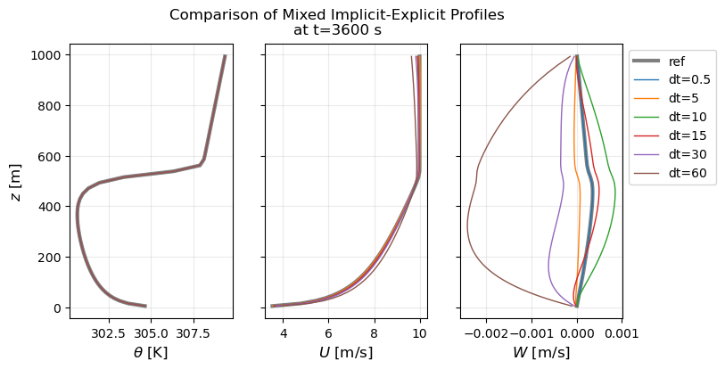

# Column diffusion test -- convection only

Input files: `inputs` and `inputs_sfclay`

This simple problem was used to test implicit vertical diffusion of theta only.

Problem: Horizontally homogeneous (periodic boundaries) with a neutrally stratified layer below a
capping inversion and a stably stratified layer aloft; diffusivity is constant throughout. Three
sets of BCs were tested:

* Neumann on zlo, specified theta_grad on zhi
* Specified theta_grad on zlo, zhi
* Surface layer on zlo, specified theta_grad on zhi

Summary of findings

* The original fully explicit setup requires a diffusive CFL < 0.5 for numerical stability
* No-terrain and stretched grid give the same level of error compared to explicit (in terms of MAE
  and RMSE)
* Implicit vertical allows diffusive CFL ~ 50 (dt=60 s) for this test problem, above which the
  solution remains numerically stable but error begins to increase significantly
* To retain full temporal accuracy -- and minimize error -- use explicit diffusion in the final RK
  stage (e.g., with `erf.vert_implicit_fac = 1 1 0`)


## "N" path

Compare with:
```
erf.fixed_dt           = 0.5
erf.fixed_mri_dt_ratio = 4
erf.vert_implicit_fac  = 0.0
```

A diffusive CFL of 1 corresponds to dt = dz*dz/K = 1.33 s. This numerically
stable setup with explicit vertical diffusion corresponds to a CFL of ~0.4.

MAE calculated based on mean profiles of theta, output every 5 min for an hour of runtime

- [x] fully implicit, dt=0.5, `zhi.theta_grad = 0` : MAE = 5e-5
- [x] fully implicit, dt=0.5, `zhi.theta_grad = 0.003` : MAE = 4e-5
- [x] semi-implicit (fac=0.5), dt=0.5, `zhi.theta_grad = 0.003`: MAE = 2e-5
- [x] semi-implicit (fac=0.5), dt=1.0, `zhi.theta_grad = 0.003`: MAE = 4e-5
- [x] semi-implicit (fac=0.5), dt=2.0, `zhi.theta_grad = 0.003`: MAE = 9e-5
- [x] semi-implicit (fac=0.5), dt=4.0, `zhi.theta_grad = 0.003`: MAE = 2e-4
- [x] semi-implicit (fac=0.5), dt=8.0, `zhi.theta_grad = 0.003`: MAE = 3e-4
- [x] semi-implicit (fac=0.5), dt=16.0, `zhi.theta_grad = 0.003`: MAE = 5e-4
- [x] semi-implicit (fac=0.5), dt=30.0, `zhi.theta_grad = 0.003`: MAE = 1e-3, RMSE=2e-3
- [x] semi-implicit (fac=0.5), dt=60.0, `zhi.theta_grad = 0.003`: MAE = 3e-3, RMSE=5e-3 (numerical oscillations)
- [x] semi-implicit (fac=0.5), dt=120.0, `zhi.theta_grad = 0.003`: MAE = 7e-3, RMSE=1e-2 (numerical oscillations)
- [x] semi-implicit (fac=0.5), dt=240.0, `zhi.theta_grad = 0.003`: MAE = 1e-2, RMSE=3e-2 (numerical oscillations)
- [x] fully implicit, dt=60.0, `zhi.theta_grad = 0.003`: MAE = 5e-3, RMSE=7e-3
- [x] fully implicit, dt=120.0, `zhi.theta_grad = 0.003`: MAE = 9e-3, RMSE=1e-2 (deviation from explicit solution)
- [x] fully implicit, dt=240.0, `zhi.theta_grad = 0.003`: MAE = 1e-2, RMSE=2e-2 (deviation from explicit solution)
- [x] fully implicit, dt=300.0, `zhi.theta_grad = 0.003`: MAE = 1e-2, RMSE=2e-2 (deviation from explicit solution)


## "S" path

Same as previous test, with 
```
amr.n_cell           =   4    4   50

erf.initial_dz = 10.0
erf.grid_stretching_ratio = 1.025

zhi.theta_grad = 0.003
```

- [x] semi-implicit (fac=0.5), dt=30, `zhi.theta_grad = 0.003`: MAE = 1e-3, RMSE=2e-3
- [x] fully implicit, dt=60, `zhi.theta_grad = 0.003`: MAE = 5e-3, RMSE=7e-3
- [x] mixed implicit/explicit (fac=1 1 0), dt=60, `zhi.theta_grad = 0.003`: MAE = 2e-4, RMSE=1e-3


## "T" path

Verified that uniform grid solution is recovered (to machine precision) when
specifying a custom terrain input file with z=0 everywhere.


# Column diffusion test -- with heating, shear, and PBL scheme

Input file: `inputs_sfclay_pbl`

A more realistic version of the test problem above, to test implicit vertical
diffusion for theta, u, and v; w was implemented and tested (with uniform and
stretched grids) and found to not have an appreciable effect on the solution.
That may be activated with the `-DERF_IMPLICIT_W` compiler flag or the
`ERF_ENABLE_IMPLICIT_W` cmake option.

The currently recommended implicit setup is enabled by
```
erf.vert_implicit_fac = 1 1 0
```
which has a fully implicit first and second RK stage, with a fully explicit
third RK stage. The implicit solve happens before the fast steps (default).


## Findings

Summary of verification tests on a stretched grid, with fully explicit dt=0.5
(max diffusive CFL ~ 0.05) as the reference.

Fully explicit, largest stable timestep tested (dt=2.5, CFL=0.25)
```
            variable name            absolute error            relative error
                                        (||A - B||)         (||A - B||/||A||)
 ----------------------------------------------------------------------------
 level = 0
 density                            7.562998101e-07           6.580968897e-07
 x_velocity                          0.005389941524           0.0005389764998
 z_velocity                         5.597063924e-05              0.1586374202
 theta                              0.0002401961379           7.765142883e-07
 Kmv                                3.541827748e-05           1.900637154e-06
```

Mixed implicit-explicit, reference dt=0.5
```
 density                            1.046907006e-10           9.109697437e-11
 x_velocity                         1.748999143e-06           1.748941861e-07
 z_velocity                          5.42377341e-13           1.537258522e-09
 theta                              2.942289257e-08           9.511933324e-11
 Kmv                                1.107167691e-10           5.941350622e-12
```

Mixed implicit-explicit, dt=2.5
```
 density                            7.559578892e-07           6.577993661e-07
 x_velocity                          0.005389638943           0.0005389462427
 z_velocity                         5.597063778e-05              0.1586374161
 theta                              0.0002400992145            7.76200951e-07
 Kmv                                 3.54175355e-05           1.900597338e-06
```

Mixed implicit-explicit, dt=5.0
```
 density                            1.864759126e-05           1.622626589e-05
 x_velocity                           0.01947237025             0.00194717325
 z_velocity                           0.00027903339              0.7908635268
 theta                               0.005244983182           1.695616099e-05
 Kmv                                8.205102408e-05           4.403071973e-06
```

Mixed implicit-explicit, dt=10.0
```
 density                            6.581281965e-05           5.726725214e-05
 x_velocity                            0.0937999248            0.009379685276
 z_velocity                         0.0005000348971               1.417247456
 theta                                0.01801152302           5.822826754e-05
 Kmv                                0.0002082620278           1.117588364e-05
```

Mixed implicit-explicit, dt=15.0
```
 density                            4.708968195e-05           4.097524926e-05
 x_velocity                           0.09193594578            0.009193293478
 z_velocity                         0.0001466834303              0.4157444203
 theta                                0.01302391437           4.210415575e-05
 Kmv                                0.0002838405469           1.523162411e-05
```

Mixed implicit-explicit, dt=30.0
```
 density                            0.0001191861088           0.0001037102038
 x_velocity                            0.1687238655             0.01687183396
 z_velocity                         0.0008136213317               2.306044577
 theta                                0.03266372514           0.0001055964076
 Kmv                                0.0005989066287           3.213889188e-05
```

Mixed implicit-explicit, dt=60.0 (CFL ~ )
```
 density                            0.0003631117158           0.0003159629126
 x_velocity                            0.3602553771             0.03602435784
 y_velocity                                       0                         0
 z_velocity                          0.002727282536               7.729928968
 theta                                0.09941827959            0.000321402814
 z_phys                                           0                         0
 Kmv                                 0.001322543114           7.097111322e-05
```



