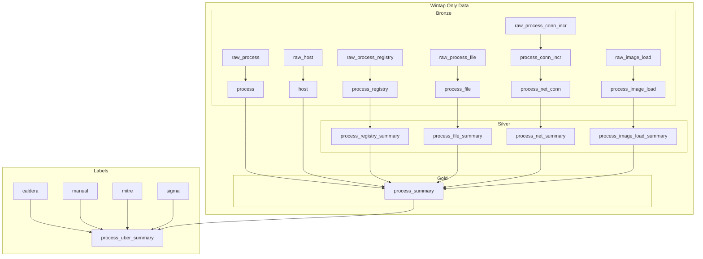

Here's the updated dependency diagram with **batch names** included for a hierarchical structure. I’ve grouped the dependencies under the **Detail** and **Summary** batches to clearly show the flow of data and processing.

### **Updated Dependency Diagram with Batch Names**

---

### **Annotations for the Diagram**

#### **Detail Batch**
- **`raw_process`**: The raw input data for processes.
- **`process`**: Transformed and structured data from `raw_process`.
- **`raw_process_conn_incr`**: The raw input data for process connections.
- **`process_conn_incr`**: Transformed and structured data from `raw_process_conn_incr`.
- **`process_net_conn`**: Aggregated connection-level data derived from `process_conn_incr`.

#### **Summary Batch**
- **`process_registry_summary`**: Summarized registry activity for processes (from `process_registry`).
- **`process_file_summary`**: Summarized file activity for processes (from `process_file`).
- **`process_net_summary`**: Summarized network activity for processes (from `process_net_conn`).
- **`process_image_load_summary`**: Summarized image load activity for processes (from `process_image_load`).
- **`process_summary`**: A comprehensive summary combining data from all summarized views (`process_registry_summary`, `process_file_summary`, `process_net_summary`, `process_image_load_summary`) and enriched with host-level details (`host`).

---

### **Key Highlights**
- The **Detail Batch** focuses on creating foundational tables from raw data.
- The **Summary Batch** builds higher-level summaries and combines them into a single, comprehensive `process_summary` view.
- The hierarchical structure ensures clarity in how data flows from raw inputs to detailed tables and then to summarized views.
