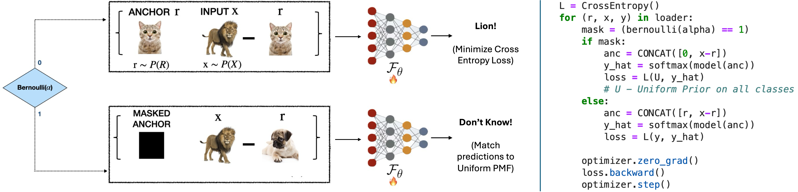

# On the Use of Anchoring for Training Vision Models - Spotlight@NeurIPS 2024

[](https://arxiv.org/abs/2406.00529) [](https://software.llnl.gov/anchoring) 

<!-- [](https://link-to-video) -->

## Abstract

Anchoring is an architecture-agnostic principle for training deep neural networks that has been shown to significantly improve uncertainty estimation, calibration, and extrapolation capabilities. Our work systematically explores anchoring as a general protocol for training vision models, providing fundamental insights into its training and inference processes and their implications for generalization and safety. Despite its promise, we identify a critical problem in anchored training that can lead to an increased risk of learning undesirable shortcuts, thereby limiting its generalization capabilities. To address this, we introduce a new anchored training protocol that employs a simple regularizer to mitigate this issue and significantly enhances generalization. We empirically evaluate our proposed approach across datasets and architectures of varying scales and complexities, demonstrating substantial performance gains in generalization and safety metrics compared to the standard training protocol.

Refer to the diagram below for a quick summary of our approach

<!-- Add the architecture.png to be displayed -->


## Train your own Anchored Transformers or Anchored CNNs 
We provide a easy-to-use wrapper that can be used around most Vision transformers as well as CNNs (and can be modified to work with any network) which works as follows:

Anchoring requires doubling the input channels -- For example, :

```
import torch
import torchvision

model = torchvision.models.vit_b_16()
model.conv_proj= torch.nn.Conv2d(6, 768, kernel_size=(16, 16), stride=(16, 16)) ## NOTE: 6 channels instead of 3
```

Next, use the provided utility to wrap your network to produce an anchored model -- thats it! 

```
from wrapper import AnchoringWrapper
model = AnchoringWrapper(model)
```

You can treat this model as a drop-in replacement for your old model, same loss function and hparams, its that easy!

```
inputs = torch.randn(64,3,224,224)
pred = model(inputs) ## Drop in replacement for training
loss = criterion(targets,pred)
...
```

## Dependencies
This codebase was developed and tested using

+ numpy `1.26.0`
+ scikit_learn `1.3.0`
+ torch `2.0.1`
+ torchmetrics `0.11.4`
+ torchvision `0.15.2`
+ relplot `1.0`

## Datasets
+ CIFAR10/100 - Torchvision
+ ImageNet-1K - Download from `[imagenet.org](https://image-net.org/download.php)' ILSVRC 2012
+ CIFAR10-C - [Click Here](https://zenodo.org/records/2535967)
+ CIFAR100-C - [Click Here](https://zenodo.org/records/3555552)
+ ImageNet-C - [Click Here](https://zenodo.org/records/2235448)
+ ImageNet-CBar - [Click Here](https://dl.fbaipublicfiles.com/inc_bar/imagenet_c_bar.tar.gz)
+ ImageNet-R - [Click Here](https://people.eecs.berkeley.edu/~hendrycks/imagenet-r.tar)
+ ImageNet-S - [Click Here](https://drive.google.com/file/d/1Mj0i5HBthqH1p_yeXzsg22gZduvgoNeA/view)

## Instructions to Run

### 1. Train the Anchored Classifier

Under CIFAR or ImageNet folder, the `train.py` script trains the classifier using the appropriate dataset and architecture. You can customize the dataset, model, and hyperparameters using the following example:

```bash
python ./CIFAR/train.py --modeltype resnet18 --seed 1 --alpha 0.25 --dataset cifar10 --subselect_classes 10 --epochs 200
```
Use ```./ImageNet/run_train.sh``` for training an Anchored model on ImageNet

### 2. Inference

After training the classifier, you can perform the inference and generalization experiments using the `gen.py` scripts in either CIFAR or ImageNet folders respectively

```bash
python -u ./CIFAR/inference.py --dataset cifar10 \
                --eval_dataset cifar10c \
                --cifar10c_datapath ../data/cifar10c/ \
                --modeltype resnet18 \
                --filename cifar10c_results.log \
                --log_path  ../logs/ \
                --ckpt_path ../ckpts/<CKPT_NAME> \
                --subselect_classes 10 \
                --seed 1
```
Use ```./ImageNet/run_inference.sh``` for performing inference an Anchored model on ImageNet

### Pre-trained Checkpoints
<table style="margin: auto">
  <thead>
    <tr>
      <th>Model</th>
      <th>Dataset</th>
      <th>Alpha</th>
      <th>Download</th>
    </tr>
  </thead>
  <tbody>
    <tr>
      <td>ResNet18</td>
      <td align="right">CIFAR10</td>
      <td align="center">0.0</td>
      <td><a href="https://arizonastateu-my.sharepoint.com/:u:/g/personal/vnaray29_sundevils_asu_edu/ESGIjvj35FdOkW-1uS7SPc0BEisJJKdMlsloXex3jX4miQ?e=IrOrRY">Click Here</a></td>
    </tr>
    <tr>
      <td>ResNet18</td>
      <td align="right">CIFAR10</td>
      <td align="center">0.25</td>
      <td><a href="https://arizonastateu-my.sharepoint.com/:u:/g/personal/vnaray29_sundevils_asu_edu/ETXb2CYnqoVHvh-szbBwJ0YBWn4pRuPfGBKEQ_eU1MaZDQ?e=Hj16Pw">Click Here</a></td>
    </tr>
    <tr>
      <td>ResNet18</td>
      <td align="right">CIFAR100</td>
      <td align="center">0.0</td>
      <td><a href="https://arizonastateu-my.sharepoint.com/:u:/g/personal/vnaray29_sundevils_asu_edu/EYlsa7q86cNNuwYtG4d4gpABgPMyBWuV4uzarILDg9J-Cg?e=h8FQjI">Click Here</a></td>
    </tr>
    <tr>
      <td>ResNet18</td>
      <td align="right">CIFAR100</td>
      <td align="center">0.25</td>
      <td><a href="https://arizonastateu-my.sharepoint.com/:u:/g/personal/vnaray29_sundevils_asu_edu/ETpltsvYENJEno9ztf0_CRcB0k-iOWkcWISyJOzlEIB3uA?e=8vmIU6">Click Here</a></td>
    </tr>
    <tr>
      <td>VIT_B_16</td>
      <td align="right">ImageNet-1K</td>
      <td align="center">0.0</td>
      <td><a href="https://arizonastateu-my.sharepoint.com/:u:/g/personal/vnaray29_sundevils_asu_edu/Eem6ENuJVVVMuR10FpS8za8BUMo3QRu0xLDGoDeTVdFfqQ?e=47jsfR">Click Here</a></td>
    </tr>
    <tr>
      <td>VIT_B_16</td>
      <td align="right">ImageNet-1K</td>
      <td align="center">0.2</td>
      <td><a href="https://arizonastateu-my.sharepoint.com/:u:/g/personal/vnaray29_sundevils_asu_edu/EQOTkCbyGhtLl3u4agfS3h4BgkOuo1o2798UERZK1Wwjtw?e=0eol3h">Click Here</a></td>
    </tr>
    <tr>
      <td>Swin_V2_T</td>
      <td align="right">ImageNet-1K</td>
      <td align="center">0.0</td>
      <td><a href="https://arizonastateu-my.sharepoint.com/:u:/g/personal/vnaray29_sundevils_asu_edu/EQhEuCTaQcRDkRo5Su2EG6cB8Hd3b9F1yLZ2YIeSmsPUsw?e=znDneN">Click Here</a></td>
    </tr>
    <tr>
      <td>Swin_V2_T</td>
      <td align="right">ImageNet-1K</td>
      <td align="center">0.2</td>
      <td><a href="https://arizonastateu-my.sharepoint.com/:u:/g/personal/vnaray29_sundevils_asu_edu/Ebtknpi8GeVKgkPfIuGuW6wBdzf9gq8hcVtsisIeWJ67UQ?e=cgl52j">Click Here</a></td>
    </tr>
    <tr>
      <td>Swin_V2_S</td>
      <td align="right">ImageNet-1K</td>
      <td align="center">0.0</td>
      <td><a href="https://arizonastateu-my.sharepoint.com/:u:/g/personal/vnaray29_sundevils_asu_edu/EQk4gySG4CVNvkNvikYqPl8BIaOuicTX63JZe97SXvCupQ?e=J2YoT5">Click Here</a></td>
    </tr>
    <tr>
      <td>Swin_V2_S</td>
      <td align="right">ImageNet-1K</td>
      <td align="center">0.2</td>
      <td><a href="https://arizonastateu-my.sharepoint.com/:u:/g/personal/vnaray29_sundevils_asu_edu/EY7LtuPmGC5Ik8iJXqYD_kEBLgeQkY9DCew4o8h5QNOwcw?e=0YWGMl">Click Here</a></td>
    </tr>
    <tr>
      <td>Swin_V2_B</td>
      <td align="right">ImageNet-1K</td>
      <td align="center">0.0</td>
      <td><a href="https://arizonastateu-my.sharepoint.com/:u:/g/personal/vnaray29_sundevils_asu_edu/EW6MzLrOszhLvd3yPwpYgSIBXnGPn95xDANKsRzsGh3liw?e=7BqWn0">Click Here</a></td>
    </tr>
    <tr>
      <td>Swin_V2_B</td>
      <td align="right">ImageNet-1K</td>
      <td align="center">0.2</td>
      <td><a href="https://arizonastateu-my.sharepoint.com/:u:/g/personal/vnaray29_sundevils_asu_edu/ESbrDCvh39NGjUW8TOFT9b8BAXoFFGEHCAIphY52vgpmow?e=tWu1rM">Click Here</a></td>
    </tr>
  </tbody>
</table>

## Citation

Our paper can be cited as:

```
@article{narayanaswamy2024use,
  title={On the Use of Anchoring for Training Vision Models},
  author={Narayanaswamy, Vivek Sivaraman and Thopalli, Kowshik and Anirudh, Rushil and Mubarka, Yamen and Sakla, Wesam and Thiagarajan, Jay},
  journal={Advances in Neural Information Processing Systems},
  volume={37},
  pages={95438--95455},
  year={2024}
}
```

## Acknowledgments

We adapt the official implementation of Anchoring (DeltaUQ) for implementing our wrapper and other algorithms: https://github.com/LLNL/DeltaUQ. We sincerely thank the authors for open-sourcing their code.

We adapt the open-source implementation of ImageNet classification using PyTorch Distributed from Torchvision (https://github.com/pytorch/vision/blob/main/references/classification/train.py)


## License
This code is distributed under the terms of the MIT license. All new contributions must be made under this license. LLNL-CODE-2003995 SPDX-License-Identifier: MIT
