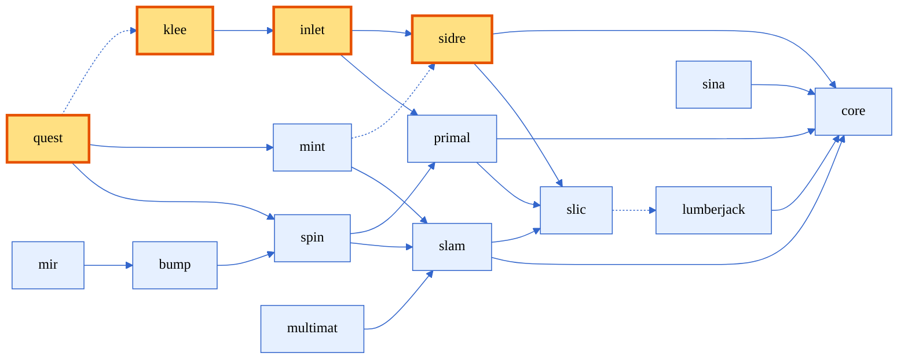

[comment]: # (#################################################################)
[comment]: # (Copyright 2017-2025, Lawrence Livermore National Security, LLC)
[comment]: # (and Axom Project Developers. See the top-level LICENSE file)
[comment]: # (for details.)
[comment]: #
[comment]: # (# SPDX-License-Identifier: BSD-3-Clause)
[comment]: # (#################################################################)


# Axom overview and introduction

Axom is a modular collection of C++ library "components" that provide the infrastructure needed to develop large-scale, multi-physics simulation software. It offers reusable capabilities for data and I/O management (Sidre and Sina with [Conduit](https://github.com/LLNL/conduit) and optional [HDF5](https://www.hdfgroup.org/solutions/hdf5/); Bump, Multimat), parameterized input (Inlet), geometry, meshing, and analysis (Primal, Mint, Mir, Quest, Spin, Slam), along with robust logging and diagnostics (Slic, Lumberjack).

Axom targets modern HPC platforms with performance portability across CPUs and GPUs, and interoperates with [RAJA](https://github.com/LLNL/RAJA) and [Umpire](https://github.com/LLNL/Umpire) to manage execution and memory when those backends are enabled. It features a [BLT](https://github.com/llnl/blt)-based CMake build system and integrates smoothly with [Spack](https://spack.io)-based and [vcpkg](https://vcpkg.io)-based dependency management through [uberenv](https://github.com/llnl/uberenv).

Axom is distributed under a BSD-3-Clause license and is available on [GitHub](https://github.com/LLNL/axom). For installation instructions, usage examples, and comprehensive API documentation, see the [Axom documentation site](https://axom.readthedocs.io/en/develop/).


## What is "Shaping"?

"Shaping" (sometimes referred to as "mesh overlay" or "painting") refers to the process of defining how complex geometric regions overlap with a computational mesh. This is crucial for setting up multi-material physics simulations where different materials occupy different regions of space. 

Shaping produces "volume fraction" fields defined on mesh cells, representing the percentage of each cell occupied by different materials. In high-order finite element meshes, volume fractions are polynomial functions describing material distribution throughout the cells. Volume fractions maintain a *partition of unity* -- they always sum to one at any location in the mesh -- ensuring complete and consistent material representation.

<br />

<figure style="text-align: center;">
  
  <figcaption>Figure: Overview of the shaping workflow in this tutorial. Geometric regions are combined with a computational mesh to produce volume fractions</figcaption>
</figure>

## Key Axom components in this tutorial

- **Klee**: Plays a critical role in flexible geometric setup for multimaterial simulations. It utilizes **Inlet** (a parameterized input library) and **Sidre** (a data management interface), allowing users to define their problem setup effectively.

- **Quest**: A component that handles higher level queries over computational meshes. Quest leverages the **Primal** (computational geometry) and **Spin** (spatial index) components, facilitating the actual shaping computations and volume fraction assignments.



<div style="text-align:center">
<figcaption>Figure: Axom components and their interdependencies, highlighting the components featured in this tutorial. Solid and dashed lines correspond to required and optional dependencies, respectively.</figcaption>
</div>

## A first example

Let's get our feet wet with a first example that uses an installed version of Axom. Specifically, we will print the version of Axom and some of its configuration properties.

> :information_source: Axom requires ``C++17`` or higher. This example uses the ``C++20`` standard.

> :memo: For details about configuring and installing Axom, see the [Zero-to-Axom Installation Guide](https://axom.readthedocs.io/en/develop/zero_to_axom/index.html)

We will be using CMake to configure our examples against a pre-installed copy of Axom configured with several third-party libraries (TPLs) including the following libraries developed by LLNL:
* [Conduit](https://github.com/LLNL/conduit/)
* [MFEM](https://mfem.org/)
* [RAJA](https://github.com/LLNL/raja)
* [Umpire](https://github.com/LLNL/umpire)

Axom's build system is based on [BLT](https://github.com/LLNL/blt) -- a streamlined CMake-based foundation for <b>B</b>uilding, <b>L</b>inking and <b>T</b>esting large-scale high performance computing (HPC) applications.

Since Axom users typically develop HPC applications that need to run on several different platforms ("hosts") with several different compilers, we will be using a CMake cache file containing several configuration variables, including the compiler and MPI information as well as compilation flags and paths to third-party libraries. We refer to this file as a "host-config".

Our application can be configured and built using the following commands:
```shell
cd <path/to/installed/tutorial/files>
mkdir build
cd build
cmake -C ../host-config.cmake ..
make -j16
```

> :memo:  BLT provides a few lightweight "smoke" tests to help diagnose configuration issues. If we configure our application with the ``ENABLE_TESTS`` CMake option, the above command will build these tests and we can run them using ``ctest``.

The following CMake snippet imports the provided Axom installation into our project's build system:
```cmake
include(CMakeFindDependencyMacro)
find_dependency(axom REQUIRED
                NO_DEFAULT_PATH 
                PATHS ${AXOM_DIR}/lib/cmake)
```
It assumes that the user has provided the path to our Axom installation via the CMake variable ``AXOM_DIR`` and provides the top-level ``axom`` CMake target as well as several other targets in the ``axom::`` namespace.

This snippet generates an executable for our application using blt's [blt_add_executable](https://llnl-blt.readthedocs.io/en/develop/api/target.html#blt-add-executable) macro:
```cmake
blt_add_executable(NAME       lesson_00_check_axom_configuration 
                   SOURCES    lesson_00/check_axom_configuration.cpp
                   DEPENDS_ON axom axom::fmt)
```

> :clapper: Look at ``CMakeLists.txt`` at the root of the tutorial directory. Since we build several applications with the same dependencies, our actual calls to ``blt_add_executable`` differ slightly.


## Including Axom components

To simplify usage of Axom components in applications, Axom generates per-component include files listing the available header files for a given component.
For example, to use Axom's ``core`` component within a source file, we add the following include line
```cpp
#include "axom/core.hpp"
```

Axom also generates a config header file containing most of the compiler defines related to the configured Axom. This file is located in ``axom/config.hpp``. For example, to guard MPI-related code, we would use the ``AXOM_USE_MPI`` as follows:
```cpp
#include "axom/config.hpp"

#ifdef AXOM_USE_MPI
  #include <mpi.h>
#endif

...
```

> :clapper: Look at ``"axom/config.hpp"`` and ``"axom/core.hpp"`` in the installation directory

## Checking the Axom version

We will use ``axom::getVersion()`` to print the version of Axom that we're using. 
This function is provided in Axom's core component.
```cpp
#include "axom/core.hpp"

std::cout << axom::fmt::format("Version: {}", axom::getVersion()) << "\n\n";
```

This includes the major, minor and patch version of Axom as well as the git SHA (when available).
The above command might produce something like:
```
Version: v0.12.0-fd04d6d3d
```

The version is also available as compiler defines in ``axom/config.hpp``. The following corresponds to the above version:
```cpp
#define AXOM_VERSION_MAJOR 0
#define AXOM_VERSION_MINOR 12
#define AXOM_VERSION_PATCH 0
#define AXOM_VERSION_FULL  "v0.12.0"
```

## Checking details about the Axom configuration

Another useful function for checking features of Axom's configuration is ``axom::about()``, which is available in Axom's ``core`` component.
```cpp
axom::about();
```


## Running the application

After building the application, it will be located in the ``bin`` directory of our build system.
We can run the application using:
```shell
./bin/lesson_00_check_axom_configuration
```

Its output should look something like:

```
Axom information:
  AXOM_VERSION_FULL: v0.12.0
  AXOM_VERSION_MAJOR: 0
  AXOM_VERSION_MINOR: 12
  AXOM_VERSION_PATCH: 0
  AXOM_GIT_SHA: fd04d6d3d
Compiler Settings: 
  C++ Standard: c++20
  Size of axom::IndexType: 8
Active programming models:    { mpi;openmp }
Available components:         { core;bump;inlet;klee;lumberjack;mint;mir;
                                primal;quest;sidre;sina;slam;slic;spin }
Active built-in dependencies: { CLI11;fmt;sol;sparsehash }
Active external dependencies: { adiak;c2c;caliper;conduit;hdf5;lua;
                                mfem;raja;scr;umpire }
```


> :clapper: Run the example for this lesson

