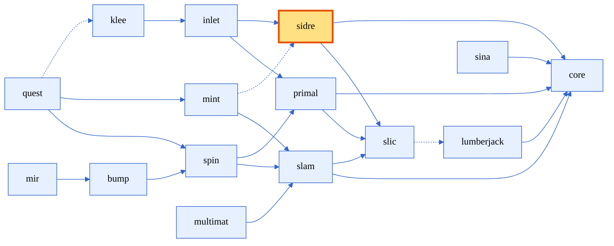

[comment]: # (#################################################################)
[comment]: # (Copyright 2017-2025, Lawrence Livermore National Security, LLC)
[comment]: # (and Axom Project Developers. See the top-level LICENSE file)
[comment]: # (for details.)
[comment]: #
[comment]: # (# SPDX-License-Identifier: BSD-3-Clause)
[comment]: # (#################################################################)

# Setting up a 2D Cartesian mesh with Axom Sidre

## Introduction

This lesson introduces how to use Axom's `Sidre` component to set up and manage basic metadata for a 2D Cartesian mesh. Sidre (*Simulation Data Repository*) provides an efficient way to store hierarchical mesh metadata. We will focus on defining the spatial bounding box and resolution of the mesh, and show how this can be used to create a mesh following the  [Conduit mesh blueprint](https://llnl-conduit.readthedocs.io/en/latest/mesh.html) conventions.

Mesh metadata defines key properties that describe the geometry and discretization of a mesh. For Cartesian meshes, two main pieces of metadata are essential:

- **Bounding Box:** Defines the spatial extent of the mesh, described by minimum and maximum coordinates in each dimension.
- **Resolution:** Specifies the number of cells along each dimension, dictating the mesh granularity.

<figure style="text-align: center;">
  
  <figcaption>Figure: A Cartesian mesh can be defined in terms of its resolution and bounding box.</figcaption>
</figure>

This tutorial demonstrates how to represent this metadata using Sidre.

## Sidre basics
<div style="text-align: center;">


<figcaption>Figure: Axom components, highlighting Sidre</figcaption>
</div>

Sidre was designed for efficiently storing and organizing simulation data in memory using hierarchical structures. It manages a tree-like organization through a central `DataStore`, which contains a hierarchy of Groups and Views.

### Key concepts in Sidre

**DataStore**
:  The top-level container that owns the entire hierarchical data structure. All groups and views ultimately belong to a DataStore instance.

**Groups**
:  Nodes in the hierarchy that act like directories or folders. Groups can contain other groups or views, helping to organize data logically.

**Views**
:  Leaf nodes containing metadata or raw data. Views provide access to scalar data or arrays stored internally using Buffers or stored externally.

**Buffers**
:  Memory blocks allocated to hold bulk (array) data referenced by views. 

**Attributes**
:  Metadata about views, such as type information or external identifiers, which provide additional context.

Sidre allows flexible and efficient memory management, making it ideal to pass around within a simulation.

In the following sections, we will create groups and views within a Sidre DataStore to store the bounding box and resolution data for a Cartesian mesh.

> :information_source: **Note:** Sidre has a hard dependency on [Conduit](https://github.com/LLNL/conduit) for its core data structures and a soft dependency on [HDF5](https://www.hdfgroup.org/solutions/hdf5/) for optional serialization capabilities.

## Defining mesh metadata with Sidre

Now, let's set up the Sidre groups and views to store the mesh metadata for a 2D Cartesian mesh. 

We'll define a simple struct to hold our input data:
```cpp
struct Input
{
  double min_x = 0.0;
  double min_y = 0.0;
  double max_x = 1.0;
  double max_y = 1.0;
  int res_x = 10;
  int res_y = 20;
};
```

Next, we'll create a root group called `"mesh"` and add two subgroups: `"bounding_box"` and `"resolution"`.

```cpp
#include "axom/sidre.hpp"

void setup_mesh_metadata(axom::sidre::DataStore& datastore, const Input& input)
{
  // Create a root group for the mesh metadata
  axom::sidre::Group* meshGroup = datastore.getRoot()->createGroup("mesh");

  // Create bounding box groups and views
  axom::sidre::Group* minGroup = meshGroup->createGroup("bounding_box/min");
  minGroup->createViewScalar("x", input.min_x);
  minGroup->createViewScalar("y", input.min_y);

  axom::sidre::Group* maxGroup = meshGroup->createGroup("bounding_box/max");
  maxGroup->createViewScalar("x", input.max_x);
  maxGroup->createViewScalar("y", input.max_y);

  // Create resolution group and views
  axom::sidre::Group* resGroup = meshGroup->createGroup("resolution");
  resGroup->createViewScalar("x", input.res_x);
  resGroup->createViewScalar("y", input.res_y);
}
```

The above Sidre hierarchy can be visualized as:

<figure style="text-align: center;">
  
  <figcaption>Figure: Sidre hierarchical structure showing the mesh metadata groups and views.</figcaption>
</figure>


> :clapper: You can try running this example code in lesson_01's `mesh_metadata_sidre` example to see how Sidre manages mesh metadata in practice. This example allows you to enter the bounding box and resolution parameters on the command line.
> <details>
> <summary> Some example runs </summary>
>
> ```bash
>  > ./bin/lesson_01_mesh_metadata_sidre -h
>   Mesh Metadata Setup
>   Usage: ./bin/lesson_01_mesh_metadata_sidre [OPTIONS]
> 
>   Options:
>     -h,--help                   Print this help message and exit
>     --min_x FLOAT               Minimum x coordinate of bounding box
>     --min_y FLOAT               Minimum y coordinate of bounding box
>     --max_x FLOAT               Maximum x coordinate of bounding box
>     --max_y FLOAT               Maximum y coordinate of bounding box
>     --res_x INT                 Resolution in x direction
>     --res_y INT                 Resolution in y direction
>
>  > ./bin/lesson_01_mesh_metadata_sidre --min_x 50 --max_x 350 --min_y 50 --max_y 350 --res_x 8 --res_y 8
>  [INFO] Sidre hierarchy was properly set up 
>  [INFO] Bounding Box Min: (50, 50) 
>  [INFO] Bounding Box Max: (350, 350) 
>  [INFO] Resolution: (8, 8) 
> ```
> </details>

> :computer: **Challenge**
>  What might this look like if we used arrays backed by `sidre::Buffer` for the bounding box and resolution instead of scalars?
> <details>
>  <summary> Solution </summary>
>
>    ```cpp
>    // Create array views for bounding box and resolution
>    axom::sidre::Group* meshGroup = datastore->getRoot()->getGroup("mesh");
>
>    // Bounding box as 2-element arrays: [x, y]
>    axom::sidre::Group* bbGroup = meshGroup->createGroup("bounding_box");
>    axom::sidre::View* minView = bbGroup->createViewAndAllocate("min", axom::sidre::DOUBLE_ID, 2);
>    axom::sidre::View* maxView = bbGroup->createViewAndAllocate("max", axom::sidre::DOUBLE_ID, 2);
>    double* min = minView->getArray<double>();
>    double* max = maxView->getArray<double>();
>    min[0] = input.min_x; min[1] = input.min_y;
>    max[0] = input.max_x; max[1] = input.max_y;
>
>    // Resolution as a 2-element int array: [nx, ny]
>    axom::sidre::View* resView = meshGroup->createViewAndAllocate("resolution", axom::sidre::INT32_ID, 2);
>    int32_t* res = resView->getArray<int32_t>();
>    res[0] = static_cast<int32_t>(input.res_x);
>    res[1] = static_cast<int32_t>(input.res_y);
>    ```
>    </details>


# Converting to Mesh Blueprint representation

We can map our user-provided bounding box and resolution to a basic "uniform" 2D Cartesian mesh following the [Conduit mesh blueprint](https://llnl-conduit.readthedocs.io/en/latest/blueprint_mesh.html) conventions as follows:

1. Use the bounding box minimum as the `coordset` origin: 
 ```cpp
    n["coordsets/coords/origin/x"] = x_min;
    n["coordsets/coords/origin/y"] = y_min;
```

2. Since the resolution is the number of cells in each direction, the `coordset` dimensions have one more point: 
```cpp
   n["coordsets/coords/dims/i"] = res_x + 1;
   n["coordsets/coords/dims/j"] = res_y + 1;
```
3. Finally, compute the uniform spacing from the bounding box extent and resolution: 
```cpp
   n["coordsets/coords/spacing/dx"] = (x_max - x_min) / res_x;
   n["coordsets/coords/spacing/dy"] = (y_max - y_min) / res_y;
```

Here's an example blueprint corresponding to the image above with resolution $(8,8)$ and bounding boxes from $(50,50)$ to $(350,350)$:
<table style="border-collapse: collapse; border: none;">
<tr style="border: none;">
<td style="width:20%; border: none;">

```yaml
mesh:
  coordsets:
    coords:
      type: "uniform"
      dims:
        i: 9
        j: 9
      origin:
        x: 50.0
        y: 50.0
      spacing:
        dx: 37.5
        dy: 37.5
  topologies:
    mesh:
      type: "uniform"
      coordset: "coords"
```
<figcaption style="text-align: center;">Figure: YAML representation of the Conduit mesh blueprint.</figcaption>

</td>
<td style="width:20%; border: none;">

<figure style="text-align: center;">
  
  <figcaption>Figure: Visualization of the blueprint mesh rendered in <a href="https://visit-dav.github.io/visit-website/">VisIt</a>.</figcaption>
</figure>

</td>
</tr>
</table>

<details>
  <summary>Detail: Converting Sidre Mesh Metadata to Conduit Blueprint</summary>

```cpp
conduit::Node create_mesh_blueprint(axom::sidre::Group* meshGroup)
{
  conduit::Node blueprint;

  if(!meshGroup)
  {
    SLIC_ERROR("Invalid mesh group provided");
    return blueprint;
  }

  // Get bounding box information
  axom::sidre::Group* bbGroup = meshGroup->getGroup("bounding_box");
  if(!bbGroup)
  {
    SLIC_ERROR("Missing bounding_box group in mesh metadata");
    return blueprint;
  }

  double x_min = bbGroup->getView("min/x")->getData<double>();
  double y_min = bbGroup->getView("min/y")->getData<double>();
  double x_max = bbGroup->getView("max/x")->getData<double>();
  double y_max = bbGroup->getView("max/y")->getData<double>();

  // Get resolution information
  axom::sidre::Group* resGroup = meshGroup->getGroup("resolution");
  if(!resGroup)
  {
    SLIC_ERROR("Missing resolution group in mesh metadata");
    return blueprint;
  }

  int res_x = resGroup->getView("x")->getData<int>();
  int res_y = resGroup->getView("y")->getData<int>();

  // Create coordset
  blueprint["coordsets/coords/type"] = "uniform";
  blueprint["coordsets/coords/dims/i"] = res_x + 1;
  blueprint["coordsets/coords/dims/j"] = res_y + 1;
  blueprint["coordsets/coords/origin/x"] = x_min;
  blueprint["coordsets/coords/origin/y"] = y_min;
  blueprint["coordsets/coords/spacing/dx"] = (x_max - x_min) / res_x;
  blueprint["coordsets/coords/spacing/dy"] = (y_max - y_min) / res_y;

  // Create topology
  blueprint["topologies/mesh/type"] = "uniform";
  blueprint["topologies/mesh/coordset"] = "coords";

  return blueprint;
}
```
</details>

## Summary and next steps

In this lesson, we learned how to use Axom's Sidre component to set up metadata for a 2D Cartesian mesh. 

We covered:

- Creating a hierarchical structure in Sidre to store mesh metadata
- Defining the bounding box and resolution for a Cartesian mesh
- Organizing the data using Sidre's Groups and Views
- Generating and visualizing a Conduit mesh blueprint representation of this metadata

Sidre provides a flexible way to store and organize simulation data, making it easier to manage complex data structures in memory efficiently.

The next lesson will extend this example by:

- Using Axom's Inlet component to parse and validate input parameters
- Extending our example to support 2D and 3D Cartesian meshes
