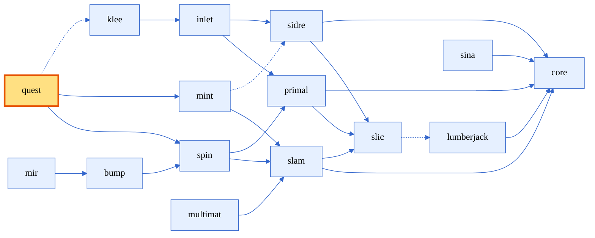
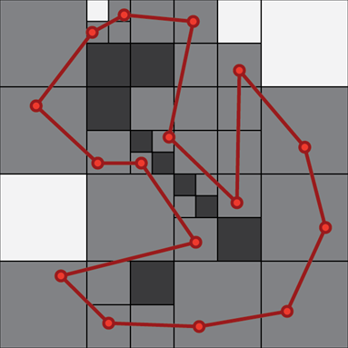
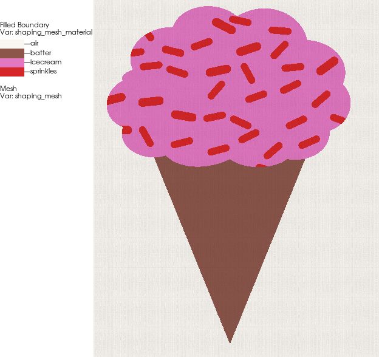
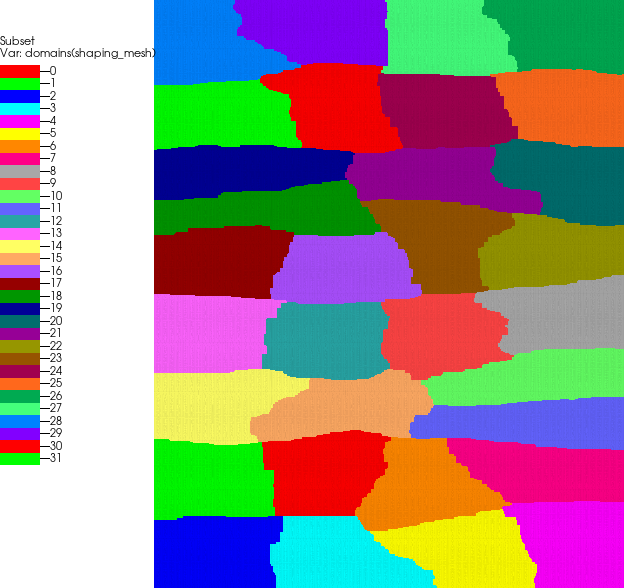

[comment]: # (#################################################################)
[comment]: # (Copyright 2017-2025, Lawrence Livermore National Security, LLC)
[comment]: # (and Axom Project Developers. See the top-level LICENSE file)
[comment]: # (for details.)
[comment]: #
[comment]: # (# SPDX-License-Identifier: BSD-3-Clause)
[comment]: # (#################################################################)

<style>
    figcaption {
        text-align: center;
        font-style: italic;
        color: #555555;
    }
</style>

# Lesson: Shaping application with Quest

In this lesson, we will consider Axom's shaping application, which takes a Klee input file describing a geometric setup and "shapes" it onto a computational mesh, resulting in a `volume_fraction` scalar field for each material.

The shaping application lives inside the `Quest` component of Axom, so we begin by describing Quest and then focus on the details of the Shaping application.

## Introduction to Quest

<div style="text-align: center;">


<figcaption>Figure: Axom components, highlighting Quest</figcaption>
</div>


Quest is a component of Axom that deals with high level geometric queries over computational meshes. 
Some examples:
    
**In/Out queries**
:  Given a point and a surface bounding a volumetric region of space, determine whether the point lies inside or outside that surface.

**Point location**
:  Given a point and a volumetric mesh (in 2D or 3D), find the element of the mesh containing the point. If such an element exists, we also find the isoparametric coordinates of the point within that element.

**Isosurface extraction**
:  Given a volumetric mesh and a scalar field defined at the mesh vertices and a field value, extract the isosurface for a given field value (e.g. using [Marching Cubes](https://en.wikipedia.org/wiki/Marching_cubes)).

**Distributed closest point**
:  Given two collection of primitives, e.g. two point clouds, each distributed across the problem's MPI ranks, for each primitive from the first collection, find the closest primitive in the second collection.

Quest applications are designed to be robust to geometric and numerical tolerances. They are defined in terms of the computational geometry primitives and operators in Axom's `primal` component and often utilize a spatial index from Axom's `spin` component. Furthermore, to achieve good performance on CPU-based and GPU-based platforms, they are built on top of our performance portability abstractions based on [RAJA](https://github.com/LLNL/RAJA) and [Umpire](https://github.com/LLNL/Umpire)

## Shaping Application Overview

The shaping application maps user-defined geometric shapes onto a target computational mesh to determine the spatial arrangement of materials. It computes conservative, per-cell volume fractions for each material based on those shapes, while honoring user-defined replacement rules. The resulting set of volume fraction fields are bounded between 0 and 1, forming a partition of unity at every location in the mesh.

For each mesh cell (or sampled location), the algorithm evaluates how each shape interacts with the current material state. It determines which materials to update according to the specified replacements rules, and computes the shape’s contribution to the cell's material volume fractions (via sampling or exact geometric intersection).

Axom's shaping application supports two types of shaping: 
- _Intersection-based shaping_, in which the volume fractions are determined by finding the intersection volume between each cell of the computational mesh and the shapes
- _Sample-based shaping_, in which we sample the shape at various locations within each cell to determine whether that point lies within the shape and then reconstruct the volume fractions from those samples.

For this lesson, we will focus on the sampling-based shaper and discuss two methods for determining whether points are inside or outside the shape:

**InOutOctree**
:  The [InOutOctree](https://www.osti.gov/biblio/1357384) approach constructs an octree over the shape, and labels each octree block as "inside", "outside" or on the "surface". The former two cases immediately yield the in/out determination, while the "surface" case requires some additional computational geometry to settle the case. This approach requires the shape to be discretized into line segments (2D) or triangles (3D), and requires the collection of facets to be watertight.

**Winding number**
:  The [winding number](https://doi.org/10.1145/3658228) approach is more computationally intensive, but is tolerant to geometric defects such as gaps in the surface as well as self-intersections. It considers the number of times the surface wraps around the query point and then rounds to the closest integer.

<figure style="text-align: center;">
  
  <figcaption>Figure: Visualization of the InOutOctree. The octree blocks are colored as "inside" (dark gray), "outside" (white), or "surface" (light gray). The surface elements are shown in red.</figcaption>
</figure>


## Shaping pipeline

We apply the same pipeline to each shape in our Klee input:

```cpp
  for(const auto& shape : shapeSet.getShapes())
  {
    const klee::Dimensions shapeDim = shape.getGeometry().getInputDimensions();

    shaper->loadShape(shape);
    shaper->prepareShapeQuery(shapeDim, shape);
    shaper->runShapeQuery(shape);
    shaper->applyReplacementRules(shape);
    shaper->finalizeShapeQuery();
  }
  shaper->adjustVolumeFractions();
```

**loadShape()**
:  We resolve the file path relative to the Klee input file, apply any transforms specified in the shape's `operators` and discretize/linearize the shape, as necessary.

**prepareShapeQuery()**
:  In this stage, we compute the bounding box of the shape, and generate a spatial index (e.g. a BVH tree or an Octree) over the shape's cells.

**runShapeQuery()**
:  In this stage, we query the spatial index to find candidates for each cell of the computational mesh. We then apply computational geometry operations on each pair of candidates. For sample-based shaping, this determines whether samples from each cell are contained within the shape. For intersection-based shaping, we find the overlap volume between each computational cell and the (discretized) shape.

**applyReplacementRules()**
:  We next apply the replacement rules to update the volume fractions for the current shape's material and for the other materials that have already been shaped in.

**finalizeShapeQuery()**
:  Finally, we release temporary memory associated with the current shape.

**adjustVolumeFractions()**
:  After all shapes have been processed, we have one more chance to update the volume fractions. For sample-based shaping, we convert from samples (at quadrature points of high order cells) to a (high order) volume fraction field for each material.
  
## Setting up the computational mesh

Returning to our running example from `lesson_02`, we extend our Inlet-based mesh metadata schema to handle some additional parameters necessary for our shaping application.

```cpp
struct MeshMetadata
{
  // original entries from lesson_02
  int dim;
  axom::Array<double> bb_min;
  axom::Array<double> bb_max;
  axom::Array<int> resolution;

  // new entries in the MeshMetadata schema for shaping options
  std::string background_material;
  int volume_fraction_order {2};
  int mesh_order {1};
  int quadrature_order {5};
  quest::SamplingShaper::SamplingMethod sampling_method {quest::SamplingShaper::SamplingMethod::InOut};
};
```
This allows the user to set the polynomial order of the volume fraction functions via `volume_fraction_order`, the sampling order for quadrature points within each element `quadrature_order`, and the `sampling_method` -- either using an `InOutOctree` over a discretized/linearized representation of the shape, or using an approach based on winding numbers.

We also allow the user to specify a "background_material". When specified, a corresponding volume fraction field will be generated and initialized to 1 everywhere. Users can incorporate this into their input with a special "geometry/format" of "none".

> :information_source: This feature is more powerful than implied above. Our shaping application allows the user to supply an initial volume fraction field for any of the materials, e.g. via attributes for each element in the input mesh.


<details>
<summary> Defining and validating the new entries </summary>
The changes to the schema and the MeshMetadata constructor are relatively straightforward. Perhaps the most interesting is the `sampling_method`, which restricts the input to two string ("inout" and "winding"), and converts from strings to an enum value.

```cpp
  static void defineSchema(inlet::Container& mesh_schema)
  {
    ...

    mesh_schema.addString("background_material", "Optional background material");
    mesh_schema.addInt("volume_fraction_order", "Order for volume fraction fields (>= 1)")
      .range(1, std::numeric_limits<int>::max());
    mesh_schema.addInt("mesh_order", "Order for mesh nodes (>= 1)")
      .range(1, std::numeric_limits<int>::max());
    mesh_schema.addInt("quadrature_order", "Order for quadrature (>= 1)")
      .range(1, std::numeric_limits<int>::max());

    mesh_schema.addString("sampling_method", "Sampling method ('inout' or 'winding')")
      .validValues({"inout", "winding"});
  }
```

```cpp
template <>
struct FromInlet<MeshMetadata>
{
  MeshMetadata operator()(const inlet::Container& input_data)
  {
    MeshMetadata result;
    ...

    if(input_data.contains("background_material"))
    {
      result.background_material = static_cast<std::string>(input_data["background_material"]);
    }

    if(input_data.contains("volume_fraction_order"))
    {
      result.volume_fraction_order = static_cast<int>(input_data["volume_fraction_order"]);
    }

    if(input_data.contains("quadrature_order"))
    {
      result.quadrature_order = static_cast<int>(input_data["quadrature_order"]);
    }

    if(input_data.contains("sampling_method"))
    {
      const auto str = static_cast<std::string>(input_data["sampling_method"]);
      if(str == "inout")
      {
        result.sampling_method = quest::SamplingShaper::SamplingMethod::InOut;
      }
      else if(str == "winding")
      {
        result.sampling_method = quest::SamplingShaper::SamplingMethod::WindingNumber;
      }
    }
    ...

    return result;
  }
}

```
</details>

<br />

Once the `MeshMetadata` instance has been initialized, we use it to generate a high order MFEM mesh using a built-in quest function `quest::util::make_cartesian_mfem_mesh_{2,3}D`:

```cpp
mfem::Mesh* createCartesianMesh(const MeshMetadata& meta, int nodal_order)
{
  mfem::Mesh* mesh = nullptr;

  switch(meta.dim)
  {
  case 2:
  {
    const axom::NumericArray<int, 2> res {meta.resolution[0], meta.resolution[1]};
    const auto bbox = meta.getBoundingBox<2>();
    mesh = quest::util::make_cartesian_mfem_mesh_2D(bbox, res, nodal_order);
  }
  break;
  case 3:
  {
    const axom::NumericArray<int, 3> res {meta.resolution[0], meta.resolution[1], meta.resolution[2]};
    const auto bbox = meta.getBoundingBox<3>();
    mesh = quest::util::make_cartesian_mfem_mesh_3D(bbox, res, nodal_order);
  }
  break;
  default:
    SLIC_ERROR("Only 2D and 3D meshes are supported");
    break;
  }

  return mesh;
}
```

We then generate a Conduit mesh blueprint over this mesh using Sidre's `MFEMSidreDataCollection` class
```cpp
  // --------------------------------------------------------------------------
  // Set up computational mesh from MeshMetadata
  // --------------------------------------------------------------------------
  mfem::Mesh* mesh = createCartesianMesh(meta, meta.mesh_order);
  constexpr bool dc_owns_data = true;  // Note: dc takes ownership of mesh
  sidre::MFEMSidreDataCollection dc("shaping", nullptr, dc_owns_data);
#ifdef AXOM_USE_MPI
  dc.SetMesh(MPI_COMM_WORLD, mesh);
#else
  dc.SetMesh(mesh);
#endif
  dc.SetMeshNodesName("positions");

  dc.AssociateMaterialSet("vol_frac", "material");
```
The last line adds `matset` metadata to our mesh blueprint, which allows VisIt to apply material interface reconstruction (MIR) to better visualize our volume fraction fields.

## Examples

### Nested circles

Our first example is a setup consisting of two concentric circles. Our setup takes a unit circle shape and scales it to the desired proportions.

<table style="border-collapse: collapse; border: none;">
  <tr style="border: none;">
  <td style="width:20%; border: none;">

```xml
<?xml version="1.0" encoding="UTF-8"?>
<svg xmlns="http://www.w3.org/2000/svg" viewBox="-1.25 -1.25 2.5 2.5">
  <circle cx="0" cy="0" r="1" fill="none" stroke="black" stroke-width="0.03"/>
</svg>
```
<figcaption style="text-align: center;">Figure: SVG representation of a unit circle.</figcaption>

<br />
<details>
<summary> MFEM representation generated via svg2contours.py </summary>

```bash
MFEM NURBS mesh v1.0

# MFEM Geometry Types: SEGMENT = 1 | SQUARE = 3 | CUBE = 5

dimension
1

elements
2
1 1 0 1
1 1 2 3

boundary
0

edges
2
0 0 1
1 0 1

vertices
4

knotvectors
2
3 4 0 0 0 0 1 1 1 1
3 4 0 0 0 0 1 1 1 1

weights
1 1
1 1
0.3333333333333333 0.3333333333333333
0.3333333333333333 0.3333333333333333

FiniteElementSpace
FiniteElementCollection: NURBS
VDim: 2
Ordering: 1

 1.0  0.0 -1.0  0.0
-1.0  0.0  1.0  0.0
-1.0  2.0  1.0  2.0
 1.0 -2.0 -1.0 -2.0
```
<figcaption style="text-align: center;">Figure: MFEM representation of the unit circle.</figcaption>
</details>

</td>
<td style="width:30%; border: none;">

<figure style="text-align: center;">
  
  <figcaption>Figure: Unit circle.</figcaption>
</figure>

</td>
</tr>
</table>

We run our shaping application with the following Klee input and mesh metadata.

<table style="border-collapse: collapse; border: none;">
  <tr style="border: none;">
  <td style="width:10%; border: none;" valign="top">

```yaml
dimensions: 2


shapes:
  - name: background
    material: void
    geometry:
      format: none
      
  - name: outer_shell
    material: steel
    geometry:
      format: mfem
      path: unit_circle.mesh
      units: cm
      operators:
        - scale: 5

  - name: inner_ball
    material: void
    geometry:
      format: mfem
      path: unit_circle.mesh
      start_units: mm
      end_units: cm
      operators:
        - scale: 25
        - convert_units_to: cm

```
<figcaption style="text-align: center;">Figure: Klee input for circles example (circles.yaml).</figcaption></br>
<ul>
    <li><a href="visit_plot_circle.py">VisIt script</a> for plotting circles shaping output.</li>
</ul>

</td>
<td style="width:20%; border: none;">

```lua
 mesh = {
   dim = 2,
   bounding_box = {
     min = { x = -6, y = -6},
     max = { x =  6, y =  6 }
   },
   resolution = { x = 100, y = 100 },
   background_material = "void",
   volume_fraction_order = 2,
   mesh_order = 2,
   quadrature_order = 5,
   sampling_method = "inout",
 }
```
<figcaption style="text-align: center;">Figure: Mesh metadata schema (circle_input.lua).</figcaption>


<figure style="text-align: center;">
  
  <figcaption>Figure: Shaped-in circles example rendered in VisIt.</figcaption>
</figure>

</td>
</tr>
</table>

We note that this example exercises scaling operators, unit conversion operators and a background material.
The replacement rules are implicit -- each new shape replaces all existing materials under it.

> :clapper: This example was run using from the build directory as:
> ```bash
>   ./bin/shaping_tutorial_lesson_04_quest_sampling_shaper \
>              -k ../src/examples/shaping_tutorial/lesson_04/circles.yaml \
>              -m ../src/examples/shaping_tutorial/lesson_04/circle_input.lua
> ```


### Ice cream example revisited

Next, we return to our ice cream example from `lesson_03`.

Recall we wanted to generate a mesh with a cone, ice cream and sprinkles, such that the sprinkles are only covering the ice cream, while the ice cream covers the cone.

<figure style="text-align: center;">
  
  <figcaption>Figure: SVG for the ice cream geometry from lesson_03.</figcaption>
</figure>

<table style="border-collapse: collapse; border: none;">
  <tr style="border: none;">
  <td style="width:10%; border: none;" valign="top">

```yaml
dimensions: 2

shapes:
  - name: background
    material: air
    geometry:
      format: none

  - name: vanilla_scoop
    material: icecream
    geometry:
      format: mfem
      path: scoop.mesh
      units: cm

  - name: colorful_sprinkles
    material: sprinkles
    geometry:
      format: mfem
      path: sprinkles.mesh
      units: cm
    replaces: [icecream]

  - name: cone
    material: batter
    geometry:
      format: mfem
      path: cone.mesh
      units: cm
    does_not_replace: [icecream, sprinkles]


```
<figcaption style="text-align: center;">Figure: Klee input for ice cream example (ice_cream.yaml).</figcaption><br>
<ul>
    <li><a href="visit_plot_ice_cream.py">VisIt script</a> for plotting ice cream shaping output.</li>
</ul>

</td>
<td style="width:20%; border: none;">

```lua
  mesh = {
    dim = 2,
    bounding_box = {
      min = { x = 0, y = 0},
      max = { x =  400, y =  500 }
    },  
    resolution = { x = 400, y = 1200 },
    background_material = "air",
    volume_fraction_order = 2,
    mesh_order = 2,
    quadrature_order = 5,
    sampling_method = "winding",
  }
```
<figcaption style="text-align: center;">Figure: Mesh metadata schema (circle_input.lua).</figcaption>


<figure style="text-align: center;">
  
  <figcaption>Figure: Shaped-in ice cream example rendered in VisIt.</figcaption>
</figure>

</td>
</tr>
</table>


<details>
<summary>The inside scoop (with extra sprinkles)</summary>

<table style="border-collapse: collapse; border: none; width: 100%;">
  <tr style="border: none;">
    <td style="width:50%; border: none; text-align: center;">
      
      <figcaption>Figure: Superimposing the sprinkle boundaries over the shaped-in ice cream.</figcaption>
    </td>
    <td style="width:50%; border: none; text-align: center;">
      
      <figcaption>Figure: Domain decomposition for our ice cream run.</figcaption>
    </td>
  </tr>
</table>
</details>

<br />

> :clapper: This example was run in parallel on 32 ranks using from the build directory as:
> ```bash
>   srun -n32 ./bin/shaping_tutorial_lesson_04_quest_sampling_shaper \
>            -k ../src/examples/shaping_tutorial/lesson_04/ice_cream.yaml \
>            -m ../src/examples/shaping_tutorial/lesson_04/ice_cream_metadata.lua
> ```

### Example: Klee's heroic roses

This example uses contours stored in MFEM files to approximate the shapes in Paul Klee's *Heroic Roses* painting.

<table style="border-collapse: collapse; border: none;">
  <tr style="border: none;">
  <td style="width:10%; border: none;" valign="top">
  <ul>
    <li><i>Heroic Roses</i> <a href="https://github.com/LLNL/axom_data/blob/main/shaping/heroic_roses_mfem.yaml">heroic_roses_mfem.yaml</a> example input file.</li>
    <li><i>Heroic Roses</i> <a href="https://github.com/LLNL/axom_data/tree/main/contours/heroic_roses/mfem">MFEM shape files</a>.</li>
    <li><a href="https://github.com/LLNL/axom/blob/develop/scripts/plotting/visit_heroic_roses.py">VisIt script</a> for plotting Heroic Roses shaping output.</li>
  </ul>

<figure style="text-align: center;">
  
  <figcaption>Figure: Paul Klee's "Heroic Roses" (1938), the inspiration for our example.</figcaption>
</figure>
</td>
<td style="width:20%; border: none;">

```lua
  mesh = {
    dim = 2,
    bounding_box = {
      min = { x = 0, y = 0},
      max = { x =  300, y = 400 }
    },
    resolution = { x = 300, y = 400 },
    background_material = "canvas",
    volume_fraction_order = 2,
    mesh_order = 2,
    quadrature_order = 5,
    sampling_method = "inout",
  }
```
<figcaption style="text-align: center;">Figure: Mesh metadata schema (heroic_roses.lua).</figcaption><bg>

<figure style="text-align: center;">
  <br>
  <figcaption>Figure: Shaped-in Heroic Roses example rendered in VisIt.</figcaption>
</figure>

</td>
</tr>
</table>


## Wrap up

In this lesson, we covered shaping in Axom, focusing on the `InOutOctree` and `Winding Number` containment tests. We defined mesh metadata (orders, quadrature, sampling method) and created high-order MFEM meshes. We used background materials, replacement rules, and produced matset-aware outputs suitable for MIR in VisIt. We demonstrated the workflow with several examples. Although we didn't focus on it, everything transparently works with MPI, and much of the workflow is GPU-ready (or work is planned to port it).

## Technologies Used

This tutorial showcases Axom's ecosystem of interconnected components:

- **Inlet**: Schema-based configuration with validation for simulation input parameters
- **Klee**: Geometric description language for defining material arrangements
- **Quest**: High-level geometric operations including SamplingShaper with robust containment tests
- **Spin**: Accelerated spatial indexing with BVH trees and Octrees for efficient queries
- **Primal**: Fundamental computational geometry primitives and operations
- **Sidre**: Data organization and Blueprint-compliant I/O via MFEMSidreDataCollection
- **Slic**: Structured logging, diagnostics, and error handling
- **Core**: Foundation libraries including memory management and parallel abstractions

The integration of these components demonstrates Axom's composability for complex HPC applications.

Thank you for your attention. Please reach out with questions, share feedback and code contributions, and let us know how you’re using Axom in your workflows!
