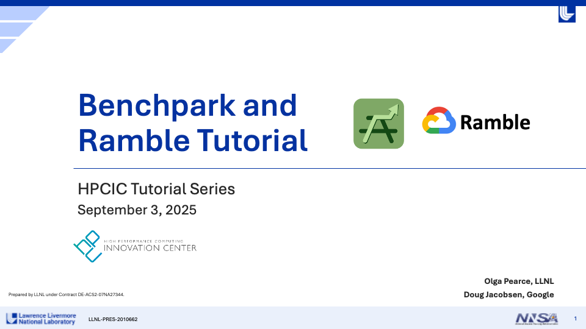

..
    Copyright 2023 Lawrence Livermore National Security, LLC and other
    Benchpark Project Developers. See the top-level COPYRIGHT file for details.

    SPDX-License-Identifier: Apache-2.0

#########################
 Tutorial: Benchpark 101
#########################

This tutorial will guide you through using Benchpark to run a strong scaling experiment
with the `Kripke benchmark <https://github.com/LLNL/Kripke>`_ on an AWS instance. Recent
presentations of this tutorial:

- August 20, 2025. Half-day tutorial at `International Symposium on High-Performance
  Parallel and Distributed Computing (HPDC) <https://hpdc.sci.utah.edu/2025/>`_ on
  Caliper, Thicket, and Benchpark.
- September 3, 2025. Half-day tutorial at `Livermore's HPC Tutorials
  <https://hpcic.llnl.gov/tutorials/2025-hpc-tutorials>`_ on Benchpark and Ramble.
- September 16, 2025. Half-day tutorial at `International Conference on eScience
  (eScience) <https://www.escience-conference.org/2025/>`_ on Benchpark and Ramble.

:download:`Download Slides <_static/slides/HPCIC25-Tutorial-Slides.pdf>`.

`Watch Video <https://www.youtube.com/watch?v=AeaUfpybJfg>`_.

By the end of this tutorial, you will be able to use Benchpark to:

- Initialize a system configuration and experiment configuration
- Build and run a scaling experiment
- Perform pre-defined performance analysis on the results of the scaling experiment

**Prerequisites**

- Access to a terminal with Benchpark installed (provided automatically by the
  infrastructure in our `Benchpark Tutorial repository
  <https://github.com/llnl/benchpark-tutorial>`_)
- Basic familiarity with command-line interfaces

***************************************
 Step 1: Verify Benchpark Installation
***************************************

First, ensure Benchpark is installed and working correctly by running:

.. code-block:: bash

    benchpark --version

You should see a version number like ``0.1.0``.

******************************************************
 Step 2: Explore Available Benchmarks and Experiments
******************************************************

Next, list all available benchmarks and experiments in Benchpark by running:

.. code-block:: bash

    benchpark list experiments

You should see an output like:

.. code-block:: text

    Experiments - BENCHMARK+PROGRAMMING_MODEL+SCALING
        ad+[mpi]
        amg2023+[openmp|cuda|rocm|mpi]+[strong|weak|throughput]
        babelstream+[openmp|cuda|rocm]
        genesis+[openmp|mpi]
        gpcnet+[mpi]
        gromacs+[openmp|cuda|rocm|mpi]
        hpcg+[openmp|mpi]+[strong|weak]
        hpl+[openmp|mpi]+[strong|weak]
        ior+[mpi]+[strong|weak]
        kripke+[openmp|cuda|rocm|mpi]+[strong|weak|throughput]
        laghos+[cuda|rocm|mpi]+[strong]
        lammps+[openmp|cuda|rocm|mpi]+[strong]
        md-test+[mpi]+[strong]
        mpi-pingpong
        osu-micro-benchmarks+[cuda|rocm|mpi]
        phloem+[mpi]
        quicksilver+[openmp|mpi]+[strong|weak]
        qws+[openmp|mpi]
        raja-perf+[openmp|cuda|rocm|mpi]+[strong|weak|throughput]
        remhos+[cuda|rocm|mpi]+[strong]
        salmon-tddft+[openmp|mpi]
        saxpy+[openmp|cuda|rocm|mpi]
        smb+[mpi]
        stream+[mpi]

From this output, you can see that Benchpark experiments are specified using Spack-like
conventions (e.g., ~, +). For example, the spec ``kripke`` describes an experiment using
the Kripke benchmark running on a single node.

Additionally, you can get only the benchmarks implementing a particular experiment by
adding ``--experiment <experiment_name>`` to the above command. For example, to get only
CUDA benchmarks, run:

.. code-block:: bash

    benchpark list experiments --experiment cuda

You should see the following:

.. code-block:: text

    Experiments - BENCHMARK+PROGRAMMING_MODEL+SCALING
        amg2023+[openmp|cuda|rocm|mpi]+[strong|weak|throughput]
        babelstream+[openmp|cuda|rocm]
        gromacs+[openmp|cuda|rocm|mpi]
        kripke+[openmp|cuda|rocm|mpi]+[strong|weak|throughput]
        laghos+[cuda|rocm|mpi]+[strong]
        lammps+[openmp|cuda|rocm|mpi]+[strong]
        osu-micro-benchmarks+[cuda|rocm|mpi]
        raja-perf+[openmp|cuda|rocm|mpi]+[strong|weak|throughput]
        remhos+[cuda|rocm|mpi]+[strong]
        saxpy+[openmp|cuda|rocm|mpi]

.. note::

    For all benchmarks, the default experiment is ``+mpi`` only without scaling. For
    Kripke, we specify the strong scaling mpi experiment on the command line using
    ``kripke +strong`` as shown in Step 4 (``+mpi`` is implied).

.. _step3_label:

********************************************
 Step 3: Initialize Your System Description
********************************************

Next, initialize the description of the AWS system by running the commands below:

.. code-block:: bash

    cd benchpark
    benchpark system init --dest=hpc-tutorial aws-tutorial instance_type=c7i.12xlarge

The ``benchpark system init`` command generates configuration files that describe the
system on which you are running. The system is specified in a system specification
(``system.py``). In the command above, the spec (i.e., ``aws-tutorial
instance_type=c7i.12xlarge``) defines a system running with `our tutorial infrastructure
on AWS <https://github.com/llnl/benchpark-tutorial>`_ that uses the `c7i.12xlarge
instance type <https://aws.amazon.com/ec2/instance-types/c7i/>`_.

After running the command above, you should see the following files in the
``hpc-tutorial`` directory:

- ``system_id.yaml``: a Benchpark configuration file that contains high-level metadata
  about the system
- ``software.yaml``: a Ramble configuration file specifying the default packages to use
  for software like compilers and MPI
- ``variables.yaml``: a Ramble configuration file defining variables that are needed for
  job script generation and scheduling (e.g., type of scheduler, number of cores per
  node)
- ``auxiliary_software_files/compilers.yaml``: a Spack configuration file defining
  available compilers on the system
- ``auxiliary_software_files/packages.yaml``: a Spack configuration file defining
  available software on the system

************************************
 Step 4: Initialize Your Experiment
************************************

Next, initialize the Kripke strong scaling experiment used in this tutorial by running:

.. code-block:: bash

    benchpark experiment init hpc-tutorial kripke +strong caliper=time,mpi

Similar to ``benchpark system init``, the ``benchpark experiment init`` command
generates the Ramble configuration file to describe the experiment to be run. The
experiment is specified in an experiment specification (``experiment.py``). In the
command above, the spec (i.e., ``kripke +strong caliper=time,mpi``) defines a
strong-scaling experiment running Kripke with the performance measurement tool known as
`Caliper <https://github.com/llnl/caliper>`_ enabled to collect performance metrics. The
``caliper=time,mpi`` specification enables execution time measurement and MPI library
instrumentation.

After running the command above, you should see a Ramble configuration file
(``ramble.yaml``) in the ``kripke-benchmark`` directory.

****************************************
 Step 5: Setup Your Benchpark Workspace
****************************************

After initializing the system description and experiment, setup a Benchpark workspace by
running:

.. code-block:: bash

    benchpark setup hpc-tutorial/kripke/ wkp/

This command takes the configuration files stored in the output directories of
``benchpark experiment init`` (i.e., ``kripke-benchmark/``) and ``benchpark system
init`` (i.e., ``hpc-tutorial/``) and combines them to generate a Benchpark workspace. A
Benchpark workspace contains everything that Benchpark, Ramble, and Spack need to build
and run your experiment, including:

- Clones of Spack and Ramble
- A ``setup.sh`` script that calls Spack and Ramble's setup scripts
- A Ramble workspace

To start using your Benchpark workspace, run:

.. code-block:: bash

    . /home/jovyan/benchpark/wkp/setup.sh

.. _step6_label:

*******************************************************************
 Step 6: Build Software Dependencies and Generate Experiment Files
*******************************************************************

Next, build any necessary software and generate all necessary files for the Kripke
scaling experiment by running:

.. code-block:: bash

    ramble \
    --workspace-dir /home/jovyan/benchpark/wkp/hpc-tutorial/kripke/workspace \
    workspace setup

This command does two things. First, it builds all necessary software using Spack.
Building the software may take a while to complete, depending on how many external
packages are contained in the system definition from :ref:`Step 3 <step3_label>`. For
this tutorial, it should take roughly 2 minutes. Second, this command generates batch
scripts (e.g., submission scripts) for executing the experiment. For each run in the
experiment, a directory containing the files necessary for the run will be created under
``/home/jovyan/benchpark/wkp/kripke-benchmark/hpc-tutorial/workspace/experiments/kripke/kripke``.
If the command is successful, you should see something like:

.. code-block:: text

    ==> Streaming details to log:
    ==>   /home/jovyan/benchpark/wkp/hpc-tutorial/kripke/workspace/logs/setup.2025-07-09_18.08.23.out
    ==>   Setting up 4 out of 4 experiments:
    ==> Experiment #1 (1/4):
    ==>     name: kripke.kripke.kripke_kripke_single_node_strong_scaling_caliper_time_mpi_2_2_1_64_64_32_64_1_128_128_4_4
    ==>     root experiment_index: 1
    ==>     log file: /home/jovyan/benchpark/wkp/hpc-tutorial/kripke/workspace/logs/setup.2025-07-09_18.08.23/kripke.kripke.kripke_kripke_single_node_strong_scaling_caliper_time_mpi_2_2_1_64_64_32_64_1_128_128_4_4.out
    ==>   Returning to log file: /home/jovyan/benchpark/wkp/hpc-tutorial/kripke/workspace/logs/setup.2025-07-09_18.08.23.out
    ==> Experiment #2 (2/4):
    ==>     name: kripke.kripke.kripke_kripke_single_node_strong_scaling_caliper_time_mpi_2_2_2_64_64_32_64_1_128_128_4_8
    ==>     root experiment_index: 2
    ==>     log file: /home/jovyan/benchpark/wkp/hpc-tutorial/kripke/workspace/logs/setup.2025-07-09_18.08.23/kripke.kripke.kripke_kripke_single_node_strong_scaling_caliper_time_mpi_2_2_2_64_64_32_64_1_128_128_4_8.out
    ==>   Returning to log file: /home/jovyan/benchpark/wkp/hpc-tutorial/kripke/workspace/logs/setup.2025-07-09_18.08.23.out
    ==> Experiment #3 (3/4):
    ==>     name: kripke.kripke.kripke_kripke_single_node_strong_scaling_caliper_time_mpi_4_2_2_64_64_32_64_1_128_128_4_16
    ==>     root experiment_index: 3
    ==>     log file: /home/jovyan/benchpark/wkp/hpc-tutorial/kripke/workspace/logs/setup.2025-07-09_18.08.23/kripke.kripke.kripke_kripke_single_node_strong_scaling_caliper_time_mpi_4_2_2_64_64_32_64_1_128_128_4_16.out
    ==>   Returning to log file: /home/jovyan/benchpark/wkp/hpc-tutorial/kripke/workspace/logs/setup.2025-07-09_18.08.23.out
    ==> Experiment #4 (4/4):
    ==>     name: kripke.kripke.kripke_kripke_single_node_strong_scaling_caliper_time_mpi_4_4_2_64_64_32_64_1_128_128_4_32
    ==>     root experiment_index: 4
    ==>     log file: /home/jovyan/benchpark/wkp/hpc-tutorial/kripke/workspace/logs/setup.2025-07-09_18.08.23/kripke.kripke.kripke_kripke_single_node_strong_scaling_caliper_time_mpi_4_4_2_64_64_32_64_1_128_128_4_32.out
    ==>   Returning to log file: /home/jovyan/benchpark/wkp/hpc-tutorial/kripke/workspace/logs/setup.2025-07-09_18.08.23.out

********************************************
 Step 7: Run Kripke Experiment using Ramble
********************************************

Next, run the Kripke strong scaling experiment by running the following command:

.. code-block:: bash

    ramble \
    --workspace-dir /home/jovyan/benchpark/wkp/hpc-tutorial/kripke/workspace \
    on

This command submits the batch scripts (e.g., submission scripts) generated in
:ref:`Step 6 <step6_label>` to the system's resource manager (which is specified in the
files generated by ``benchpark system init``). For the AWS infrastructure used in this
tutorial, the resource manager is LLNL's `Flux resource manager
<https://flux-framework.org/>`_.

If the above command is successful, you should see something like:

.. code-block:: bash

    ==> Streaming details to log:
    ==>   /home/jovyan/benchpark/wkp/hpc-tutorial/kripke/workspace/logs/execute.2025-07-09_18.14.08.out
    ==>   Executing 4 out of 4 experiments:
    ==>   Log files for experiments are stored in: /home/jovyan/benchpark/wkp/hpc-tutorial/kripke/workspace/logs/execute.2025-07-09_18.14.08
    ==> Running executors...
    ƒV54uD5o5
    ƒV57fKkEK
    ƒV5ANUS6s
    ƒV5D498h5

The final lines printed by the ``ramble on`` command are the job IDs produced by the
system resource manager. You can use these IDs to track the progress of the jobs in your
experiment. For example, with Flux, you can see job status by running:

.. code-block:: bash

    flux jobs -a

This command will produce an output like:

.. image:: ./flux_jobs_a_output.png
    :alt: Example output of flux jobs -a
    :width: 750px
    :align: center

.. note::

    If you are running on our `AWS infrastructure
    <https://github.com/llnl/benchpark-tutorial>`_, it should take roughly 1 minute for
    all jobs to finish running. Additionally, only one job will run at a time under our
    infrastructure because each user only has 1 node. If you are running on an HPC
    system, expect the jobs to complete faster.

After all the jobs are finished, each job directory (i.e., subdirectories of
``/home/jovyan/benchpark/wkp/hpc-tutorial/kripke/workspace/experiments/kripke/kripke``)
will contain a Caliper output file (i.e., a ``.cali`` file) containing performance data
for the job.

*************************
 Step 8: Analyze Results
*************************

Finally, we perform pre-defined analysis on the Caliper files generated by the scaling
study we defined in the experiment. The ``benchpark analyze`` command uses the `Thicket
<https://github.com/llnl/thicket>`_ performance analysis tool to compose the Caliper
performance profiles and visualize the scaling performance. We focus on the
application-level function calls, specifying the ``--no-mpi`` flag to hide MPI function
calls in the resulting graph. We also specify ``--chart-fontsize`` to increase the
overall font size in the resulting graph, helpful for better readability of the graph in
presentations.

.. code-block:: bash

    benchpark analyze \
    --workspace-dir /home/jovyan/benchpark/wkp/hpc-tutorial/kripke/workspace \
    --no-mpi \
    --chart-fontsize 15 \
    --chart-figsize 12 7

The command above reads in the Caliper files generated by the experiment and outputs
several files, such as the stacked area chart and Caliper calling context tree shown
below. These files can be found in
``/home/jovyan/benchpark/wkp/hpc-tutorial/kripke/workspace/analyze``.

.. image:: ./graph-and-tree.png
    :width: 900px
    :align: center

************
 Next Steps
************

Now that you know how to initialize, run, and analyze the performance of an experiment,
check out our :doc:`Benchpark Workflow <./benchpark-workflow>` page for more information
on how to interact with Benchpark, and further guides.

The second portion of this tutorial demonstrates how to add a new experiment to
Benchpark. Follow the guide on :doc:`Adding an Experiment <./add-an-experiment>` page as
you

`Watch Video Starting at 1:47:00 <https://www.youtube.com/watch?v=AeaUfpybJfg>`_.
