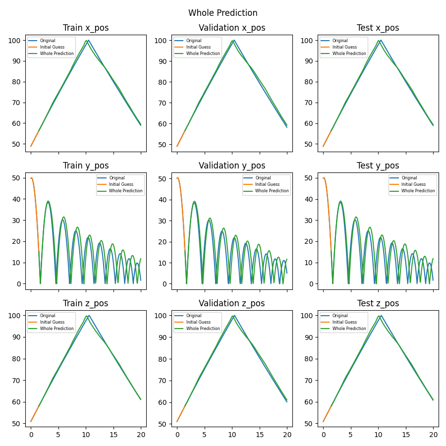

# Ball Bounce Long Short-Term Memory (LSTM) Recurrent Neural Network (RNN)

This tutorial is built on top of the [Bounce Ball VVUQ](../bouncing_ball_vvuq/1_baseline_simulation.md) tutorial by creating a Long Short-Term Memory (LSTM) Recurrent Neural Network (RNN) using the data from the simulation ensembles.

## Overview

A Recurrent Neural Network (RNN) is a type of Neural Network (NN) that can process data where order is important such as text and time history data. A Long Short-Term Memory (LSTM) network is a type of RNN that is modified to overcome the vanishing gradient problem which is caused by the gradient multiplication of the chain of time history data during the backpropagation of weight updates. This tutorial will use [Tensorflow](https://www.tensorflow.org/) which is a Machine Learning library developed by Google. [Keras](https://keras.io/) is an API for Tensorflow that allows users to easily and more intuitively work with Tensorflow.

## Changes to Bounce Ball VVUQ tutorial

There are a couple of changes to the Bounce Ball VVUQ tutorial baseline even though this tutorial is built on top of it. The first change is that we removed extraneous steps from the workflow (`post_process-ball-bounce` and `create-surrogate-ball-bounce`) but kept `run-ball-bounce` and  `ingest-ball-bounce` since we only care about ingesting all the ensemble data into the database.

A new step was created `create_initial_store` so that the parallel `ingest-ball-bounce` steps don't try to create the store the same time which will cause errors. We also adjusted the dependency of `ingest-ball-bounce` so that it runs for each `run-ball-bounce` instead of running only once after all the `run-ball-bounce_*` are complete. The Merlin worker `ball_bounce_worker` is updated to have a `--concurrency 100` and include the step `ingest-ball-bounce` to run 100 occurrences of `run-ball-bounce` and `ingest-ball-bounce` in parallel.

This causes the now multiple `ingest-ball-bounce` steps to call the Kosh store in parallel which means we can test out the Kosh threadsafe capabilities [Example_ThreadSafe.ipynb](https://lc.llnl.gov/gitlab/ASCAML/kosh/-/blob/develop/examples/Example_ThreadSafe.ipynb?ref_type=heads). These new capabilities are beneficial for large ensembles that call the Kosh store in parallel as the parallel calls can block one another. Thus, `dsv_to_sina.py` was updated and changed to `dsv_to_kosh.py` to implement these new threadsafe capabilities which prevent the parallel calls from blocking one another.

We then introduced a new step `lstm-ball-bounce` which creates the LSTM model from the simulation data.

Another change that was made was to reduce the gravity from $9.81 \frac{m}{s^2}$ to $.0981 \frac{m}{s^2}$ so that the `y_pos` transient data does not settle down to 0 right away. This was done just to have more transient data for `y_pos`.

## Visualization LSTM Kosh Notebook

This notebook allows the user to train an LSTM model and visualize its predictions. The notebook can be updated as needed to modify the LSTM model and post-process the prediction results. The notebook automatically gets converted to a Python script using the command `jupyter nbconvert --to script $(SPECROOT)/*.ipynb` in the `lstm-ball-bounce` step so there is no need to manually export it to a script. The notebook has more details on what training an LSTM model entails.

Below is the plot of the LSTM prediction and its true value for comparison. This model is using a `window=30` which is the number of time steps given per batch (this is explained more in the Jupyter Notebook) and the model parameters below. This is where fine tuning the model becomes an "art" since adjusting these values could give a completely different prediction. What works for this set of ensembles might not work for another. Note that due to the randomness of the data split and the training early stopping, the predictions below will not be the same each time.

```
lstm_model = tf.keras.models.Sequential([
    tf.keras.layers.LSTM(64,return_sequences=True),
    tf.keras.layers.LSTM(32,return_sequences=True),
    tf.keras.layers.LSTM(16,return_sequences=True),
    tf.keras.layers.LSTM(8,return_sequences=False),
    tf.keras.layers.Dense(num_features)
])

lstm_model.compile(loss='mse', optimizer='adam')

early_stopping = tf.keras.callbacks.EarlyStopping(monitor='val_loss', patience=5,
                                                  restore_best_weights=True)

history = lstm_model.fit(X_train_lstm, y_train_lstm,
                         epochs=100, # default epochs = 1
                         validation_data = (X_val_lstm, y_val_lstm),
                         callbacks=[early_stopping]
                        )
```



## How to run

1. Run `setup.sh` in the top directory to create a virtual environment with all necessary dependencies and install the jupyter kernel.

2. Run `source weave_demos_venv/bin/activate` to enter the virtual environment (you can `deactivate` when you've finished the demo to exit it) and `cd` back into this directory.

3. Follow the steps below.
   1. Run `merlin run ball_bounce_suite_merlin_lstm.yaml --pgen pgen_ensembles.py` and `merlin run-workers ball_bounce_suite_merlin_lstm.yaml`
      1. Change `NUM_STUDIES = 1024` to a smaller number depending on computer capability  (e.g. 64) in `pgen_ensembles.py`
   2. Run `visualization_lstm_kosh.ipynb`
      1. Update the lstm model and/or update `NUM_STUDIES` above to get more training samples

  * Note: If the notebook `visualization_lstm_kosh.ipynb` is to your liking, you can just run step 1 above and the updated notebook will automatically be exported as a script.

## Content overview

### Starting files:

- `create_store.py`: Create store that will be used throughout workflow.
- `ball_bounce.py`: The "simulation" script, containing all the logic for bouncing the ball.
- `dsv_to_kosh.py`: A bare-bones ingester that finds dsv files and inserts them into a Kosh datastore using the parallel safe threadsafe methods.
- `pgen_ensembles.py`: A custom parameter generator for Maestro and Merlin containing the uncertainty bounds of the parameters for the baseline simulation ensemble.
- `ball_bounce_suite_merlin_lstm.yaml`: The Merlin workflow description for running the baseline simulation ensemble, consolidating the data into a datastore, and training the LSTM RNN.
- `visualization_lstm_kosh.ipynb`: A Jupyter notebook to train the LSTM RNN.

### Files created by the demo:

- `ball-bounce-lstm`
  - `create-initial-store`: Contains the code to create store.
  - `run-ball-bounce/`: Contains the baseline simulation ensemble.
  - `ingest-ball-bounce/`: Contains the code to add the baseline simulation ensemble to the datastore.
  - `lstm-ball-bounce/`: Contains the images created by the Jupyter notebook.