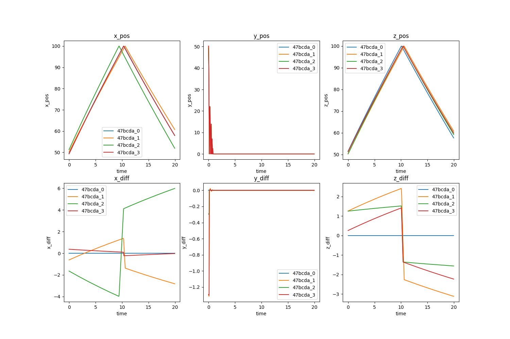
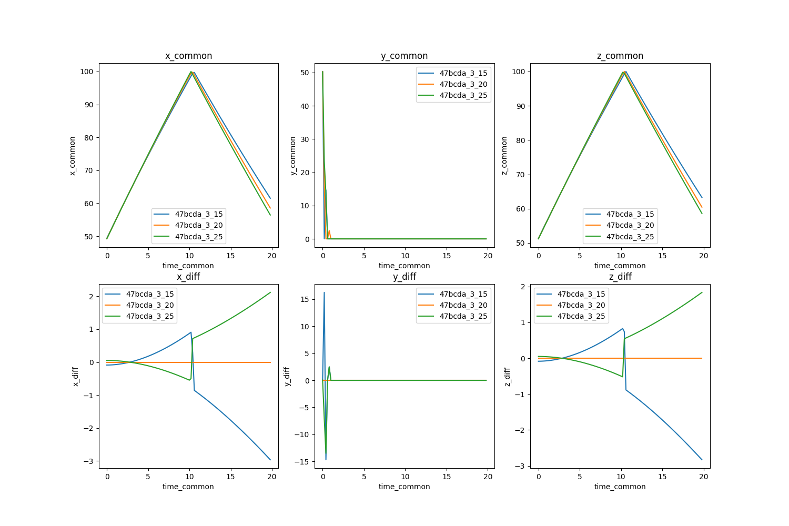

# 1. Baseline Simulation

Having a baseline simulation isn't necessary for every workflow but if the workflow includes post-processing plans that include any Verification, Validation, and Uncertainty Quantification (VVUQ), it is highly recommended. 

If you don't have validation data you can skip to [2. Uncertainty Bounds](./2_uncertainty_bounds.md) and if you don't want to do VVUQ you can skip to [3. Simulation Ensembles](./3_simulation_ensembles.md). 

Every simulation needs a set of initial conditions (ICs), boundary conditions (BCs), and other predefined parameters in order to run but how are those (default) values determined? The test documentation may state that an experiment's temperature shall be set at a certain value which in theory would provide a certain IC and BC but those can never be precisely known with 100% certainty.  What about the material information from the manufacturer; the manufacturing process is never perfect. 

This step aims to create a small parameter study that can be used to "calibrate" your simulation against the actual experiment.


## Quantities of Interest (QoIs)

Quantities of Interest (QoIs), as the name suggests, are the results you are most intersted in. Your QoIs could be temperatures, accelerations, rates, etc. These are the parameters you are trying to understand in your study. 

It is important to choose QoIs that you have validation data for so you can compare your simulation to the actual experiment data. The QoIs will be used to build a scientific narrative that either confirms or rejects assumptions about the true behavior of the overall study.

### Bouncing Ball

We will take WEAVE's Bouncing Ball Demo as our example experiment and select our QoIs to be `Maximum Height`, `Number of Bounces`, `Distance Travelled`, and other data but the QoIs we have for comparison with the validation data will be `x_pos`, `y_pos`, and `z_pos`.


## Small Parameter Set

Select your small set of parameters that could affect your QoIs the most such as the IC, BC, and a material property or two (the detailed parameter study will be done in the later steps). Select ranges that seem reasonable and known (i.e. don't select a temperature of 1000 K when the experiment occured at 100 K or gravity of 20 $\frac{m}{s^2}$ when Earth's gravity is approximately 9.81 $\frac{m}{s^2}$). Create a small sweep of these parameters by selecting discrete values and varying them a bit.

!!! note
    This may seem trivial since we are only tracking one ball but imagine if we were tracking X amount of balls with Y amount of parameters that interacted with one another in a real world scenario with a much more complicated physics simulation, then each initial condition and boundary condition for each ball would affect all the other balls.

### Bouncing Ball

For the Bouncing Ball Demo we will set our parameters to include `x_pos_initial`, `y_pos_initial`, `z_pos_initial`, `x_vel_initial`, `y_vel_initial`, and `z_vel_initial`.

## Running the Simulation

Now that we have chosen our QoIs and parameters, we can create an initial set of simulations to determine our baseline simulation. It is always good practice to use the parameter values provided by the experiment specification and/or experimentalists. The reason we run these initial sets of simulations is because we may not know (precisely) the parameter value used to create the simulation results: experimental and user bias can be introduced at any step of the experiment and can take the form of the apparatus not being calibrated correctly, or the experimentalist mistyped an input, and so on.

### Bouncing Ball

Let's say a Bouncing Ball experimentalist physically bounced a ball in a fixed size box. The initial ball position would be known and controlled, with the experimentalist noting values of `X_POS_INITIAL = 50`, `Y_POS_INITIAL = 50`, `Z_POS_INITIAL = 50`, `X_VEL_INITIAL = 5.0`, `Y_VEL_INITIAL = 5.0`, and `Z_VEL_INITIAL = 5.0`. 

We can use those values and input them into our simulation model. There are more parameters that the Python script `ball_bounce.py` can take but those are more for the simulation itself (use Earth's `GRAVITY = 9.81` and a standard box of `BOX_SIDE_LENGTH = 100`). 

We can run more simulations with varying the X, Y, and Z parameters values, as seen in the table below.

| rec.id | x_pos_initial | y_pos_initial | z_pos_initial | x_vel_initial | y_vel_initial | z_vel_initial |
| --- | --- | --- | --- | --- | --- | --- |
| 47bcda_1 | 50.0 | 50.0 | 50.0 | 5.0 | 5.0 | 5.0 |
| 47bcda_2 | 51.0 | 49.0 | 50.0 | 5.5 | 4.9 | 5.1 |
| 47bcda_3 | 49.0 | 50.0 | 51.0 | 5.25 | 4.9 | 5.0 |

``` bash
#!/bin/bash

OUT_FILE=./baseline/baseline_1_output.dsv
X_POS_INITIAL=50
Y_POS_INITIAL=50
Z_POS_INITIAL=50
X_VEL_INITIAL=5
Y_VEL_INITIAL=5
Z_VEL_INITIAL=5
GRAVITY=9.81
BOX_SIDE_LENGTH=100
GROUP_ID=47bcda
RUN_ID=1
python ball_bounce.py $OUT_FILE $X_POS_INITIAL $Y_POS_INITIAL $Z_POS_INITIAL $X_VEL_INITIAL $Y_VEL_INITIAL $Z_VEL_INITIAL $GRAVITY $BOX_SIDE_LENGTH $GROUP_ID $RUN_ID

```

Since we don't have validation data for our Bouncing Ball Demo, we can run the simulation with a range of parameter values that we know the bouncing ball can possibly take. For example, we know the position of the ball is confined by the size of the box, so the initial X, Y, Z positions cannot exceed that and are therefore bounded by that range. The parameters below can represent our validation data (again, emphasis on nothing is perfectly accurate in the real world). 

| rec.id | x_pos_initial | y_pos_initial | z_pos_initial | x_vel_initial | y_vel_initial | z_vel_initial |
| --- | --- | --- | --- | --- | --- | --- |
| 47bcda_0 | 49.37 | 48.71 | 51.25 | 5.22 | 4.83 | 5.13 |

Run the command below in order to setup our necessary Python environments, Python packages, Jupyter Kernel, and directory structure.

``` bash
sh setup.sh
```

The `baseline.sh` script runs the four simulations and ingests their data using the `dsv_to_sina.py` script. These simulations and their results will be in `01_baseline_simulation/baseline/`.

``` bash
sh 01_baseline_simulation/baseline/baseline.sh
```

## Calculate Root Mean Squared Error (RMSE)

After all your simulations have run to completion, gather all your data using Sina/Kosh and start post-processing them to establish your baseline. Calculate the Root Mean Squared Error (RMSE) for all your QoIs using the equation below where $x_{true}$ is your validation data and $x_{pred}$ is your predicted or simulated data. This will allow you to hone in on the set of parameters that gave you the minimum RMSE averaged across all your QoIs. Here we are trying to flatten all the RMSEs for each QoI into a single average value to compare between simulations. This set of parameters will define your baseline simulation.

$$
RMSE = \sqrt{\frac{\sum_{i=1}^{D}(x_{true}-x_{pred})^2}{N}}
$$

### Bouncing Ball

Using Sina, we then plot each QoI validation data using their unique run ID (for example, `run.id = '47bcda_0'`), alongside with their corresponding residuals $diff=x_{true}-x_{pred}$. The figure below depicts the affects on QoIs when adjusting the run parameters slightly. We will use the Jupyter Notebook `visualization_baseline_sina.ipynb` or `visualization_baseline_kosh.ipynb` in `01_baseline_simulation/baseline/` to post-process the data and create the plots below. You will notice that Sina and Kosh have very similar methods since Kosh is built on top of Sina.



The RMSE for each run is calculated using the formula above and shown in the table below. The RMSE for each QoI is plotted for a quick visualization of the smallest RMSE. Taking the mean of the RMSE accross all the QoIs for each simulation run, we see that `run.id = '47bcda_3'` produces the smallest value and thus we choose the parameters from that run to define our baseline simulation. These parameters will be used as the comparative basis for all other simulations we will conduct moving forward.

| rec.id | x_rmse | y_rmse | z_rmse | Mean RMSE |
| --- | --- | --- | --- | --- |
| 47bcda_0 | 0.0 | 0.0 | 0.0 | 0.0 |
| 47bcda_1 | 1.57 | 0.11 | 2.3 | 1.33 |
| 47bcda_2 | 4.12 | 0.03 | 1.42 | 1.86 |
| 47bcda_3 | 0.2 | 0.11 | 1.43 | 0.58 |


## Numerical Resolution Study

We can now use the baseline simulation parameters to run a numerical resolution study to bound the numerical uncertainty. Numerical resolution studies can be computationally expensive so it is suggested to do at least 3 numerical resolutions: fine, nominal, and coarse. 

!!! note 
    We used the nominal time-step and spatial-grid size for the small parameter study above and will continue with it for the simulation ensembles in the next steps.

### Bouncing Ball

The Bouncing Ball Demo doesn't use a spatial-grid but it does use a time-step `TICKS_PER_SECOND = 20` which is the nominal resolution. We can choose a value of 15 for our coarse time-step and a value of 25 for our fine time-step. The `num_res.sh` script runs the three simulations and ingests their data using the `dsv_to_sina.py` script. These simulations and their results will be in `01_baseline_simulation/num_res/`. Use the Jupyter Notebook `visualization_num_res_sina.ipynb` or `visualization_num_res_kosh.ipynb` to post-process the data and create the plots below.

``` bash
sh 01_baseline_simulation/num_res/num_res.sh
```

The plots showcase how the resolution affects the QoIs. We didn't plot the RMSE since we are not comparing to actual 'validation' data like in the previous section.

!!! note

    You have to make sure that you extract the QoIs at the `common` timesteps or else you can't acquire the differences or numerical uncertainty (standard deviation).



Here is where we decide if running simulations with a finer resolution is worth the computational cost. The Bouncing Ball Demo using the fine time-step is not computationally expensive so we can run it using the fine time-step. However, if this were a complex high-fidelity physics model, we would opt for the nominal time-step. For the purposes of this tutorial, we will stick with the nominal time-step of `TICKS_PER_SECOND = 20`.

The plots for the numerical uncertainty are below. We can see that as the time-step increases, the variance between simulations also increases.

