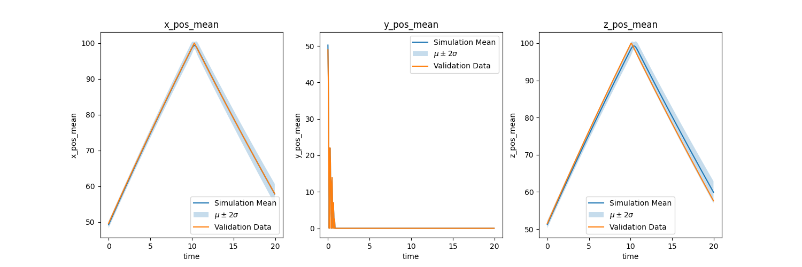
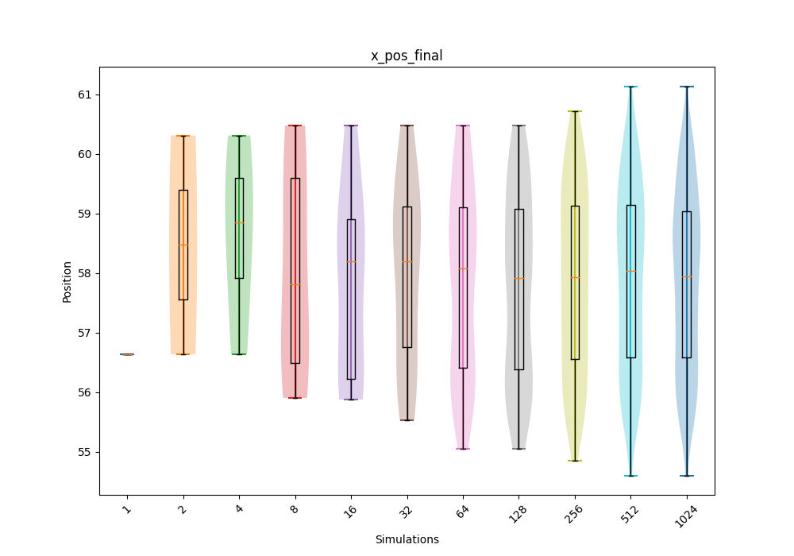
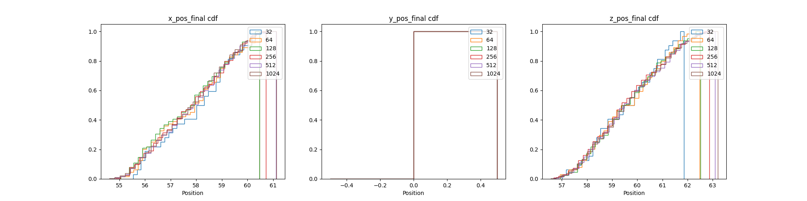
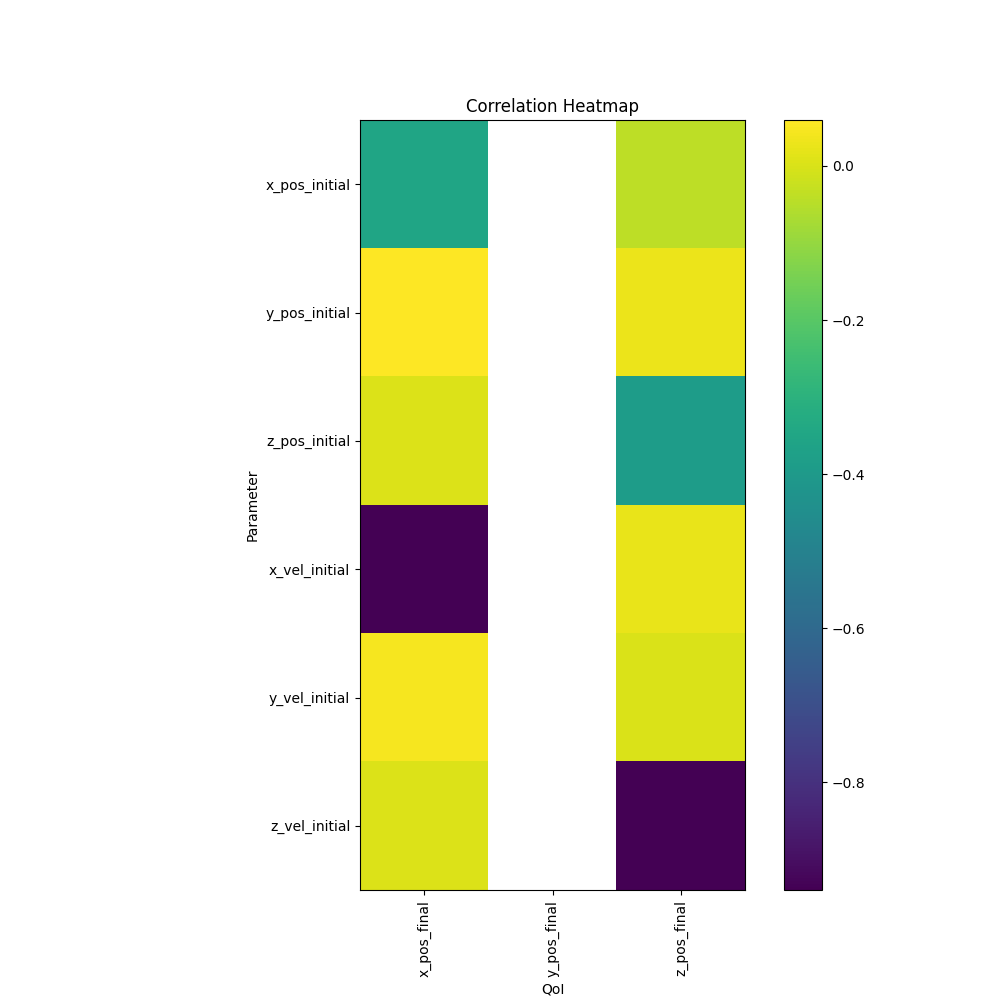
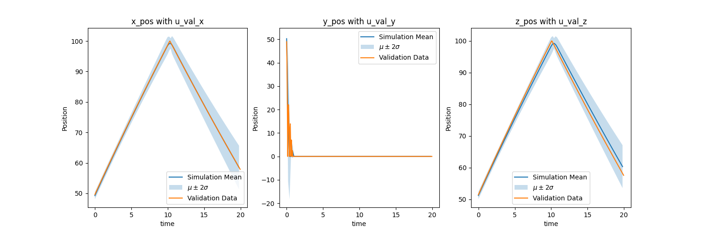

# 5. Post-Process Data

What is the end goal of simulation, what are you trying to show? Now that you have all the data, it can be easy to get lost in the sea of it. In step [1. Baseline Simulation](./1_baseline_simulation.md) we spoke about QoIs and their importance. The end goal of the simulation ensemble is to determine something about the QoIs that were selected beforehand.

## Workflow

The worklow files for the different orchestration tools can be seen below. This is where you can use Sina, Kosh, or PyDv to post-process the data or one of your own scripts. However, you might have noticed that we ran the orchestration spec in the last step. This is because we need to do some data exploration to understand how our data is structured and what sorts of plots we would like. You can write a Jupyter Notebook using Sina/Kosh after the ingestion step to easily see relationships between data that you might have missed. Sina/Kosh and PyDV can also be used in regular Python scripts. After we have written our scripts to post-process our data we can include them in our orchestration spec to further automate future simulation ensembles.

### Maestro & Merlin

In order to add post processing to our spec file, we'll need to modify the `env` and `study` blocks.

We'll add one variable `POST_PROCESS_SCRIPT_PATH` and modify the `OUTPUT_DS_PATH` variable in the `env` block. The `POST_PROCESS_SCRIPT_PATH` variable will define the script `visualization_ensembles_sina.py` that will be used for post-processing. Also, now that we're running a different spec file that's located in a separate directory, we need to modify the path of the `OUTPUT_DS_PATH` variable to be `../04_manage_data/data/ensembles_output.sqlite`.

In the `study` block we need to add a new step `post_process-ball-bounce` to be run after the data is ingested. This step will use Sina to post-process the data and output some graphs which can be seen in the [**Potential Plots**](./5_post-process_data.md#potential-plots) section below. The `post_process-ball-bounce` step `depends` on the `ingest-ball-bounce` step (note the absence of the asterisk since this is only a single step) to complete before it can post process the consolidated data.

From here, the specs start to differ slightly. If you're using Maestro read the [Maestro Specification](./5_post-process_data.md#maestro-specification) section and if you're using Merlin see the [Merlin Specification](./5_post-process_data.md#merlin-specification) section.

#### Maestro Specification

We can now run the Maestro spec with the bash command below. The data will be located in `03_simulation_ensembles/data` for the simulation ensembles, `04_manage_data/data` for the sqlite database, and `05_post-process_data/images` for the plots.

Bash Command:

``` bash 
maestro run 05_post-process_data/ball_bounce_suite_maestro_post-process_data.yaml --pgen 02_uncertainty_bounds/pgen_ensembles.py
```

Meastro Spec:

``` yaml title="05_post-process_data/ball_bounce_suite_maestro_post-process_data.yaml"
description:
    name: ball-bounce 
    description: A workflow that simulates a ball bouncing in a box over several input sets.

env:
    variables:
        OUTPUT_PATH: ./03_simulation_ensembles/data
        SIM_SCRIPT_PATH: ../ball_bounce.py
        PROCESS_SCRIPT_PATH: ../dsv_to_sina.py
        OUTPUT_DS_PATH: ../04_manage_data/data/ensembles_output.sqlite
        POST_PROCESS_SCRIPT_PATH: ./visualization_ensembles_sina.py

study:
    - name: run-ball-bounce
      description: Run a family of simulations of a ball in a box. 
      run:
          cmd: |
            python $(SPECROOT)/$(SIM_SCRIPT_PATH) output.dsv $(X_POS_INITIAL) $(Y_POS_INITIAL) $(Z_POS_INITIAL) $(X_VEL_INITIAL) $(Y_VEL_INITIAL) $(Z_VEL_INITIAL) $(GRAVITY) $(BOX_SIDE_LENGTH) $(GROUP_ID) $(RUN_ID)
    
    - name: ingest-ball-bounce
      description: Ingest the outputs from the previous step
      run:
          cmd: |
            python $(SPECROOT)/$(PROCESS_SCRIPT_PATH) $(OUTPUT_PATH) $(SPECROOT)/$(OUTPUT_DS_PATH)
          depends: [run-ball-bounce_*]
      
    - name: post_process-ball-bounce
      description: Post-process the simulation data
      run:
          cmd: |
              python $(SPECROOT)/$(POST_PROCESS_SCRIPT_PATH) $(SPECROOT)
          depends: [ingest-ball-bounce]
```

#### Merlin Specification

!!! warning
    If you try to run the Maestro spec above using Merlin, you will run into issues where nothing is added to the `sqlite` datastore. To fix this, use `$(run-ball-bounce.workspace)` instead of `$(OUTPUT_PATH)` in the `cmd` for the `ingest-ball-bounce` step. 
    
This example is showing how to run the simulation ensembles, ingest the data from them, and post-process the ingested data using Merlin.

##### Adding Post-processing to the Merlin Spec

Now, in our `merlin` block, we need to tell `other_worker` to work on our new `post_process-ball-bounce` step in addition to `ingest-ball-bounce`. Since we've already created the `other_worker`, all we need to do is add `post_process-ball-bounce` to the list of steps that this worker will handle.

Merlin Spec:

``` yaml title="05_post-process_data/ball_bounce_suite_merlin_post-process_data.yaml"
description:
    name: ball-bounce 
    description: A workflow that simulates a ball bouncing in a box over several input sets.

env:
    variables:
        OUTPUT_PATH: ./03_simulation_ensembles/data
        SIM_SCRIPT_PATH: ../ball_bounce.py
        PROCESS_SCRIPT_PATH: ../dsv_to_sina.py
        OUTPUT_DS_PATH: ../04_manage_data/data/ensembles_output.sqlite
        POST_PROCESS_SCRIPT_PATH: ./visualization_ensembles_sina.py

user:
    study:
        run:
            run_ball_bounce: &run_ball_bounce
                cmd: |
                  python $(SPECROOT)/$(SIM_SCRIPT_PATH) output.dsv $(X_POS_INITIAL) $(Y_POS_INITIAL) $(Z_POS_INITIAL) $(X_VEL_INITIAL) $(Y_VEL_INITIAL) $(Z_VEL_INITIAL) $(GRAVITY) $(BOX_SIDE_LENGTH) $(GROUP_ID) $(RUN_ID)
                max_retries: 1

study:
    - name: run-ball-bounce
      description: Run a family of simulations of a ball in a box. 
      run:
          <<: *run_ball_bounce

    - name: ingest-ball-bounce
      description: Ingest the outputs from the previous step
      run:
          cmd: |
            python $(SPECROOT)/$(PROCESS_SCRIPT_PATH) $(run-ball-bounce.workspace) $(SPECROOT)/$(OUTPUT_DS_PATH)
          depends: [run-ball-bounce_*]

    - name: post_process-ball-bounce
      description: Post process the simulation data
      run:
          cmd: |
            python $(SPECROOT)/$(POST_PROCESS_SCRIPT_PATH) $(SPECROOT)
          depends: [ingest-ball-bounce]

merlin:
    resources:
        task_server: celery
        overlap: False
        workers:
            ball_bounce_worker:
                args: -l INFO --concurrency 4 --prefetch-multiplier 2 -O fair
                steps: [run-ball-bounce]
            other_worker:
                args: -l INFO --concurrency 1 --prefetch-multiplier 1 -O fair
                steps: [ingest-ball-bounce, post_process-ball-bounce]
```

##### Running the Merlin Spec

!!! important
    To be able to use Merlin in a distributed environment (not locally), you first need to make sure you've set up your merlin config file (`app.yaml`). See [Merlin's confluence page](https://lc.llnl.gov/confluence/display/MERLIN) and the [Merlin configuration docs](https://merlin.readthedocs.io/en/latest/merlin_config.html) for more information.

Running a Merlin study can be broken down into 3 distinct steps:

1. Launching the tasks
2. Launching the workers
3. Stopping the workers

See [here](./3_simulation_ensembles.md#running-the-merlin-spec) for more information on why this is necessary.

Launching the tasks:

``` bash
merlin run 05_post-process_data/ball_bounce_suite_merlin_post-process_data.yaml --pgen 02_uncertainty_bounds/pgen_ensembles.py
```

Launching the workers:

``` bash
merlin run-workers 05_post-process_data/ball_bounce_suite_merlin_post-process_data.yaml
```

Once all the steps have completed the data will be located in `03_simulation_ensembles/data` for the simulation ensembles, `04_manage_data/data` for the sqlite database, and `05_post-process_data/images` for the plots. We can now stop the workers.

Stopping the workers:

``` bash
merlin stop-workers
```

## Potential Plots

Below is a list of potential plots that one can create with the QoIs along with their purpose. This again depends on your dataset. You can create these graphs by running the Jupyter Notebook `05_post-process_data/visualization_ensembles_sina.ipynb` or by running Maestro spec which calls out the `05_post-process_data/visualization_ensembles_sina.py` script. There is also a Jupyter Notebook for Kosh but for the sake of not creating another set of Maestro and Merlin specs, the Sina files are the ones used.

A notebook can be saved as a Python script by clicking File -> Download as -> Python (.py). The tutorial notebook includes logic to see if arguments have been passed into it in order to adjust the file load and save paths since running it as a Jupyter Notebook will have a different working directory than running it as a script through the Maestro/Merlin spec above. Be sure to turn off interactive mode in the Sina plots as well.

* QoI transient data with uncertainty bounds
    * Plots: Simulation Ensemble mean with uncertainty bounds and experiment data
    * Purpose: If simulations can predict experiment within uncertainty bounds
    
* QoI point data violin and box plots
    * Plots: Simulation distribution at a certain time, max/min value, max/min difference with experiment, etc...
    * Purpose: If simulations are within desired/expected range
    
* QoI point data violin and box convergence plots
    * Plots: Same as above but over 1, 2, 4, 8, 16, 32, 64, 128, 256, etc... simulations.
    * Purpose: How distribution converges over simulations to see if number of simulations can be reduced
    
* QoI point data PDF and CDF plots
    * Plots: Different view of the violin and box plots
    * Purpose: If simulations are within desired/expected range
    
* QoI point data PDF and CDF convergence plots
    * Plots: Different view of the violin and box convergence plots
    * Purpose: How distribution converges over simulations to see if number of simulations can be reduced
    
    
* QoI point data parameter correlation scatter plots
    * Plots: Matrix of scatter plots for parameter correlation for each QoI point data
    * Purpose: Which parameter has the largest effect on each QoI point data to reduce uncertainty in that parameter in order to reduce uncertainty in the QoI point data
    
* QoI point data parameter correlation heatmaps
    * Plots: Heatmap of parameter correlation values for each point data, more consolidated version of the scatter plots
    * Purpose: Which parameter has the largest effect on each QoI point data to reduce uncertainty in that parameter in order to reduce uncertainty in the QoI point data
    
* QoI point data parameter correlation convergence heatmaps
    * Plots: Heatmap of parameter correlation values for each point data over simulations
    * Purpose: How correlation converges over simulations to see if number of simulations can be reduced
    
* QoI point data parameter Sobol' Indices heatmaps plots
    * Plots: Same as correlation heatmaps but with Sobol' Indices, this is needed if correlation isn't linear
    * Purpose: Which parameter has the largest effect on each QoI point data to reduce uncertainty in that parameter in order to reduce uncertainty in the QoI point data
    * **See 6. Surrogate Model**


## Adding up the uncertainties

If we take a look at [ASME V&V 20](https://www.asme.org/codes-standards/find-codes-standards/v-v-20-standard-verification-validation-computational-fluid-dynamics-heat-transfer), the authors list a couple of sources of uncertainty: numerical ($u_{num}$), input ($u_{input}$), and experimental ($u_{D}$) with each being **one standard deviation**. We can acquire the numerical uncertainty through the mesh resolution study in step 1, the input uncertainty through the simulation ensembles in step 3, and the experimental uncertainty by talking with the experimentalists. We use the equation below to acquire overall uncertainty ($u_{val}$) for **each** QoI. We apply this overall uncertainty to the mean value of each QoI to see if it encapsulates the experimental values. This overall uncertainy will also be aplied to Quantification of Margins and Uncertainties (QMU) below (assuming normal distribution???)

$$
u_{val}= \sqrt{u_{num}^{2}+u_{input}^{2}+u_{D}^{2}}
$$

### Bouncing Ball

Since we don't have $u_{D}$ (due to it not being an actual experiment) we will just average the transient $u_{num}$ and $u_{input}$ and use that as $u_{D}$. Remember that all of these are **one standard deviation** so in the second chart below $\mu \pm 2 \sigma = \mu \pm 2 u_{val}$. We can see that our simulation with our uncertainties encapsulates the experiment so we can start recommending how the system will behave.




## Quantification of Margins and Uncertainties (QMU)

Quantification of Margins and Uncertainties (QMU) can now be used to understand how much margin your QoI has from a certain limit. For example, how much margin do you have if a specific position (QoI) shall not exceed a certain location (requirement). We calculate the margin factor ($MF$) using the equation below where $Req.$ is the requirement, $\mu$ is the QoI simulation mean, and $u_{val}$ is the validation uncertainty acquired in the previous section for each QoI. We want $MF$ to be large since we want a large margin and small uncertainty relative to the margin. This signifies that the mean of our simulation is far away from the requirement value and that the simuluation values don't vary much about the mean. This can be interpreted as how many standard deviations are between the requirement and the mean. For a normal distribution, three standard deviations cover 99.7% of the data.

$$
MF = \frac{Req - \mu}{u_{val}}
$$

### Bouncing Ball

Using $u_{val}$ at the last timestep for each QOI since we want the final positions of x, y, and z we get the plots below. We are assuming a normal distribution. Remember that for a normal distribution, three standard deviations cover 99.7% of the data so this has a good amount of margin. The final y position graph doesn't have a distribution since all the values were 0.

$$
MF_x = \frac{Req_x - \mu_x}{u_{val_{x}}} = \frac{75 - 58.48}{3.56} = 4.64
$$

$$
MF_y = \frac{Req_y - \mu_y}{u_{val_{y}}} = \frac{5 - 0}{0} = Inf.
$$

$$
MF_z = \frac{Req_z - \mu_z}{u_{val_{z}}} = \frac{80 - 60.41}{3.37} = 5.81
$$


