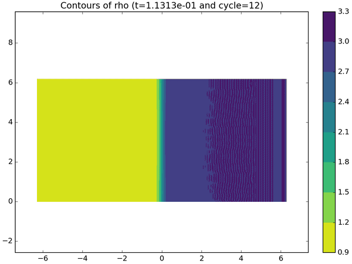
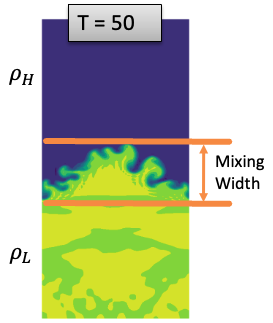

# Rayleigh Taylor Modeling with pyranda

Pyranda is an mpi parallel high order finited difference solver for arbitrary hyperbolic PDE systems [pyranda](https://github.com/LLNL/pyranda). 

This set of examples works through simulations of the Rayleigh-Taylor problem,
which is an instability between interfaces of two fluids acting under non-impulsive accelerations (see Richtmyer-Meshkov for the impulsively accelerated version).

This tutorial was designed as part of an Amazon Web Services series. If you are following this tutorial please follow instrcutions in [this presentation](AWS_Tutorial_2024.pptx). Otherwise please use the [pyranda_rayleigh_taylor.ipynb](pyranda_rayleigh_taylor.ipynb) notebook.

## Nominal behaviors

The first set of models demonstrate the phenomena and explore the effects of different fluid densities via the non-dimensional Atwood number that expresses the light/heavy fluid
density ratios.  There are a variety of regimes that can be probed, but we'll focus on the configuration of multimode initial interface perturbations with miscible fluids.  In this
setup, the mixing width grows with a form of ~ alpha*A*g*t, where A = atwood number, g = accleration (often gravity), t = time, and alpha is a ~constant factor.  There are some caveats,
such as low wavenumber content in the initial condition (or large wavelength) tends to dominate and grow faster.  Thus this scaling law breaks down a bit in the presence of a lot of
low wavenumber content.  The intial study will show some of these effects with a caveat that doing this in 2D can't quite give the right answer owing to the significant 3D effects in
such problems.

Later in the notebook we will setup a surrogate model to predict the mixing width (see graph below)

### Use Maestro To Run Experiments with pyranda

The `rayleigh_taylor.yaml` file is a Maestro study specification that can run parameter sweeps of our pyranda rayleigh taylor model, allowing variance of the Atwood number and
the seed fed into a randomized velocity perturbation applied to the fluid interface.

## Uncertainty Quantification

At this point we are going to demonstrate an uncertainty quantification (UQ) study with data from Pyranda.

### Goal

Our goal is to understand the uncertainty or variability of the mixing width layer in fluid mixing situations, and how the Atwood number and velocity contribute to the mixing width variability.

Information sources:
* Physics equations in Pyranda simulation
* Real world experimental data

### The workflow

In this UQ Study we will:
* Generate a large amount of data with simulation (Trata and Maestro/Merlin)
* Fit a surrogate model to simulation data for faster inference
* Use IBIS to do Bayesian Inference and better understand input/output variance (including visualizing the results)

### Simulation and surrogate model visualization

The plot step of the workflow allows us to see how the inputs for the simulation were generated with Trata. 

It also generates a plot that gives us an idea of the mixing width over time for all simulations. 

We will also show the prediction of our surrogate model as it interpolates and extrapolates in the corners of the plot.

We will evaluate the GP model with a leave-one-out cross-validation method where a model is trained on all the data except the first data point, next we will train a model on all but the second data point, etc. Each time we train a model we will evaluate it on the data point that was left out. It can be a costly cross-validation method, but in this situation our surrogate model is fast to train and predict.
